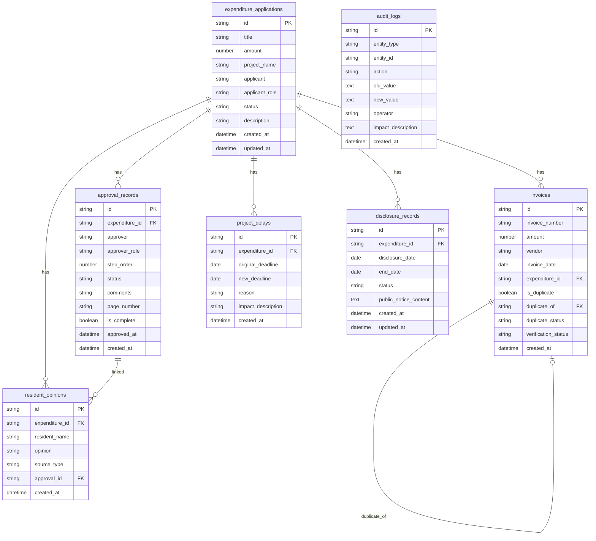

## 1. 架构设计

```mermaid
flowchart TB
    subgraph "前端层"
        "React + TypeScript"
        "Tailwind CSS"
        "Zustand 状态管理"
        "React Router"
    end
    subgraph "后端层"
        "Express + TypeScript"
        "REST API"
        "业务逻辑服务"
    end
    subgraph "数据层"
        "SQLite (better-sqlite3)"
        "审计日志"
        "查重索引"
    end
    "React + TypeScript" --> "REST API"
    "REST API" --> "业务逻辑服务"
    "业务逻辑服务" --> "SQLite (better-sqlite3)"
    "业务逻辑服务" --> "审计日志"
    "业务逻辑服务" --> "查重索引"
```

## 2. 技术说明

- 前端：React@18 + Tailwind CSS@3 + Vite
- 初始化工具：vite-init
- 后端：Express@4 + TypeScript (ESM)
- 数据库：SQLite (better-sqlite3)，无需外部服务

## 3. 路由定义

| 路由 | 用途 |
|------|------|
| / | 仪表盘：财务总览、异常预警、变更时间线 |
| /expenditures | 支出申请列表 |
| /expenditures/:id | 支出申请详情 |
| /expenditures/new | 新建支出申请 |
| /invoices | 发票管理列表 |
| /invoices/:id | 发票详情 |
| /invoices/duplicates | 查重检测结果 |
| /approvals | 审批追踪列表 |
| /approvals/:id | 审批详情（含流程图） |
| /disclosures | 公示管理列表 |
| /disclosures/:id | 公示详情 |
| /reports | 导出报告 |

## 4. API 定义

### 4.1 支出申请

```typescript
interface ExpenditureApplication {
  id: string
  title: string
  amount: number
  project_name: string
  applicant: string
  applicant_role: string
  status: 'draft' | 'pending_review' | 'reviewing' | 'approved' | 'rejected' | 'delayed'
  description: string
  created_at: string
  updated_at: string
}

// POST /api/expenditures - 创建支出申请
// GET /api/expenditures - 列表查询（支持筛选）
// GET /api/expenditures/:id - 详情（含关联发票、审批、意见、公示）
// PUT /api/expenditures/:id - 更新
// PATCH /api/expenditures/:id/status - 状态变更
```

### 4.2 发票记录

```typescript
interface Invoice {
  id: string
  invoice_number: string
  amount: number
  vendor: string
  invoice_date: string
  expenditure_id: string
  is_duplicate: boolean
  duplicate_of: string | null
  duplicate_status: 'none' | 'suspected' | 'confirmed' | 'dismissed'
  verification_status: 'pending' | 'verified' | 'failed'
  created_at: string
}

// POST /api/invoices - 录入发票（自动触发查重）
// GET /api/invoices - 列表查询
// GET /api/invoices/:id - 详情
// GET /api/invoices/duplicates - 查重检测结果
// PATCH /api/invoices/:id/duplicate - 确认/排除重复
// PATCH /api/invoices/:id/verify - 凭证校验
```

### 4.3 审批记录

```typescript
interface ApprovalRecord {
  id: string
  expenditure_id: string
  approver: string
  approver_role: string
  step_order: number
  status: 'pending' | 'approved' | 'rejected' | 'page_missing'
  comments: string
  page_number: string | null
  is_complete: boolean
  approved_at: string | null
  created_at: string
}

// POST /api/approvals - 创建审批节点
// GET /api/approvals?expenditure_id= - 按支出申请查询
// PATCH /api/approvals/:id - 更新审批状态
```

### 4.4 居民意见

```typescript
interface ResidentOpinion {
  id: string
  expenditure_id: string
  resident_name: string
  opinion: string
  source_type: 'onsite' | 'written' | 'online'
  approval_id: string | null
  created_at: string
}

// POST /api/opinions - 提交居民意见
// GET /api/opinions?expenditure_id= - 按支出申请查询
```

### 4.5 项目延期

```typescript
interface ProjectDelay {
  id: string
  expenditure_id: string
  original_deadline: string
  new_deadline: string
  reason: string
  impact_description: string
  created_at: string
}

// POST /api/delays - 记录项目延期
// GET /api/delays?expenditure_id= - 按支出申请查询
```

### 4.6 公示记录

```typescript
interface DisclosureRecord {
  id: string
  expenditure_id: string
  disclosure_date: string
  end_date: string
  status: 'draft' | 'published' | 'ended'
  public_notice_content: string
  created_at: string
  updated_at: string
}

// POST /api/disclosures - 创建公示
// GET /api/disclosures - 列表查询
// GET /api/disclosures/:id - 详情
// PATCH /api/disclosures/:id/status - 状态变更
```

### 4.7 审计日志

```typescript
interface AuditLog {
  id: string
  entity_type: 'expenditure' | 'invoice' | 'approval' | 'opinion' | 'delay' | 'disclosure'
  entity_id: string
  action: 'create' | 'update' | 'status_change' | 'duplicate_confirm' | 'delay_record'
  old_value: string | null
  new_value: string
  operator: string
  impact_description: string
  created_at: string
}

// GET /api/audit-logs - 查询审计日志（支持按实体类型/时间筛选）
// GET /api/audit-logs/entity/:type/:id - 查询某实体的完整变更历史
```

### 4.8 导出报告

```typescript
interface ExportReport {
  id: string
  title: string
  date_range_start: string
  date_range_end: string
  project_filter: string | null
  includes: {
    expenditures: boolean
    invoices: boolean
    duplicates: boolean
    approvals: boolean
    delays: boolean
    disclosures: boolean
  }
  summary: {
    total_amount: number
    total_expenditures: number
    duplicate_count: number
    missing_page_count: number
    delay_count: number
  }
  created_at: string
}

// POST /api/reports/generate - 生成报告
// GET /api/reports - 报告列表
// GET /api/reports/:id/download - 下载报告文件
```

### 4.9 链路追溯

```typescript
interface TraceChain {
  expenditure: ExpenditureApplication
  invoices: Invoice[]
  approvals: ApprovalRecord[]
  opinions: ResidentOpinion[]
  delays: ProjectDelay[]
  disclosures: DisclosureRecord[]
  audit_logs: AuditLog[]
  anomalies: {
    duplicates: Invoice[]
    missing_pages: ApprovalRecord[]
    delays: ProjectDelay[]
  }
}

// GET /api/trace/:expenditure_id - 获取某支出申请的完整链路
```

### 4.10 仪表盘

```typescript
// GET /api/dashboard - 仪表盘汇总数据
interface DashboardData {
  total_amount_this_month: number
  pending_approval_count: number
  anomaly_count: {
    duplicates: number
    missing_pages: number
    delays: number
  }
  publishing_count: number
  recent_changes: AuditLog[]
}
```

## 5. 服务器架构图

```mermaid
flowchart LR
    subgraph "Controller 层"
        "ExpenditureController"
        "InvoiceController"
        "ApprovalController"
        "DisclosureController"
        "ReportController"
        "AuditLogController"
    end
    subgraph "Service 层"
        "ExpenditureService"
        "InvoiceService (含查重)"
        "ApprovalService (含缺页检测)"
        "DisclosureService"
        "ReportService (含一致性校验)"
        "AuditLogService"
        "TraceService"
    end
    subgraph "Repository 层"
        "ExpenditureRepo"
        "InvoiceRepo"
        "ApprovalRepo"
        "OpinionRepo"
        "DelayRepo"
        "DisclosureRepo"
        "AuditLogRepo"
    end
    subgraph "数据库"
        "SQLite"
    end
    "ExpenditureController" --> "ExpenditureService"
    "InvoiceController" --> "InvoiceService (含查重)"
    "ApprovalController" --> "ApprovalService (含缺页检测)"
    "DisclosureController" --> "DisclosureService"
    "ReportController" --> "ReportService (含一致性校验)"
    "AuditLogController" --> "AuditLogService"
    "ExpenditureService" --> "ExpenditureRepo"
    "InvoiceService (含查重)" --> "InvoiceRepo"
    "ApprovalService (含缺页检测)" --> "ApprovalRepo"
    "DisclosureService" --> "DisclosureRepo"
    "ReportService (含一致性校验)" --> "ExpenditureRepo"
    "ReportService (含一致性校验)" --> "InvoiceRepo"
    "AuditLogService" --> "AuditLogRepo"
    "ExpenditureRepo" --> "SQLite"
    "InvoiceRepo" --> "SQLite"
    "ApprovalRepo" --> "SQLite"
    "DisclosureRepo" --> "SQLite"
    "AuditLogRepo" --> "SQLite"
```

## 6. 数据模型

### 6.1 数据模型定义



### 6.2 数据定义语言

```sql
CREATE TABLE expenditure_applications (
  id TEXT PRIMARY KEY,
  title TEXT NOT NULL,
  amount REAL NOT NULL,
  project_name TEXT NOT NULL,
  applicant TEXT NOT NULL,
  applicant_role TEXT NOT NULL DEFAULT '财务人员',
  status TEXT NOT NULL DEFAULT 'draft' CHECK(status IN ('draft','pending_review','reviewing','approved','rejected','delayed')),
  description TEXT DEFAULT '',
  created_at TEXT NOT NULL DEFAULT (datetime('now')),
  updated_at TEXT NOT NULL DEFAULT (datetime('now'))
);

CREATE TABLE invoices (
  id TEXT PRIMARY KEY,
  invoice_number TEXT NOT NULL,
  amount REAL NOT NULL,
  vendor TEXT NOT NULL,
  invoice_date TEXT NOT NULL,
  expenditure_id TEXT NOT NULL REFERENCES expenditure_applications(id),
  is_duplicate INTEGER NOT NULL DEFAULT 0,
  duplicate_of TEXT REFERENCES invoices(id),
  duplicate_status TEXT NOT NULL DEFAULT 'none' CHECK(duplicate_status IN ('none','suspected','confirmed','dismissed')),
  verification_status TEXT NOT NULL DEFAULT 'pending' CHECK(verification_status IN ('pending','verified','failed')),
  created_at TEXT NOT NULL DEFAULT (datetime('now'))
);

CREATE INDEX idx_invoices_number ON invoices(invoice_number);
CREATE INDEX idx_invoices_expenditure ON invoices(expenditure_id);
CREATE INDEX idx_invoices_duplicate ON invoices(duplicate_status);

CREATE TABLE approval_records (
  id TEXT PRIMARY KEY,
  expenditure_id TEXT NOT NULL REFERENCES expenditure_applications(id),
  approver TEXT NOT NULL,
  approver_role TEXT NOT NULL,
  step_order INTEGER NOT NULL,
  status TEXT NOT NULL DEFAULT 'pending' CHECK(status IN ('pending','approved','rejected','page_missing')),
  comments TEXT DEFAULT '',
  page_number TEXT,
  is_complete INTEGER NOT NULL DEFAULT 0,
  approved_at TEXT,
  created_at TEXT NOT NULL DEFAULT (datetime('now'))
);

CREATE INDEX idx_approvals_expenditure ON approval_records(expenditure_id);

CREATE TABLE resident_opinions (
  id TEXT PRIMARY KEY,
  expenditure_id TEXT NOT NULL REFERENCES expenditure_applications(id),
  resident_name TEXT NOT NULL,
  opinion TEXT NOT NULL,
  source_type TEXT NOT NULL DEFAULT 'written' CHECK(source_type IN ('onsite','written','online')),
  approval_id TEXT REFERENCES approval_records(id),
  created_at TEXT NOT NULL DEFAULT (datetime('now'))
);

CREATE INDEX idx_opinions_expenditure ON resident_opinions(expenditure_id);

CREATE TABLE project_delays (
  id TEXT PRIMARY KEY,
  expenditure_id TEXT NOT NULL REFERENCES expenditure_applications(id),
  original_deadline TEXT NOT NULL,
  new_deadline TEXT NOT NULL,
  reason TEXT NOT NULL,
  impact_description TEXT DEFAULT '',
  created_at TEXT NOT NULL DEFAULT (datetime('now'))
);

CREATE INDEX idx_delays_expenditure ON project_delays(expenditure_id);

CREATE TABLE disclosure_records (
  id TEXT PRIMARY KEY,
  expenditure_id TEXT NOT NULL REFERENCES expenditure_applications(id),
  disclosure_date TEXT NOT NULL,
  end_date TEXT NOT NULL,
  status TEXT NOT NULL DEFAULT 'draft' CHECK(status IN ('draft','published','ended')),
  public_notice_content TEXT DEFAULT '',
  created_at TEXT NOT NULL DEFAULT (datetime('now')),
  updated_at TEXT NOT NULL DEFAULT (datetime('now'))
);

CREATE INDEX idx_disclosures_expenditure ON disclosure_records(expenditure_id);

CREATE TABLE audit_logs (
  id TEXT PRIMARY KEY,
  entity_type TEXT NOT NULL CHECK(entity_type IN ('expenditure','invoice','approval','opinion','delay','disclosure')),
  entity_id TEXT NOT NULL,
  action TEXT NOT NULL CHECK(action IN ('create','update','status_change','duplicate_confirm','delay_record')),
  old_value TEXT,
  new_value TEXT NOT NULL,
  operator TEXT NOT NULL,
  impact_description TEXT DEFAULT '',
  created_at TEXT NOT NULL DEFAULT (datetime('now'))
);

CREATE INDEX idx_audit_entity ON audit_logs(entity_type, entity_id);
CREATE INDEX idx_audit_created ON audit_logs(created_at);
```
