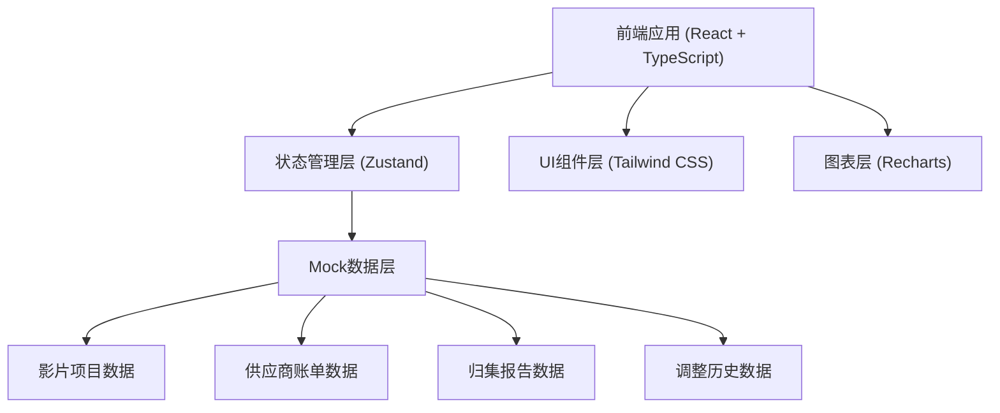
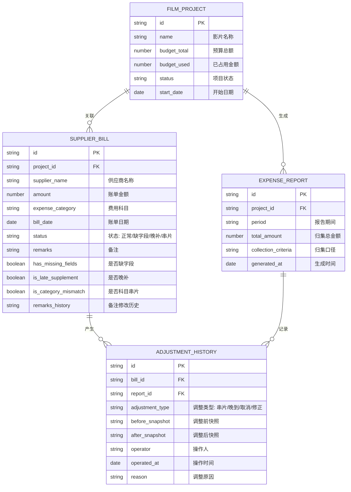

## 1. 架构设计



## 2. 技术选型说明

- **前端框架**：React@18 + TypeScript + Vite
  - 采用函数式组件 + Hooks 开发模式
  - TypeScript 提供类型安全保障
- **状态管理**：Zustand
  - 轻量级状态管理，支持筛选条件全局联动
  - 实现费用归集状态的实时更新
- **样式方案**：Tailwind CSS@3
  - 原子化CSS，快速构建专业财务系统界面
  - 支持深色主题切换
- **图表库**：Recharts
  - React原生图表库，支持平滑过渡动画
  - 柱状图、饼图、折线图覆盖数据可视化需求
- **路由**：React Router v6
  - 单页应用路由管理
  - 支持嵌套路由和参数传递
- **Mock数据**：内置JSON模拟数据
  - 包含缺字段、晚补、备注修改等样例记录
  - 无后端依赖，可独立运行

## 3. 路由定义

| 路由路径 | 页面名称 | 功能说明 |
|----------|----------|----------|
| /dashboard | 归集仪表盘 | 费用概览、筛选、图表、异常告警 |
| /projects | 影片项目管理 | 影片列表、预算追踪 |
| /bills | 供应商账单管理 | 账单列表、详情、字段校验 |
| /reports | 费用归集报告 | 归集结果、口径说明、导出 |
| /history | 调整历史追踪 | 历史记录、修正对比视图 |

## 4. 数据模型

### 4.1 实体关系图



### 4.2 TypeScript 类型定义

```typescript
// 影片项目
interface FilmProject {
  id: string;
  name: string;
  budgetTotal: number;
  budgetUsed: number;
  status: 'active' | 'completed' | 'paused';
  startDate: string;
}

// 供应商账单
interface SupplierBill {
  id: string;
  projectId: string;
  supplierName: string;
  amount: number;
  expenseCategory: string;
  billDate: string;
  status: 'normal' | 'missing_fields' | 'late_supplement' | 'category_mismatch';
  remarks: string;
  hasMissingFields: boolean;
  isLateSupplement: boolean;
  isCategoryMismatch: boolean;
  remarksHistory: RemarksChange[];
}

// 备注修改历史
interface RemarksChange {
  id: string;
  oldValue: string;
  newValue: string;
  operator: string;
  operatedAt: string;
}

// 归集报告
interface ExpenseReport {
  id: string;
  projectId: string;
  period: string;
  totalAmount: number;
  collectionCriteria: string;
  generatedAt: string;
  details: ReportDetail[];
}

// 报告明细
interface ReportDetail {
  category: string;
  amount: number;
  billCount: number;
}

// 调整历史
interface AdjustmentHistory {
  id: string;
  billId?: string;
  reportId?: string;
  adjustmentType: 'category_mismatch' | 'invoice_late' | 'activity_cancelled' | 'manual_correction';
  beforeSnapshot: string;
  afterSnapshot: string;
  operator: string;
  operatedAt: string;
  reason: string;
}

// 筛选条件
interface FilterConditions {
  projectId?: string;
  dateRange?: { start: string; end: string };
  expenseCategory?: string;
  status?: string;
}
```

## 5. 核心功能实现要点

### 5.1 数据联动机制

- 筛选条件存储在全局Store中
- 所有图表和列表组件订阅筛选条件变化
- 使用 useMemo 优化派生数据计算性能

### 5.2 费用归集逻辑

- 非一次性判断，支持动态重新归集
- 预算占用变化触发发票追踪状态更新
- 调整历史自动关联更新

### 5.3 历史留痕机制

- 所有修改操作生成前后快照
- 科目串片记录不被后续操作覆盖
- 支持时间线方式回溯历史

### 5.4 手动修正对比

- 左右分栏展示修正前后数据
- 差异字段高亮显示
- 确认后生成修正历史记录
