## 1. 架构设计

```mermaid
graph TB
    subgraph "前端 React + Tailwind"
        "押金账本页" --> "API 层"
        "入住档案页" --> "API 层"
        "结算中心页" --> "API 层"
        "床位总览页" --> "API 层"
    end
    subgraph "后端 Express + SQLite"
        "API 层" --> "路由层"
        "路由层" --> "服务层"
        "服务层" --> "数据层"
    end
    subgraph "数据存储"
        "数据层" --> "SQLite 数据库"
    end
```

## 2. 技术说明

- 前端：React@18 + TailwindCSS@3 + Vite
- 初始化工具：vite-init
- 后端：Express@4 + TypeScript（ESM）
- 数据库：SQLite（本地文件，无需额外安装）
- 状态管理：Zustand

## 3. 路由定义

| 路由 | 用途 |
|------|------|
| `/` | 重定向至押金账本页 |
| `/deposit` | 押金账本页——总览、流水、状态推进 |
| `/archive` | 入住档案页——列表、详情、新增 |
| `/settlement` | 结算中心页——事件列表、费用试算、结算说明 |
| `/beds` | 床位总览页——床位看板、费用关联 |

后端 API 路由：

| 路由 | 方法 | 用途 |
|------|------|------|
| `/api/residents` | GET | 获取入住档案列表 |
| `/api/residents/:id` | GET | 获取单个档案详情 |
| `/api/residents` | POST | 新增入住档案 |
| `/api/residents/:id` | PUT | 更新档案信息 |
| `/api/deposits` | GET | 获取押金账本列表 |
| `/api/deposits/:id` | GET | 获取单个押金账本详情（含流水） |
| `/api/deposits` | POST | 新增押金记录 |
| `/api/deposits/:id/transactions` | POST | 新增押金流水（收/退/补差） |
| `/api/events` | GET | 获取事件列表（转房/退押/护理变更） |
| `/api/events/:id` | GET | 获取事件详情 |
| `/api/events` | POST | 创建事件 |
| `/api/events/:id/advance` | POST | 推进事件状态 |
| `/api/beds` | GET | 获取床位列表及状态 |
| `/api/beds/:id` | PUT | 更新床位状态 |
| `/api/settlements` | GET | 获取结算说明列表 |
| `/api/settlements/:id` | GET | 获取结算说明详情 |
| `/api/settlements/generate/:eventId` | POST | 根据事件生成结算说明 |
| `/api/settlements/:id/export` | GET | 导出结算说明（JSON） |
| `/api/fee-rates` | GET | 获取费用标准 |

## 4. API 定义

### 核心类型

```typescript
interface Resident {
  id: string;
  name: string;
  gender: '男' | '女';
  birthDate: string;
  idCard: string;
  nursingLevel: '自理' | '半护理' | '全护理' | '特护';
  bedId: string;
  admitDate: string;
  emergencyContact: string;
  emergencyPhone: string;
  status: '在住' | '退住';
  createdAt: string;
  updatedAt: string;
}

interface Deposit {
  id: string;
  residentId: string;
  residentName: string;
  bedLabel: string;
  totalAmount: number;
  currentBalance: number;
  status: '待收' | '已收' | '部分退' | '已退';
  transactions: DepositTransaction[];
  createdAt: string;
  updatedAt: string;
}

interface DepositTransaction {
  id: string;
  depositId: string;
  type: '收取' | '退还' | '补差收取' | '补差退还' | '费用抵扣';
  amount: number;
  reason: string;
  triggerSource: string;
  triggerEventId?: string;
  operatorId: string;
  createdAt: string;
}

interface Bed {
  id: string;
  roomNumber: string;
  bedNumber: string;
  floor: number;
  roomType: '单人间' | '双人间' | '三人间' | '特护间';
  status: '空' | '已住' | '待转出' | '待转入';
  residentId?: string;
  residentName?: string;
  dailyRate: number;
}

interface Event {
  id: string;
  type: '转房补差' | '短住退押' | '护理变更';
  residentId: string;
  residentName: string;
  status: '申请' | '试算' | '待确认' | '已完成';
  triggerSource: string;
  currentStep: string;
  nextStep: string;
  details: EventDetail;
  feeCalculation?: FeeCalculation;
  createdAt: string;
  updatedAt: string;
}

interface EventDetail {
  originalBedId?: string;
  targetBedId?: string;
  originalNursingLevel?: string;
  targetNursingLevel?: string;
  reason: string;
}

interface FeeCalculation {
  items: FeeItem[];
  totalDue: number;
  totalRefund: number;
  netAmount: number;
}

interface FeeItem {
  name: string;
  amount: number;
  calculationBasis: string;
}

interface Settlement {
  id: string;
  eventId: string;
  residentId: string;
  residentName: string;
  type: '转房补差' | '短住退押' | '护理变更';
  depositSnapshot: Deposit;
  feeCalculation: FeeCalculation;
  generatedAt: string;
}

interface FeeRate {
  id: string;
  roomType: string;
  nursingLevel: string;
  dailyRate: number;
  depositAmount: number;
}
```

## 5. 服务端架构图

```mermaid
graph LR
    "Controller" --> "Service"
    "Service" --> "Repository"
    "Repository" --> "SQLite"
```

## 6. 数据模型

### 6.1 数据模型定义

```mermaid
erDiagram
    "residents" ||--o{ "deposits" : "拥有"
    "residents" ||--o{ "events" : "产生"
    "residents" }o--|| "beds" : "入住"
    "deposits" ||--o{ "deposit_transactions" : "包含"
    "events" ||--o| "settlements" : "生成"
    "fee_rates" ||--o{ "beds" : "适用"

    "residents" {
        string id PK
        string name
        string gender
        string birth_date
        string id_card
        string nursing_level
        string bed_id FK
        string admit_date
        string emergency_contact
        string emergency_phone
        string status
        string created_at
        string updated_at
    }

    "deposits" {
        string id PK
        string resident_id FK
        number total_amount
        number current_balance
        string status
        string created_at
        string updated_at
    }

    "deposit_transactions" {
        string id PK
        string deposit_id FK
        string type
        number amount
        string reason
        string trigger_source
        string trigger_event_id FK
        string created_at
    }

    "beds" {
        string id PK
        string room_number
        string bed_number
        number floor
        string room_type
        string status
        string resident_id FK
        number daily_rate
    }

    "events" {
        string id PK
        string type
        string resident_id FK
        string status
        string trigger_source
        string current_step
        string next_step
        string details_json
        string created_at
        string updated_at
    }

    "settlements" {
        string id PK
        string event_id FK
        string resident_id FK
        string type
        string deposit_snapshot_json
        string fee_calculation_json
        string generated_at
    }

    "fee_rates" {
        string id PK
        string room_type
        string nursing_level
        number daily_rate
        number deposit_amount
    }
```



### 6.2 数据定义语言

```sql
CREATE TABLE residents (
  id TEXT PRIMARY KEY,
  name TEXT NOT NULL,
  gender TEXT NOT NULL CHECK(gender IN ('男', '女')),
  birth_date TEXT NOT NULL,
  id_card TEXT NOT NULL UNIQUE,
  nursing_level TEXT NOT NULL CHECK(nursing_level IN ('自理', '半护理', '全护理', '特护')),
  bed_id TEXT,
  admit_date TEXT NOT NULL,
  emergency_contact TEXT NOT NULL,
  emergency_phone TEXT NOT NULL,
  status TEXT NOT NULL DEFAULT '在住' CHECK(status IN ('在住', '退住')),
  created_at TEXT NOT NULL DEFAULT (datetime('now')),
  updated_at TEXT NOT NULL DEFAULT (datetime('now'))
);

CREATE TABLE deposits (
  id TEXT PRIMARY KEY,
  resident_id TEXT NOT NULL REFERENCES residents(id),
  total_amount REAL NOT NULL DEFAULT 0,
  current_balance REAL NOT NULL DEFAULT 0,
  status TEXT NOT NULL DEFAULT '待收' CHECK(status IN ('待收', '已收', '部分退', '已退')),
  created_at TEXT NOT NULL DEFAULT (datetime('now')),
  updated_at TEXT NOT NULL DEFAULT (datetime('now'))
);

CREATE TABLE deposit_transactions (
  id TEXT PRIMARY KEY,
  deposit_id TEXT NOT NULL REFERENCES deposits(id),
  type TEXT NOT NULL CHECK(type IN ('收取', '退还', '补差收取', '补差退还', '费用抵扣')),
  amount REAL NOT NULL,
  reason TEXT NOT NULL,
  trigger_source TEXT NOT NULL,
  trigger_event_id TEXT REFERENCES events(id),
  created_at TEXT NOT NULL DEFAULT (datetime('now'))
);

CREATE TABLE beds (
  id TEXT PRIMARY KEY,
  room_number TEXT NOT NULL,
  bed_number TEXT NOT NULL,
  floor INTEGER NOT NULL,
  room_type TEXT NOT NULL CHECK(room_type IN ('单人间', '双人间', '三人间', '特护间')),
  status TEXT NOT NULL DEFAULT '空' CHECK(status IN ('空', '已住', '待转出', '待转入')),
  resident_id TEXT REFERENCES residents(id),
  daily_rate REAL NOT NULL DEFAULT 0
);

CREATE TABLE events (
  id TEXT PRIMARY KEY,
  type TEXT NOT NULL CHECK(type IN ('转房补差', '短住退押', '护理变更')),
  resident_id TEXT NOT NULL REFERENCES residents(id),
  status TEXT NOT NULL DEFAULT '申请' CHECK(status IN ('申请', '试算', '待确认', '已完成')),
  trigger_source TEXT NOT NULL,
  current_step TEXT NOT NULL,
  next_step TEXT NOT NULL,
  details_json TEXT NOT NULL DEFAULT '{}',
  created_at TEXT NOT NULL DEFAULT (datetime('now')),
  updated_at TEXT NOT NULL DEFAULT (datetime('now'))
);

CREATE TABLE settlements (
  id TEXT PRIMARY KEY,
  event_id TEXT NOT NULL REFERENCES events(id),
  resident_id TEXT NOT NULL REFERENCES residents(id),
  type TEXT NOT NULL CHECK(type IN ('转房补差', '短住退押', '护理变更')),
  deposit_snapshot_json TEXT NOT NULL DEFAULT '{}',
  fee_calculation_json TEXT NOT NULL DEFAULT '{}',
  generated_at TEXT NOT NULL DEFAULT (datetime('now'))
);

CREATE TABLE fee_rates (
  id TEXT PRIMARY KEY,
  room_type TEXT NOT NULL,
  nursing_level TEXT NOT NULL,
  daily_rate REAL NOT NULL,
  deposit_amount REAL NOT NULL
);

CREATE INDEX idx_deposits_resident ON deposits(resident_id);
CREATE INDEX idx_transactions_deposit ON deposit_transactions(deposit_id);
CREATE INDEX idx_beds_room ON beds(room_number, bed_number);
CREATE INDEX idx_events_resident ON events(resident_id);
CREATE INDEX idx_events_status ON events(status);
CREATE INDEX idx_settlements_event ON settlements(event_id);

INSERT INTO fee_rates (id, room_type, nursing_level, daily_rate, deposit_amount) VALUES
  ('fr1', '单人间', '自理', 180, 10000),
  ('fr2', '单人间', '半护理', 220, 12000),
  ('fr3', '单人间', '全护理', 280, 15000),
  ('fr4', '单人间', '特护', 350, 20000),
  ('fr5', '双人间', '自理', 120, 6000),
  ('fr6', '双人间', '半护理', 150, 8000),
  ('fr7', '双人间', '全护理', 200, 10000),
  ('fr8', '双人间', '特护', 260, 14000),
  ('fr9', '三人间', '自理', 90, 4000),
  ('fr10', '三人间', '半护理', 120, 5000),
  ('fr11', '三人间', '全护理', 160, 7000),
  ('fr12', '三人间', '特护', 210, 10000),
  ('fr13', '特护间', '全护理', 320, 18000),
  ('fr14', '特护间', '特护', 420, 25000);

INSERT INTO beds (id, room_number, bed_number, floor, room_type, status, daily_rate) VALUES
  ('b1', '101', 'A', 1, '单人间', '空', 180),
  ('b2', '101', 'B', 1, '单人间', '空', 180),
  ('b3', '102', 'A', 1, '双人间', '空', 120),
  ('b4', '102', 'B', 1, '双人间', '空', 120),
  ('b5', '103', 'A', 1, '双人间', '空', 120),
  ('b6', '103', 'B', 1, '双人间', '空', 120),
  ('b7', '201', 'A', 2, '三人间', '空', 90),
  ('b8', '201', 'B', 2, '三人间', '空', 90),
  ('b9', '201', 'C', 2, '三人间', '空', 90),
  ('b10', '202', 'A', 2, '三人间', '空', 90),
  ('b11', '202', 'B', 2, '三人间', '空', 90),
  ('b12', '202', 'C', 2, '三人间', '空', 90),
  ('b13', '301', 'A', 3, '特护间', '空', 320),
  ('b14', '301', 'B', 3, '特护间', '空', 320),
  ('b15', '302', 'A', 3, '单人间', '空', 220),
  ('b16', '302', 'B', 3, '单人间', '空', 220);

INSERT INTO residents (id, name, gender, birth_date, id_card, nursing_level, bed_id, admit_date, emergency_contact, emergency_phone, status) VALUES
  ('r1', '张秀兰', '女', '1945-03-12', '310101194503120028', '半护理', 'b3', '2025-09-15', '张伟', '13800001111', '在住'),
  ('r2', '李德明', '男', '1940-07-22', '310101194007220015', '自理', 'b5', '2025-11-01', '李芳', '13900002222', '在住'),
  ('r3', '王桂芬', '女', '1938-11-05', '310101193811050043', '全护理', 'b1', '2025-06-20', '王建国', '13700003333', '在住'),
  ('r4', '赵福生', '男', '1942-01-18', '310101194201180017', '特护', 'b13', '2025-04-10', '赵敏', '13600004444', '在住');

INSERT INTO deposits (id, resident_id, total_amount, current_balance, status) VALUES
  ('d1', 'r1', 8000, 8000, '已收'),
  ('d2', 'r2', 6000, 6000, '已收'),
  ('d3', 'r3', 15000, 15000, '已收'),
  ('d4', 'r4', 25000, 25000, '已收');

INSERT INTO deposit_transactions (id, deposit_id, type, amount, reason, trigger_source) VALUES
  ('dt1', 'd1', '收取', 8000, '入住押金', '入住档案 r1'),
  ('dt2', 'd2', '收取', 6000, '入住押金', '入住档案 r2'),
  ('dt3', 'd3', '收取', 15000, '入住押金', '入住档案 r3'),
  ('dt4', 'd4', '收取', 25000, '入住押金', '入住档案 r4');

UPDATE beds SET status = '已住', resident_id = 'r1', daily_rate = 150 WHERE id = 'b3';
UPDATE beds SET status = '已住', resident_id = 'r2', daily_rate = 120 WHERE id = 'b5';
UPDATE beds SET status = '已住', resident_id = 'r3', daily_rate = 280 WHERE id = 'b1';
UPDATE beds SET status = '已住', resident_id = 'r4', daily_rate = 420 WHERE id = 'b13';
```
