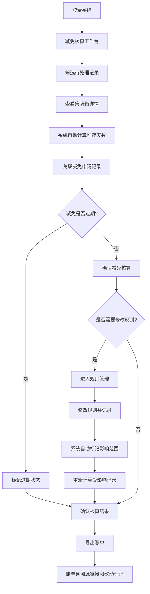

## 1. 产品概述
港口堆存费减免核算系统，解决港口结算员在处理堆存费减免时依赖聊天截图确认争议的问题，实现全流程可追溯的数字化管理。系统面向港口结算员，提供集装箱记录管理、堆存天数自动计算、减免申请审批、证据链追踪、账单导出等完整功能。

核心价值：实现减免核算全流程留痕，避免人工重复录入，支持规则改动影响追溯，提升港口结算效率和准确性。

## 2. 核心功能

### 2.1 用户角色
| 角色 | 注册方式 | 核心权限 |
|------|----------|----------|
| 港口结算员 | 系统分配账号 | 集装箱记录管理、减免申请、确认核算、筛选查询、导出账单、查看证据追踪 |

### 2.2 功能模块
1. **减免核算工作台**：集装箱记录列表、筛选条件、批量操作、状态统计
2. **集装箱详情页**：箱号信息、堆存记录、查验记录、减免申请历史、来源追溯
3. **减免规则管理**：规则列表、规则版本、规则修改历史、影响分析
4. **证据追踪中心**：操作日志、规则变更记录、争议备注留痕、完整审计链
5. **账单导出模块**：生成核算账单、导出Excel/PDF、规则改动标记、数据溯源链接

### 2.3 页面详情
| 页面名称 | 模块名称 | 功能描述 |
|---------|----------|----------|
| 减免核算工作台 | 顶部筛选区 | 按箱号、状态、日期范围、减免类型筛选，支持多条件组合 |
| 减免核算工作台 | 集装箱列表 | 展示箱号、进港时间、出港时间、堆存天数、查验状态、减免状态、操作按钮 |
| 减免核算工作台 | 批量操作区 | 批量确认、批量导出、状态变更 |
| 减免核算工作台 | 统计面板 | 待处理、已确认、减免通过、减免过期的数量统计 |
| 集装箱详情页 | 基本信息卡 | 箱号、箱型、进/出港时间、堆存天数自动计算 |
| 集装箱详情页 | 堆存记录时间线 | 每日堆存明细、查验跨天标记、费用计算过程 |
| 集装箱详情页 | 减免申请区 | 减免类型、减免金额、申请原因、审批状态、申请人 |
| 集装箱详情页 | 证据链面板 | 操作时间线、规则版本、争议备注、关联来源链接 |
| 减免规则管理 | 规则列表 | 规则名称、适用条件、减免比例、生效时间、版本号 |
| 减免规则管理 | 规则编辑 | 修改规则值、记录修改原因、生成新版本 |
| 减免规则管理 | 影响分析 | 展示规则变更对历史记录的影响范围和金额变化 |
| 证据追踪中心 | 操作日志 | 所有操作的完整记录，支持按箱号、操作人、时间筛选 |
| 证据追踪中心 | 规则变更历史 | 规则修改前后对比、修改人、修改时间、影响记录数 |
| 账单导出 | 导出配置 | 选择导出范围、格式、是否包含规则改动标记 |
| 账单导出 | 预览下载 | 在线预览账单、下载文件、包含数据溯源链接 |

## 3. 核心流程
结算员登录系统 → 进入减免核算工作台 → 筛选待处理集装箱 → 查看集装箱详情（自动关联堆存记录和减免申请）→ 确认减免核算（系统自动计算堆存天数和费用）→ 如需修改规则，进入规则管理（系统自动记录变更并标记影响）→ 导出账单（包含规则改动标记和溯源链接）。

## 4. 用户界面设计

### 4.1 设计风格
- **主色调**：深海蓝 (#1E3A5F)，代表港口专业稳重的特质
- **辅助色**：橙色 (#F59E0B) 用于状态警示，绿色 (#10B981) 用于确认通过，红色 (#EF4444) 用于减免过期
- **按钮风格**：圆角8px，微阴影，悬浮时有轻微上浮效果
- **字体**：标题使用 Noto Serif SC，正文使用 Inter，数字使用 JetBrains Mono 等宽字体
- **布局风格**：卡片式布局，左侧导航 + 右侧内容区，数据表格支持固定表头
- **图标风格**：线性图标，配合港口元素（集装箱、船舶、锚链等）装饰

### 4.2 页面设计概述
| 页面名称 | 模块名称 | UI元素 |
|---------|----------|--------|
| 减免核算工作台 | 统计面板 | 渐变背景卡片，数字大号展示，状态色区分，悬浮有数据变化动效 |
| 减免核算工作台 | 数据表格 | 斑马纹行，行悬浮高亮，状态标签带边框和圆角，操作按钮组 |
| 集装箱详情页 | 时间线 | 垂直时间线，节点带图标，查验跨天用特殊橙色标记，可点击展开详情 |
| 集装箱详情页 | 证据链面板 | 侧边抽屉式，操作日志按时间倒序，规则变更用diff对比展示 |
| 减免规则管理 | 影响分析 | 热力图样式展示影响范围，金额变化用红绿箭头标注 |
| 账单导出 | 导出预览 | 仿纸质账单样式，规则改动处用黄色背景高亮，溯源链接可点击 |

### 4.3 响应性
桌面端优先设计，支持1280px以上分辨率。平板端自适应布局，表格可横向滚动。移动端简化展示核心信息，支持基本筛选和查看操作。

### 4.4 动效设计
- 页面加载：内容区淡入 + 卡片错落出现（staggered animation）
- 状态变更：状态标签颜色渐变过渡 + 轻微缩放效果
- 表格筛选：筛选条件展开/收起的平滑过渡动画
- 导出过程：进度条动画 + 完成时的成功动效
- 证据链展开：抽屉从右侧滑入，内容逐项淡入
