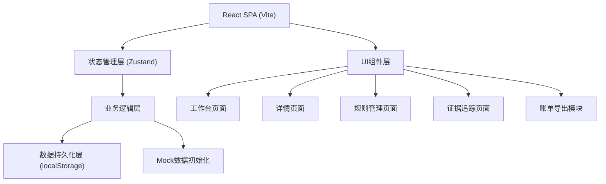
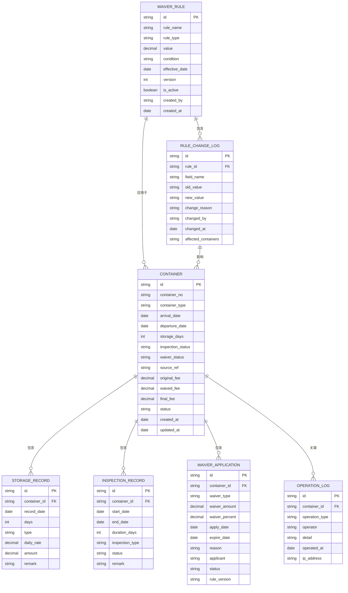

## 1. 架构设计
前端单页应用架构，使用React状态管理全量数据，无需后端服务。数据持久化采用localStorage + 导出备份机制，实现完整的端到端功能。



## 2. 技术描述
- **前端**：React@18 + TypeScript + tailwindcss@3 + vite
- **初始化工具**：vite-init (npm create vite@latest)
- **后端**：无后端，纯前端实现，数据存储在localStorage
- **状态管理**：Zustand (轻量级状态管理)
- **路由**：React Router v6
- **UI组件**：Headless UI + Lucide React Icons
- **表格**：TanStack Table (原React Table)
- **日期处理**：date-fns
- **导出功能**：xlsx (Excel导出) + jspdf (PDF导出)
- **数据**：内置Mock样例数据，包含箱号重复、查验跨天、减免过期等场景

## 3. 路由定义
| 路由 | 用途 |
|------|------|
| / | 减免核算工作台（首页） |
| /container/:id | 集装箱详情页 |
| /rules | 减免规则管理 |
| /audit | 证据追踪中心 |
| /export | 账单导出 |

## 4. 数据模型

### 4.1 数据模型定义



### 4.2 数据结构定义（TypeScript）

```typescript
interface Container {
  id: string;
  containerNo: string;
  containerType: string;
  arrivalDate: Date;
  departureDate: Date;
  storageDays: number;
  inspectionStatus: 'none' | 'pending' | 'in_progress' | 'completed';
  waiverStatus: 'none' | 'applied' | 'approved' | 'rejected' | 'expired';
  sourceRef: string;
  originalFee: number;
  waivedFee: number;
  finalFee: number;
  status: 'pending' | 'confirmed' | 'exported';
  createdAt: Date;
  updatedAt: Date;
  storageRecords: StorageRecord[];
  inspectionRecords: InspectionRecord[];
  waiverApplications: WaiverApplication[];
  operationLogs: OperationLog[];
  affectedByRuleChange?: string;
}

interface StorageRecord {
  id: string;
  containerId: string;
  recordDate: Date;
  days: number;
  type: 'normal' | 'inspection' | 'holiday';
  dailyRate: number;
  amount: number;
  remark?: string;
  isCrossDay?: boolean;
}

interface InspectionRecord {
  id: string;
  containerId: string;
  startDate: Date;
  endDate: Date;
  durationDays: number;
  inspectionType: 'customs' | 'quarantine' | 'security';
  status: 'pending' | 'in_progress' | 'completed';
  remark?: string;
  isCrossDay: boolean;
}

interface WaiverApplication {
  id: string;
  containerId: string;
  waiverType: 'inspection' | 'delay' | 'special' | 'holiday';
  waiverAmount: number;
  waiverPercent: number;
  applyDate: Date;
  expireDate: Date;
  reason: string;
  applicant: string;
  status: 'pending' | 'approved' | 'rejected' | 'expired';
  ruleVersion: string;
  auditTrail: AuditEntry[];
}

interface WaiverRule {
  id: string;
  ruleName: string;
  ruleType: 'percent' | 'fixed' | 'days';
  value: number;
  condition: string;
  effectiveDate: Date;
  version: number;
  isActive: boolean;
  createdBy: string;
  createdAt: Date;
  changeLogs: RuleChangeLog[];
}

interface RuleChangeLog {
  id: string;
  ruleId: string;
  fieldName: string;
  oldValue: string;
  newValue: string;
  changeReason: string;
  changedBy: string;
  changedAt: Date;
  affectedContainerIds: string[];
}

interface OperationLog {
  id: string;
  containerId?: string;
  operationType: 'create' | 'update' | 'confirm' | 'export' | 'rule_change' | 'note';
  operator: string;
  detail: string;
  operatedAt: Date;
  ipAddress: string;
  note?: string;
}

interface AuditEntry {
  timestamp: Date;
  actor: string;
  action: string;
  oldValue?: string;
  newValue?: string;
  remark?: string;
}
```

### 4.3 样例数据设计
样例数据包含以下测试场景：
1. **箱号重复场景**：同一条箱号出现两条记录，一条已确认，一条待处理
2. **查验跨天场景**：查验记录跨越多天，系统正确计算减免天数
3. **减免过期场景**：一条减免申请已过有效期，系统自动标记过期
4. **正常记录场景**：一条完整的正常流程记录，用于对比验证
5. **规则改动场景**：一条记录受规则变更影响，展示改动前后金额对比

## 5. 核心业务逻辑

### 5.1 堆存天数计算
```typescript
function calculateStorageDays(arrival: Date, departure: Date, inspections: InspectionRecord[]): {
  totalDays: number;
  inspectionDays: number;
  billableDays: number;
  records: StorageRecord[];
}
```

### 5.2 减免有效性检查
```typescript
function checkWaiverValidity(application: WaiverApplication, currentDate: Date): {
  isValid: boolean;
  isExpired: boolean;
  daysUntilExpiry: number;
}
```

### 5.3 规则变更影响分析
```typescript
function analyzeRuleImpact(oldRule: WaiverRule, newRule: WaiverRule, containers: Container[]): {
  affectedCount: number;
  totalFeeChange: number;
  affectedContainerIds: string[];
  details: { containerId: string; oldFee: number; newFee: number; change: number }[];
}
```

### 5.4 费用计算
```typescript
function calculateFees(container: Container, rules: WaiverRule[]): {
  originalFee: number;
  waivedFee: number;
  finalFee: number;
  calculationBreakdown: CalculationItem[];
}
```

## 6. 状态管理设计

```typescript
interface AppState {
  containers: Container[];
  rules: WaiverRule[];
  operationLogs: OperationLog[];
  filters: {
    containerNo?: string;
    status?: string;
    dateFrom?: Date;
    dateTo?: Date;
    waiverStatus?: string;
  };
  selectedContainerId?: string;
  notifications: Notification[];
  
  // Actions
  loadData: () => void;
  saveData: () => void;
  updateFilters: (filters: Partial<AppState['filters']>) => void;
  selectContainer: (id: string | undefined) => void;
  confirmContainer: (id: string, operator: string, note?: string) => void;
  updateRule: (ruleId: string, updates: Partial<WaiverRule>, reason: string, operator: string) => void;
  exportBills: (containerIds: string[], options: ExportOptions) => Blob;
  addNote: (containerId: string, note: string, operator: string) => void;
}
```
