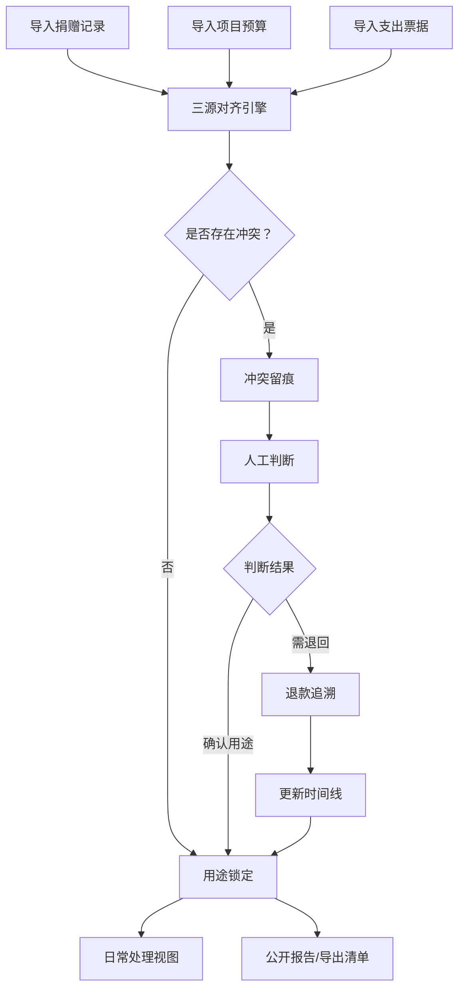
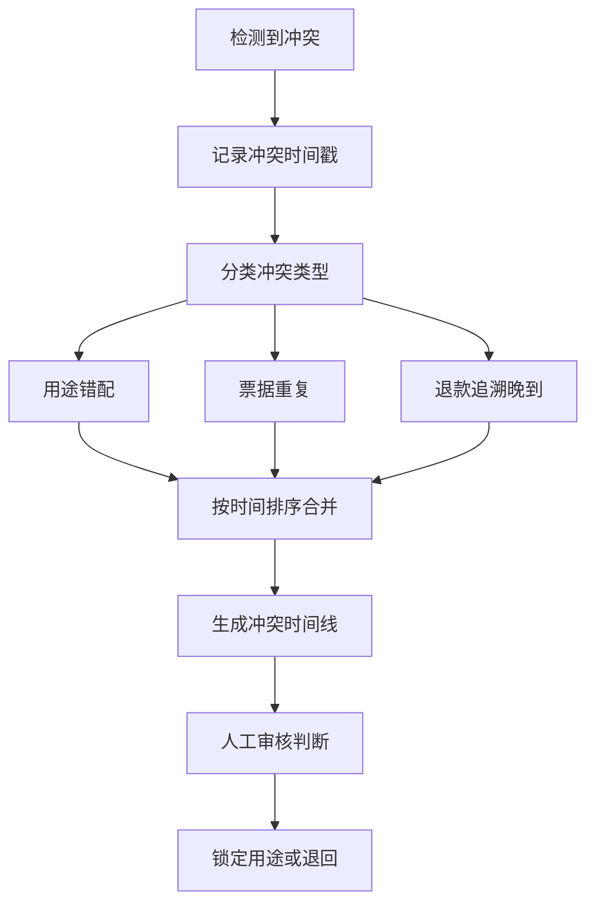

## 1. 产品概述

公益捐赠指定用途账管理系统，面向基金会财务人员，解决捐赠记录、项目预算、支出票据三源对账时信息不一致、票据晚到、用途错配等核心痛点。系统让同事自主导入样例数据、查看票据图片、点开明细、导出结果，从捐赠记录到导出清单形成完整可追溯链路，不再依赖后台变量支撑。

- 目标用户：基金会财务人员、项目负责人
- 核心价值：三源对账透明化、用途锁定可追溯、日常处理与事后复盘口径一致

## 2. 核心功能

### 2.1 用户角色

| 角色 | 注册方式 | 核心权限 |
|------|----------|----------|
| 财务人员 | 内部账号 | 导入数据、用途锁定、导出清单、查看公开报告 |
| 项目负责人 | 内部账号 | 查看项目预算、票据明细、用途冲突记录 |

### 2.2 功能模块

1. **总览页面**：捐赠记录总览、三源对齐状态、冲突告警、快捷操作入口
2. **捐赠记录页**：导入捐赠样例、查看记录详情、关联预算与票据
3. **项目预算页**：预算明细、用途匹配状态、冲突标记
4. **支出票据页**：票据图片查看、导入票据、票据与记录关联
5. **用途锁定页**：锁定用途、冲突留痕、时间线排序、日常处理视图
6. **公开报告页**：事后复盘报告、导出清单、口径一致性校验

### 2.3 页面详情

| 页面名称 | 模块名称 | 功能描述 |
|----------|----------|----------|
| 总览页面 | 三源对齐仪表盘 | 展示捐赠记录/预算/票据的对齐状态，冲突数量统计，快捷跳转 |
| 总览页面 | 冲突告警条 | 实时显示用途错配、票据重复、退款追溯晚到等冲突，按时间排序 |
| 捐赠记录页 | 记录列表 | 展示所有捐赠记录，支持搜索筛选，标记关联状态 |
| 捐赠记录页 | 样例导入 | 用户自主导入CSV/Excel样例数据，自动解析字段映射 |
| 捐赠记录页 | 记录详情面板 | 点击记录展开明细，显示关联预算和票据，冲突高亮 |
| 项目预算页 | 预算列表 | 按项目分组展示预算，用途匹配进度条 |
| 项目预算页 | 冲突标记 | 用途不匹配的预算行标红，支持点击查看差异 |
| 支出票据页 | 票据卡片网格 | 以卡片形式展示票据缩略图，支持点击放大查看原图 |
| 支出票据页 | 票据导入 | 拖拽上传票据图片/PDF，自动OCR提取关键信息 |
| 支出票据页 | 关联匹配 | 票据自动关联到捐赠记录，未关联票据醒目提示 |
| 用途锁定页 | 锁定操作区 | 对确认用途的记录执行锁定，锁定后不可随意修改 |
| 用途锁定页 | 冲突留痕时间线 | 用途错配+票据重复+退款追溯的事件时间线，按发生顺序排列 |
| 用途锁定页 | 日常处理视图 | 简洁视图，仅显示待处理事项和快捷锁定按钮 |
| 公开报告页 | 报告生成器 | 一键生成指定用途账报告，与日常锁定口径一致 |
| 公开报告页 | 导出清单 | 导出CSV/Excel清单，包含完整链路信息 |
| 公开报告页 | 口径校验 | 对比日常锁定数据与导出数据，确保一致性 |

## 3. 核心流程

### 3.1 三源导入与对齐流程

用户分别导入捐赠记录、项目预算、支出票据，系统自动对齐三源数据，发现冲突时留痕并等待判断。

### 3.2 冲突处理流程

当用途错配、票据重复、退款追溯晚到同时出现时，系统按时间顺序排列事件，确保结果可追溯。

### 3.3 捐赠记录到导出清单完整链路

## 4. 用户界面设计

### 4.1 设计风格

- 主色调：深青色(#0F766E)代表信任与稳重，搭配琥珀色(#D97706)作为告警强调色
- 辅助色：石板灰(#334155)用于文字，翡翠绿(#059669)用于确认状态
- 按钮风格：圆角(8px)，主按钮实色填充，次按钮描边，危险操作红色
- 字体：标题用 Noto Serif SC（衬线体，传递权威感），正文用 Noto Sans SC
- 布局风格：左侧固定导航栏 + 右侧内容区，卡片式布局，数据表格紧凑
- 图标风格：线性图标（lucide-react），统一2px描边
- 冲突标记：红色脉冲动画边框 + 琥珀色背景条纹

### 4.2 页面设计概览

| 页面名称 | 模块名称 | UI元素 |
|----------|----------|--------|
| 总览页面 | 三源对齐仪表盘 | 三个环形进度条（捐赠/预算/票据），中心数字统计，深青色渐变背景 |
| 总览页面 | 冲突告警条 | 水平滚动告警条，红色脉冲图标，琥珀色背景，点击跳转 |
| 捐赠记录页 | 记录列表 | 条纹交替表格，行悬停高亮，关联状态色块，右侧操作按钮组 |
| 捐赠记录页 | 样例导入 | 虚线拖拽区域，上传进度条，字段映射预览表格，确认按钮 |
| 捐赠记录页 | 记录详情面板 | 右侧滑出面板，分段显示（基本信息/关联预算/关联票据），冲突区红色背景 |
| 项目预算页 | 预算列表 | 按项目分组的折叠面板，进度条显示匹配率，冲突行左侧红色竖线标记 |
| 支出票据页 | 票据卡片网格 | 3列卡片网格，票据缩略图+金额+日期，悬停放大效果，未关联红色角标 |
| 支出票据页 | 票据导入 | 拖拽上传区，支持多文件，缩略图预览队列，OCR结果编辑框 |
| 用途锁定页 | 锁定操作区 | 表格+批量操作栏，锁定按钮（钥匙图标），批量选择复选框 |
| 用途锁定页 | 冲突留痕时间线 | 垂直时间线，事件节点按类型着色（错配红/重复琥珀/退款灰），时间戳标注 |
| 用途锁定页 | 日常处理视图 | 紧凑卡片列表，仅显示待处理项，快捷锁定按钮，完成项折叠 |
| 公开报告页 | 报告生成器 | 报告预览区，日期范围选择器，生成按钮，PDF预览 |
| 公开报告页 | 导出清单 | 导出按钮组（CSV/Excel），清单预览表格，链路完整性指示器 |
| 公开报告页 | 口径校验 | 双列对比视图（日常锁定 vs 导出数据），差异高亮，校验通过/失败徽章 |

### 4.3 响应式设计

- 桌面优先设计，最小宽度1280px
- 平板端（768-1280px）：侧边栏收起为图标模式，表格列精简
- 移动端（<768px）：底部标签导航，卡片单列，表格转卡片列表

### 4.4 无障碍

- 所有交互元素支持键盘导航
- 冲突告警同时使用颜色和图标双重标识
- 票据图片提供alt文字描述
- 表单验证错误使用aria-live区域播报
