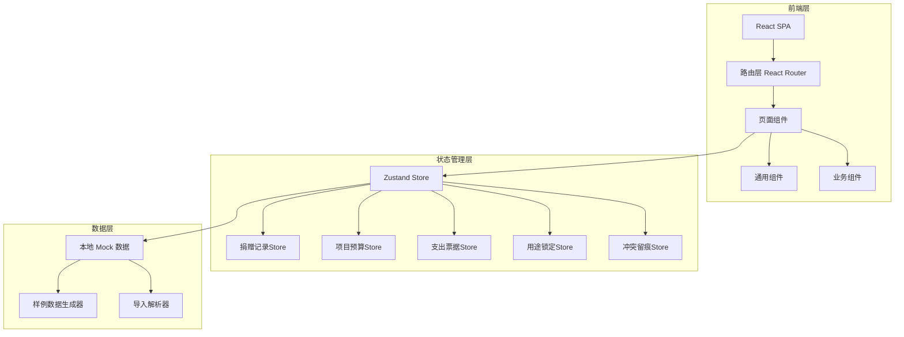
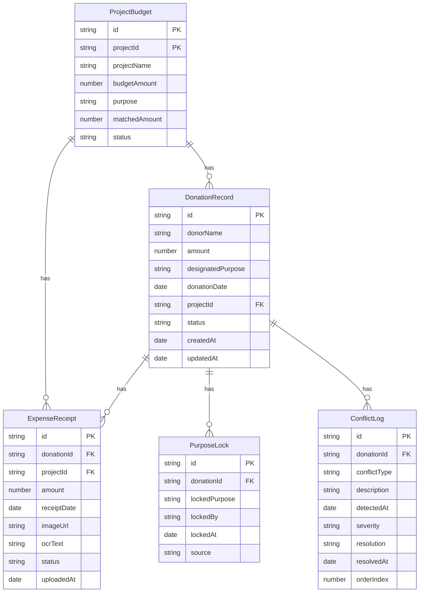

## 1. 架构设计

## 2. 技术说明

- 前端：React@18 + TypeScript + Tailwind CSS@3 + Vite
- 初始化工具：vite-init（react-ts 模板）
- 状态管理：Zustand
- 后端：无（纯前端，数据存储在 Zustand + localStorage）
- 数据库：无（使用 Mock 数据，支持用户导入覆盖）

## 3. 路由定义

| 路由 | 用途 |
|------|------|
| / | 总览页面，三源对齐仪表盘与冲突告警 |
| /donations | 捐赠记录页，导入样例、查看记录详情 |
| /budgets | 项目预算页，预算明细与用途匹配 |
| /receipts | 支出票据页，票据图片查看与导入 |
| /lock | 用途锁定页，锁定操作与冲突留痕时间线 |
| /report | 公开报告页，报告生成与导出清单 |

## 4. API 定义

本系统为纯前端应用，无后端 API。数据通过以下方式管理：

- **导入接口**：前端解析 CSV/Excel 文件，使用 PapaParse 解析 CSV，SheetJS 解析 Excel
- **图片查看**：使用 FileReader API 读取本地图片，支持放大查看
- **数据持久化**：Zustand persist 中间件 + localStorage
- **导出接口**：使用 SheetJS 生成 Excel，纯前端导出

## 5. 数据模型

### 5.1 数据模型定义

### 5.2 数据定义

**DonationRecord（捐赠记录）**

| 字段 | 类型 | 说明 |
|------|------|------|
| id | string | 唯一标识，格式 DR-YYYYMMDD-NNN |
| donorName | string | 捐赠人/单位名称 |
| amount | number | 捐赠金额 |
| designatedPurpose | string | 指定用途 |
| donationDate | date | 捐赠日期 |
| projectId | string | 关联项目ID |
| status | string | 状态：pending/locked/conflicted |
| createdAt | date | 创建时间 |
| updatedAt | date | 更新时间 |

**ProjectBudget（项目预算）**

| 字段 | 类型 | 说明 |
|------|------|------|
| id | string | 唯一标识，格式 PB-NNN |
| projectId | string | 项目ID |
| projectName | string | 项目名称 |
| budgetAmount | number | 预算金额 |
| purpose | string | 用途描述 |
| matchedAmount | number | 已匹配金额 |
| status | string | 状态：matched/partial/conflicted |

**ExpenseReceipt（支出票据）**

| 字段 | 类型 | 说明 |
|------|------|------|
| id | string | 唯一标识，格式 ER-NNN |
| donationId | string | 关联捐赠记录ID |
| projectId | string | 关联项目ID |
| amount | number | 票据金额 |
| receiptDate | date | 票据日期 |
| imageUrl | string | 图片URL（base64或blob） |
| ocrText | string | OCR提取文本 |
| status | string | 状态：linked/unlinked/duplicate |
| uploadedAt | date | 上传时间 |

**PurposeLock（用途锁定）**

| 字段 | 类型 | 说明 |
|------|------|------|
| id | string | 唯一标识 |
| donationId | string | 关联捐赠记录ID |
| lockedPurpose | string | 锁定用途 |
| lockedBy | string | 锁定操作人 |
| lockedAt | date | 锁定时间 |
| source | string | 来源：donation/budget/manual |

**ConflictLog（冲突留痕）**

| 字段 | 类型 | 说明 |
|------|------|------|
| id | string | 唯一标识 |
| donationId | string | 关联捐赠记录ID |
| conflictType | string | 冲突类型：purpose_mismatch/receipt_duplicate/refund_delayed |
| description | string | 冲突描述 |
| detectedAt | date | 检测时间 |
| severity | string | 严重程度：high/medium/low |
| resolution | string | 处理结果 |
| resolvedAt | date | 处理时间 |
| orderIndex | number | 排序序号（保证先后顺序） |

## 6. 关键技术决策

### 6.1 三源对齐策略

捐赠记录作为主信息源，项目预算和支出票据作为补充证据。对齐规则：
1. 按 projectId 关联捐赠记录和项目预算
2. 按 donationId 关联捐赠记录和支出票据
3. 三源数据差异时，以捐赠记录为准，但必须留痕

### 6.2 冲突检测与排序

- 用途错配：捐赠记录的 designatedPurpose 与项目预算的 purpose 不一致
- 票据重复：同一 donationId 下出现金额和日期相同的票据
- 退款追溯晚到：票据的 receiptDate 晚于捐赠记录的 donationDate 超过30天
- 多种冲突同时出现时，按 detectedAt 时间排序，orderIndex 递增

### 6.3 口径一致性

- 用途锁定数据直接作为公开报告和导出清单的数据源
- 导出前执行口径校验：对比锁定记录与导出字段，差异项高亮
- 任何锁定操作变更，同步触发报告数据更新标记

### 6.4 链路完整性

从捐赠记录到导出清单的完整链路不依赖后台变量，而是通过以下前端机制保证：
1. 每条捐赠记录携带关联ID链（projectId → budgetId → receiptIds → lockId）
2. 冲突日志与记录双向引用
3. 导出清单包含完整链路字段，可直接追溯
