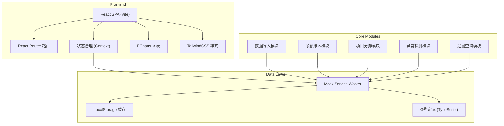
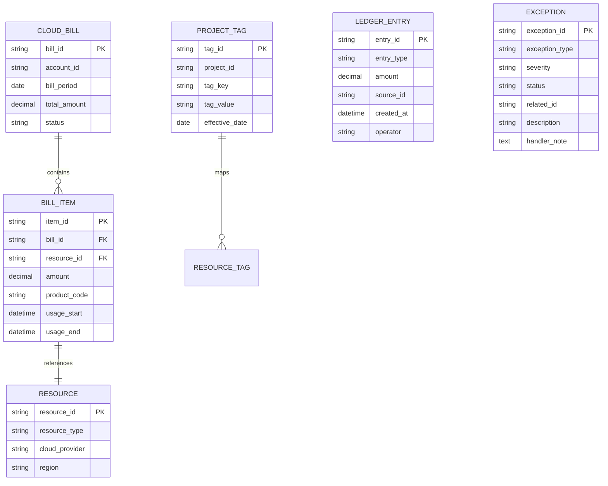

## 1. 架构设计



## 2. 技术栈说明

- **前端框架**: React 18 + TypeScript 5
- **构建工具**: Vite 5
- **路由管理**: React Router Dom 6
- **样式方案**: TailwindCSS 3
- **图表库**: ECharts 5
- **UI组件**: 自定义组件 + Lucide React 图标
- **数据Mock**: MSW + 静态JSON
- **状态管理**: React Context + useReducer

## 3. 路由定义

| 路由路径 | 页面名称 | 说明 |
|----------|----------|------|
| / | 概览页 | 系统概览、核心指标卡片、快捷入口 |
| /import | 数据导入中心 | 云账单、项目标签、消耗报告导入 |
| /ledger | 余额账本 | 充值、消耗、退款流水与余额管理 |
| /allocation | 项目分摊 | 成本分摊明细与规则调整 |
| /exceptions | 异常复核 | 三类异常检测与处理工作台 |
| /analysis | 消耗分析 | 多维筛选、图表与明细联动 |
| /trace | 追溯查询 | 双向追溯链路可视化 |

## 4. 数据模型

### 4.1 ER图



### 4.2 核心数据类型

```typescript
// 云账单
interface CloudBill {
  billId: string;
  accountId: string;
  accountName: string;
  billPeriod: string;
  totalAmount: number;
  items: BillItem[];
  status: 'imported' | 'validated' | 'processed';
  importTime: string;
}

// 账单明细
interface BillItem {
  itemId: string;
  billId: string;
  resourceId: string;
  resourceName: string;
  productCode: string;
  productName: string;
  amount: number;
  usageAmount: number;
  usageUnit: string;
  tags: Record<string, string>;
  usageStart: string;
  usageEnd: string;
}

// 项目标签
interface ProjectTag {
  tagId: string;
  projectId: string;
  projectName: string;
  tagKey: string;
  tagValue: string;
  effectiveDate: string;
  expireDate?: string;
}

// 账本流水
interface LedgerEntry {
  entryId: string;
  entryType: 'recharge' | 'consume' | 'refund';
  amount: number;
  balanceAfter: number;
  sourceType: string;
  sourceId: string;
  sourceDesc: string;
  createdAt: string;
  operator: string;
}

// 异常记录
interface ExceptionRecord {
  exceptionId: string;
  exceptionType: 'missing_tag' | 'cross_project' | 'refund_occupied';
  severity: 'high' | 'medium' | 'low';
  status: 'pending' | 'processing' | 'resolved' | 'ignored';
  relatedBillId?: string;
  relatedItemId?: string;
  relatedResourceId?: string;
  description: string;
  suggestion: string;
  handlerNote?: string;
  createdAt: string;
  handledAt?: string;
  handledBy?: string;
}

// 项目分摊结果
interface AllocationResult {
  projectId: string;
  projectName: string;
  totalAmount: number;
  billPeriod: string;
  items: AllocationItem[];
}

interface AllocationItem {
  itemId: string;
  resourceId: string;
  resourceName: string;
  amount: number;
  tags: Record<string, string>;
  allocationRule: 'tag_match' | 'manual' | 'proportion';
}
```

## 5. 核心模块设计

### 5.1 异常检测模块

```typescript
// 标签缺失检测
const detectMissingTags = (billItems: BillItem[], requiredTags: string[]): ExceptionRecord[] => {
  return billItems
    .filter(item => !requiredTags.every(tag => item.tags?.[tag]))
    .map(item => ({
      exceptionId: generateId(),
      exceptionType: 'missing_tag',
      severity: 'medium',
      status: 'pending',
      relatedItemId: item.itemId,
      relatedResourceId: item.resourceId,
      description: `资源 ${item.resourceName} 缺少必要标签: ${requiredTags.filter(t => !item.tags?.[t]).join(', ')}`,
      suggestion: '请在云控制台为该资源补充项目标签，或手动指定分摊项目',
      createdAt: new Date().toISOString()
    }));
};

// 资源串项目检测
const detectCrossProject = (billItems: BillItem[], projectTags: ProjectTag[]): ExceptionRecord[] => {
  // 检测同一资源在不同账单周期归属不同项目
};

// 退款占用检测
const detectRefundOccupied = (ledgerEntries: LedgerEntry[]): ExceptionRecord[] => {
  // 检测退款是否正确抵扣对应项目预算
};
```

### 5.2 双向追溯模块

```typescript
interface TraceNode {
  id: string;
  type: 'bill' | 'item' | 'allocation' | 'ledger' | 'recharge';
  title: string;
  amount: number;
  date: string;
  children?: TraceNode[];
}

// 正向追溯：账单 -> 分摊 -> 账本
const traceForward = (billId: string): TraceNode => { ... };

// 反向追溯：账本 -> 分摊 -> 账单 -> 充值
const traceBackward = (entryId: string): TraceNode => { ... };
```
