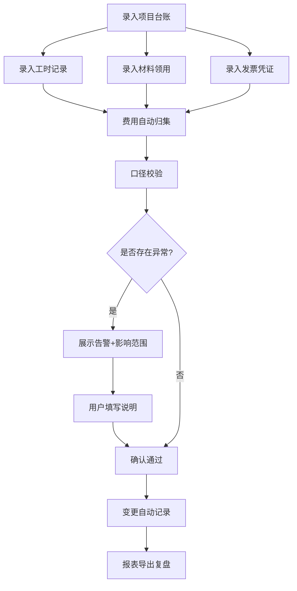

## 1. 产品概述

研发费用加计归集系统——帮助财税专员将项目台账、工时记录、材料领用、发票凭证等多源数据统一归集到费用线上，解决工时与发票互相打架的问题。核心能力：数据刷新不丢失、变更链路可追踪、异常口径有拦截、归集报表可导出。

- 目标用户：企业财税专员、研发费用管理人员
- 核心价值：把"费用归集这条线"稳定下来，改过什么、谁影响了谁要看得见，项目串账/工时补录/发票缺项不能一路绿灯通过

## 2. 核心功能

### 2.1 用户角色

| 角色 | 使用方式 | 核心权限 |
|------|----------|----------|
| 财税专员 | 直接使用 | 录入数据、查看归集、处理校验、导出报表 |

### 2.2 功能模块

1. **费用归集页**：项目维度费用汇总、数据源录入（项目台账/工时/材料/发票）、校验告警内联显示
2. **变更追踪页**：变更日志、影响链路分析、版本回溯
3. **报表导出页**：归集汇总报表、口径校验报告、Excel导出

### 2.3 页面详情

| 页面 | 模块 | 功能说明 |
|------|------|----------|
| 费用归集页 | 项目费用汇总 | 按项目展示人工费/材料费/其他费用汇总，支持展开查看明细来源 |
| 费用归集页 | 数据源录入 | 分别录入项目台账、工时记录、材料领用、发票凭证，每条数据记录来源和版本号 |
| 费用归集页 | 口径校验告警 | 对项目串账、工时补录、发票缺项进行校验，内联展示告警及影响范围 |
| 变更追踪页 | 变更日志 | 按时间线展示所有数据变更，标注变更类型、影响项目、影响归集条目数 |
| 变更追踪页 | 影响链路 | 点击任意变更可查看完整影响链：源头数据→受影响归集条目→受影响报表项目 |
| 变更追踪页 | 版本快照 | 每次数据变更自动保存快照，可对比任意两个版本的差异 |
| 报表导出页 | 归集汇总报表 | 按项目/费用类别展示汇总，附带口径说明 |
| 报表导出页 | 校验报告 | 汇总所有校验异常项，按严重程度排序 |
| 报表导出页 | Excel导出 | 一键导出归集明细和校验报告为Excel文件 |

## 3. 核心流程

用户首先录入项目台账建立项目基础信息，然后逐项录入工时记录、材料领用和发票凭证。系统自动将数据归集到对应项目费用线上，同时触发口径校验。校验发现的异常（项目串账、工时补录、发票缺项）以告警形式展示，用户必须填写说明才能确认通过。所有变更自动记录到变更追踪，形成完整的"谁改了什么→影响了谁"链路。最终通过报表导出进行复盘。

## 4. 用户界面设计

### 4.1 设计风格

- 主色调：深青灰（#1a2332）+ 金琥珀色强调（#d4a853），传达专业沉稳的财税调性
- 辅助色：校验异常用珊瑚红（#e8635a）、通过用苔绿（#4caf82）、中性灰（#8b95a5）
- 按钮风格：微圆角（4px），扁平化+悬停阴影
- 字体：思源黑体/Noto Sans SC 作为主字体，数字用 JetBrains Mono 等宽显示
- 布局：左侧固定导航 + 右侧内容区，表格为主的信息密度布局
- 图标：线性图标风格，简洁统一

### 4.2 页面设计概览

| 页面 | 模块 | UI元素 |
|------|------|--------|
| 费用归集页 | 项目费用汇总 | 表格+汇总卡片，项目行可展开查看明细来源标签 |
| 费用归集页 | 数据源录入 | Tab切换四种数据源，表单录入+表格列表，来源标签+版本号列 |
| 费用归集页 | 口径校验告警 | 内联告警条，红/黄标签标注异常类型，展开显示影响条目列表 |
| 变更追踪页 | 变更日志 | 时间线布局，每条变更卡片显示：时间、操作人、变更类型、影响条目数 |
| 变更追踪页 | 影响链路 | 树状连线图，从源头数据连到受影响归集条目 |
| 变更追踪页 | 版本快照 | 左右双栏对比，差异高亮 |
| 报表导出页 | 归集汇总报表 | 交叉表格，行=项目，列=费用类别，单元格可点击追溯来源 |
| 报表导出页 | 校验报告 | 分组列表，按严重程度着色 |
| 报表导出页 | Excel导出 | 导出按钮+格式选择，生成后自动下载 |

### 4.3 响应式设计

- 桌面端优先（1280px+），信息密度高
- 平板端（768-1280px）侧边栏折叠为图标模式
- 移动端暂不作为主要适配目标

### 4.4 3D场景

不适用
