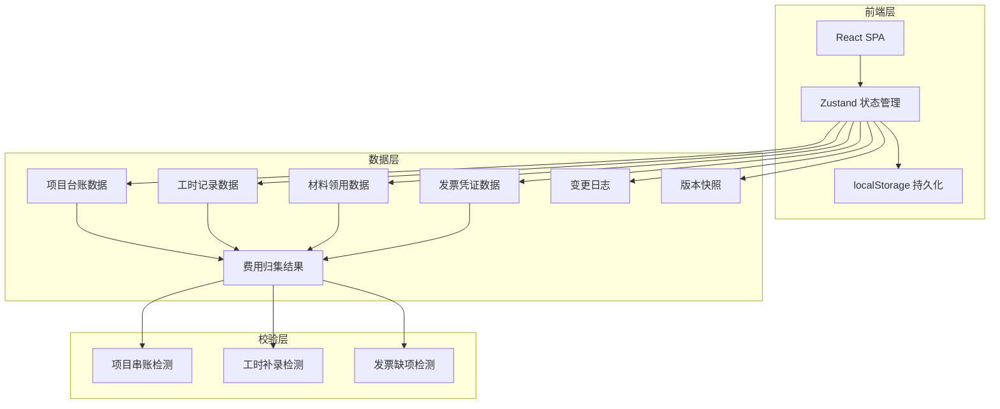
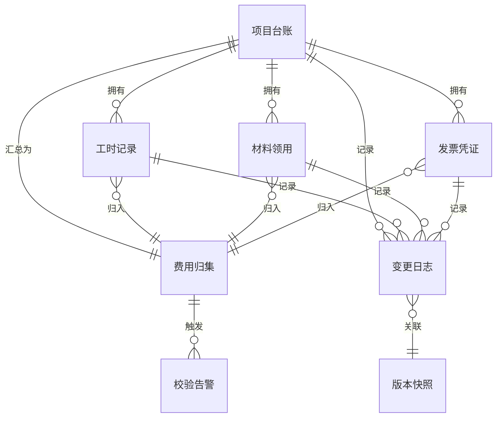

## 1. 架构设计



## 2. 技术说明

- 前端：React@18 + TypeScript + Tailwind CSS@3 + Vite
- 初始化工具：Vite (create-vite)
- 后端：无（纯前端，数据持久化到 localStorage）
- 数据库：localStorage + zustand/middleware persist，数据结构化存储

## 3. 路由定义

| 路由 | 用途 |
|------|------|
| / | 费用归集页 - 项目费用汇总、数据源录入、校验告警 |
| /tracking | 变更追踪页 - 变更日志、影响链路、版本快照 |
| /report | 报表导出页 - 归集汇总、校验报告、Excel导出 |

## 4. API定义

无后端API。所有数据操作通过 Zustand Store 完成，数据持久化到 localStorage。

### 核心 Store 接口

```typescript
interface ProjectLedger {
  id: string
  name: string
  code: string
  startDate: string
  endDate: string
  budget: number
  status: 'active' | 'closed'
  source: string
  version: number
}

interface TimeRecord {
  id: string
  projectId: string
  employeeName: string
  hours: number
  hourlyRate: number
  date: string
  isRetroactive: boolean
  retroactiveReason: string
  source: string
  version: number
}

interface MaterialRequisition {
  id: string
  projectId: string
  materialName: string
  quantity: number
  unitPrice: number
  requisitionDate: string
  source: string
  version: number
}

interface InvoiceVoucher {
  id: string
  projectId: string
  invoiceNumber: string
  amount: number
  category: string
  invoiceDate: string
  isMissing: boolean
  missingReason: string
  source: string
  version: number
}

interface ExpenseAggregation {
  projectId: string
  laborCost: number
  materialCost: number
  otherCost: number
  totalCost: number
  laborSources: { id: string; type: string; amount: number }[]
  materialSources: { id: string; type: string; amount: number }[]
  otherSources: { id: string; type: string; amount: number }[]
}

interface ValidationAlert {
  id: string
  type: 'cross_project' | 'retroactive_entry' | 'missing_invoice'
  severity: 'error' | 'warning'
  sourceId: string
  sourceType: string
  message: string
  affectedAggregationIds: string[]
  explanation: string
  resolved: boolean
}

interface ChangeLogEntry {
  id: string
  timestamp: string
  operation: 'create' | 'update' | 'delete'
  entityType: string
  entityId: string
  entityName: string
  previousValue: Record<string, unknown> | null
  newValue: Record<string, unknown> | null
  affectedAggregationIds: string[]
  snapshotId: string
}

interface VersionSnapshot {
  id: string
  timestamp: string
  trigger: string
  aggregations: ExpenseAggregation[]
  dataHash: string
}
```

## 5. 服务端架构

不适用（纯前端应用）

## 6. 数据模型

### 6.1 数据模型关系



### 6.2 数据存储结构

localStorage 以 Zustand persist middleware 存储，key 为 `rd-expense-store`，包含：

- `projects`: ProjectLedger[]
- `timeRecords`: TimeRecord[]
- `materials`: MaterialRequisition[]
- `invoices`: InvoiceVoucher[]
- `aggregations`: ExpenseAggregation[]
- `alerts`: ValidationAlert[]
- `changelog`: ChangeLogEntry[]
- `snapshots`: VersionSnapshot[]
