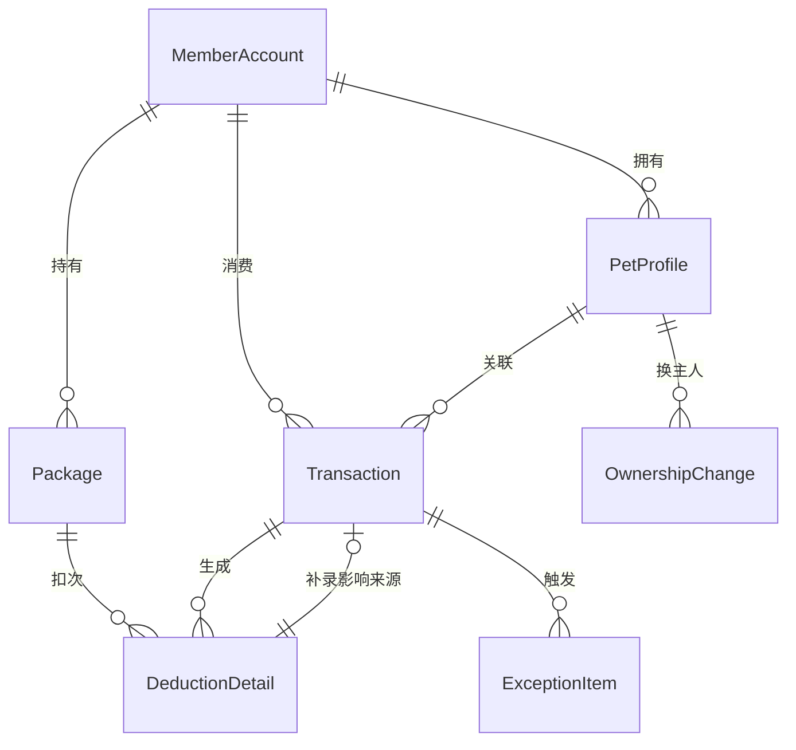

## 1. 架构设计

```mermaid
graph TB
    subgraph "前端层"
        "React SPA" --> "Zustand状态管理"
        "React SPA" --> "React Router"
        "React SPA" --> "Recharts图表"
        "React SPA" --> "Tailwind CSS"
    end
    subgraph "后端层"
        "Express API" --> "业务逻辑服务"
        "业务逻辑服务" --> "数据校验"
        "业务逻辑服务" --> "异常检测引擎"
        "业务逻辑服务" --> "补录影响追踪"
        "业务逻辑服务" --> "退款试算引擎"
    end
    subgraph "数据层"
        "SQLite数据库" --> "会员账户表"
        "SQLite数据库" --> "宠物档案表"
        "SQLite数据库" --> "消费流水表"
        "SQLite数据库" --> "扣次明细表"
        "SQLite数据库" --> "异常清单表"
        "SQLite数据库" --> "操作日志表"
    end
    "React SPA" -->|"HTTP/JSON"| "Express API"
    "Express API" -->|"SQL"| "SQLite数据库"
```

## 2. 技术说明

- 前端：React@18 + Tailwind CSS@3 + Vite + Zustand + React Router + Recharts
- 初始化工具：vite-init
- 后端：Express@4 + TypeScript (ESM)
- 数据库：SQLite (better-sqlite3)，Mock数据初始化
- 图表：Recharts
- 图标：lucide-react

## 3. 路由定义

| 路由 | 用途 |
|------|------|
| / | 会员预存总览页，余额概览、筛选联动图表和明细 |
| /accounts | 会员账户与宠物档案管理，换主人追踪 |
| /transactions | 消费流水与扣次明细，补录影响标记 |
| /exceptions | 待确认与异常清单，异常处理 |
| /refund | 退款试算与导出 |

## 4. API定义

### 4.1 会员账户 API

```typescript
interface MemberAccount {
  id: string
  name: string
  phone: string
  balance: number
  status: "active" | "frozen" | "closed"
  createdAt: string
  updatedAt: string
}

interface CreateMemberRequest {
  name: string
  phone: string
  initialBalance: number
}

// GET /api/members - 获取会员列表（支持筛选）
// POST /api/members - 创建会员
// GET /api/members/:id - 获取会员详情
// PUT /api/members/:id - 更新会员信息
```

### 4.2 宠物档案 API

```typescript
interface PetProfile {
  id: string
  name: string
  species: string
  breed: string
  currentOwnerId: string
  createdAt: string
}

interface OwnershipChange {
  id: string
  petId: string
  previousOwnerId: string
  newOwnerId: string
  reason: string
  status: "pending" | "confirmed" | "rejected"
  confirmedBy: string | null
  confirmedAt: string | null
  createdAt: string
}

// GET /api/pets - 获取宠物列表
// POST /api/pets - 创建宠物档案
// POST /api/pets/:id/ownership-change - 发起换主人
// PUT /api/ownership-changes/:id - 审批换主人
```

### 4.3 消费流水与扣次 API

```typescript
interface Transaction {
  id: string
  memberId: string
  petId: string
  packageId: string | null
  amount: number
  type: "consumption" | "recharge" | "refund"
  isBackfilled: boolean
  backfillNote: string | null
  backfilledAt: string | null
  affectedDetailIds: string[]
  createdAt: string
}

interface DeductionDetail {
  id: string
  transactionId: string
  packageId: string
  deductionCount: number
  remainingCount: number
  status: "normal" | "duplicate" | "expired" | "manual_override"
  originalStatus: string | null
  manualOverrideBy: string | null
  manualOverrideAt: string | null
  manualOverrideReason: string | null
  backfillAffected: boolean
  backfillSourceTransactionId: string | null
  createdAt: string
}

// GET /api/transactions - 获取流水列表（支持筛选）
// POST /api/transactions - 录入消费流水
// POST /api/transactions/backfill - 补录历史流水
// GET /api/deduction-details - 获取扣次明细
// PUT /api/deduction-details/:id/status - 人工修改扣次状态
```

### 4.4 套餐 API

```typescript
interface Package {
  id: string
  name: string
  totalDeductions: number
  usedDeductions: number
  remainingDeductions: number
  price: number
  expiresAt: string
  status: "active" | "expired" | "exhausted"
  memberId: string
}

// GET /api/packages - 获取套餐列表
// GET /api/packages/stats - 套餐统计（图表数据）
```

### 4.5 异常清单 API

```typescript
interface ExceptionItem {
  id: string
  type: "ownership_change" | "package_expired" | "duplicate_deduction" | "backfill_impact" | "amount_anomaly"
  severity: "warning" | "critical"
  relatedMemberId: string
  relatedPetId: string | null
  relatedTransactionId: string | null
  description: string
  status: "pending" | "confirmed" | "rejected" | "resolved"
  resolvedBy: string | null
  resolvedAt: string | null
  resolution: string | null
  createdAt: string
}

// GET /api/exceptions - 获取异常清单（支持筛选）
// PUT /api/exceptions/:id - 处理异常（确认/驳回/解决）
```

### 4.6 退款试算 API

```typescript
interface RefundCalculation {
  memberId: string
  totalBalance: number
  consumableAmount: number
  deductionOverrides: Array<{
    detailId: string
    originalAmount: number
    overrideAmount: number
    difference: number
    overrideBy: string
    overrideAt: string
    reason: string
  }>
  overrideImpactTotal: number
  suggestedRefund: number
}

interface ExportRequest {
  type: "normal_details" | "exception_details" | "refund_report"
  format: "csv" | "xlsx"
  filters: Record<string, unknown>
}

// POST /api/refund/calculate - 退款试算
// POST /api/export - 导出清单
```

### 4.7 总览统计 API

```typescript
interface DashboardStats {
  totalBalance: number
  monthlyConsumption: number
  pendingCount: number
  exceptionCount: number
  packageStats: Array<{
    packageName: string
    remainingCount: number
    totalCount: number
  }>
  recentTransactions: Transaction[]
}

// GET /api/dashboard - 获取总览数据（筛选条件作为query参数）
```

## 5. 服务器架构

```mermaid
graph LR
    "Router" --> "Controller"
    "Controller" --> "Service"
    "Service" --> "Repository"
    "Repository" --> "SQLite"
    "Service" --> "异常检测引擎"
    "Service" --> "补录影响追踪"
    "Service" --> "退款试算引擎"
```

## 6. 数据模型

### 6.1 数据模型定义



### 6.2 数据定义语言

```sql
CREATE TABLE member_accounts (
  id TEXT PRIMARY KEY,
  name TEXT NOT NULL,
  phone TEXT NOT NULL,
  balance REAL NOT NULL DEFAULT 0,
  status TEXT NOT NULL DEFAULT 'active' CHECK(status IN ('active','frozen','closed')),
  created_at TEXT NOT NULL DEFAULT (datetime('now')),
  updated_at TEXT NOT NULL DEFAULT (datetime('now'))
);

CREATE TABLE pet_profiles (
  id TEXT PRIMARY KEY,
  name TEXT NOT NULL,
  species TEXT NOT NULL,
  breed TEXT NOT NULL DEFAULT '',
  current_owner_id TEXT NOT NULL REFERENCES member_accounts(id),
  created_at TEXT NOT NULL DEFAULT (datetime('now'))
);

CREATE TABLE ownership_changes (
  id TEXT PRIMARY KEY,
  pet_id TEXT NOT NULL REFERENCES pet_profiles(id),
  previous_owner_id TEXT NOT NULL REFERENCES member_accounts(id),
  new_owner_id TEXT NOT NULL REFERENCES member_accounts(id),
  reason TEXT NOT NULL DEFAULT '',
  status TEXT NOT NULL DEFAULT 'pending' CHECK(status IN ('pending','confirmed','rejected')),
  confirmed_by TEXT,
  confirmed_at TEXT,
  created_at TEXT NOT NULL DEFAULT (datetime('now'))
);

CREATE TABLE packages (
  id TEXT PRIMARY KEY,
  name TEXT NOT NULL,
  member_id TEXT NOT NULL REFERENCES member_accounts(id),
  total_deductions INTEGER NOT NULL,
  used_deductions INTEGER NOT NULL DEFAULT 0,
  remaining_deductions INTEGER NOT NULL DEFAULT 0,
  price REAL NOT NULL,
  expires_at TEXT NOT NULL,
  status TEXT NOT NULL DEFAULT 'active' CHECK(status IN ('active','expired','exhausted')),
  created_at TEXT NOT NULL DEFAULT (datetime('now'))
);

CREATE TABLE transactions (
  id TEXT PRIMARY KEY,
  member_id TEXT NOT NULL REFERENCES member_accounts(id),
  pet_id TEXT REFERENCES pet_profiles(id),
  package_id TEXT REFERENCES packages(id),
  amount REAL NOT NULL,
  type TEXT NOT NULL CHECK(type IN ('consumption','recharge','refund')),
  is_backfilled INTEGER NOT NULL DEFAULT 0,
  backfill_note TEXT,
  backfilled_at TEXT,
  affected_detail_ids TEXT NOT NULL DEFAULT '[]',
  created_at TEXT NOT NULL DEFAULT (datetime('now'))
);

CREATE TABLE deduction_details (
  id TEXT PRIMARY KEY,
  transaction_id TEXT NOT NULL REFERENCES transactions(id),
  package_id TEXT NOT NULL REFERENCES packages(id),
  deduction_count INTEGER NOT NULL DEFAULT 1,
  remaining_count INTEGER NOT NULL,
  status TEXT NOT NULL DEFAULT 'normal' CHECK(status IN ('normal','duplicate','expired','manual_override')),
  original_status TEXT,
  manual_override_by TEXT,
  manual_override_at TEXT,
  manual_override_reason TEXT,
  backfill_affected INTEGER NOT NULL DEFAULT 0,
  backfill_source_transaction_id TEXT REFERENCES transactions(id),
  created_at TEXT NOT NULL DEFAULT (datetime('now'))
);

CREATE TABLE exception_items (
  id TEXT PRIMARY KEY,
  type TEXT NOT NULL CHECK(type IN ('ownership_change','package_expired','duplicate_deduction','backfill_impact','amount_anomaly')),
  severity TEXT NOT NULL DEFAULT 'warning' CHECK(severity IN ('warning','critical')),
  related_member_id TEXT REFERENCES member_accounts(id),
  related_pet_id TEXT REFERENCES pet_profiles(id),
  related_transaction_id TEXT REFERENCES transactions(id),
  description TEXT NOT NULL,
  status TEXT NOT NULL DEFAULT 'pending' CHECK(status IN ('pending','confirmed','rejected','resolved')),
  resolved_by TEXT,
  resolved_at TEXT,
  resolution TEXT,
  created_at TEXT NOT NULL DEFAULT (datetime('now'))
);

CREATE TABLE operation_logs (
  id TEXT PRIMARY KEY,
  operator TEXT NOT NULL,
  action TEXT NOT NULL,
  target_type TEXT NOT NULL,
  target_id TEXT NOT NULL,
  old_value TEXT,
  new_value TEXT,
  note TEXT,
  created_at TEXT NOT NULL DEFAULT (datetime('now'))
);

CREATE INDEX idx_transactions_member ON transactions(member_id);
CREATE INDEX idx_transactions_pet ON transactions(pet_id);
CREATE INDEX idx_transactions_type ON transactions(type);
CREATE INDEX idx_transactions_backfilled ON transactions(is_backfilled);
CREATE INDEX idx_deduction_details_transaction ON deduction_details(transaction_id);
CREATE INDEX idx_deduction_details_package ON deduction_details(package_id);
CREATE INDEX idx_deduction_details_status ON deduction_details(status);
CREATE INDEX idx_deduction_details_backfill ON deduction_details(backfill_affected);
CREATE INDEX idx_exception_items_type ON exception_items(type);
CREATE INDEX idx_exception_items_status ON exception_items(status);
CREATE INDEX idx_ownership_changes_status ON ownership_changes(status);
CREATE INDEX idx_packages_member ON packages(member_id);
CREATE INDEX idx_packages_status ON packages(status);
CREATE INDEX idx_pets_owner ON pet_profiles(current_owner_id);
```
