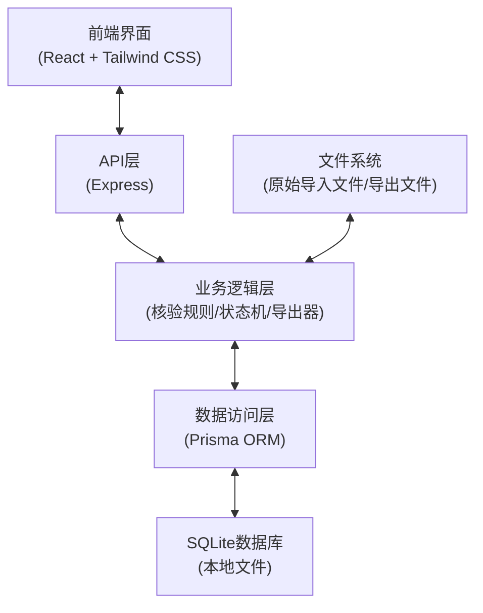
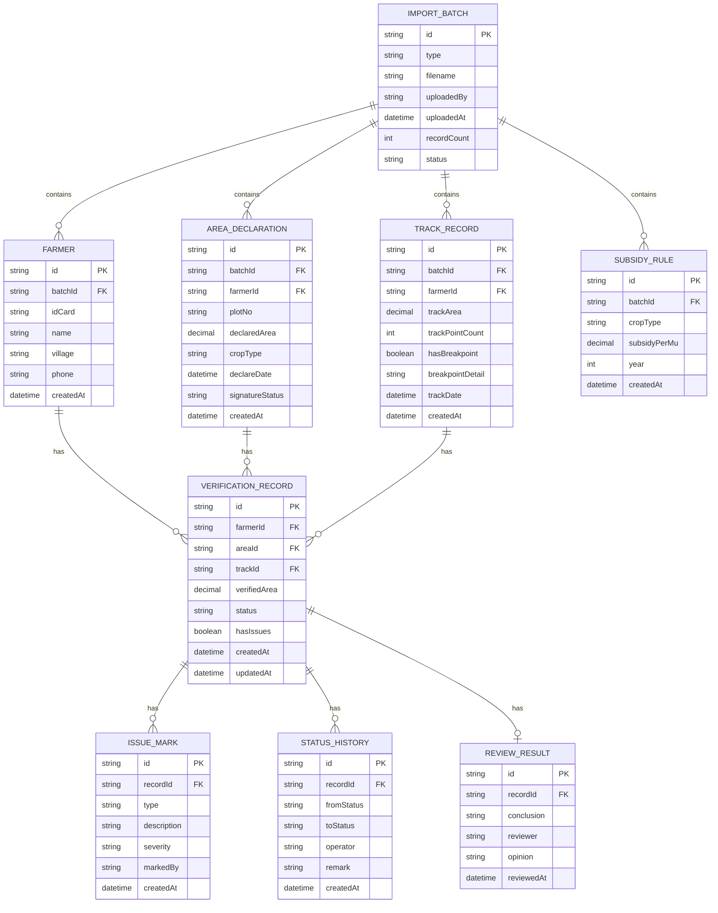

## 1. 架构设计

本地单节点应用架构，前后端一体，数据全部存储在本地SQLite数据库，无需外部服务依赖。



## 2. 技术描述

- **前端**：React@18 + TypeScript + TailwindCSS@3 + Vite
- **后端**：Express@4 + TypeScript
- **数据库**：SQLite + Prisma ORM（本地文件存储，无需单独安装数据库）
- **文件处理**：xlsx（Excel导入导出）、papaparse（CSV处理）
- **图表**：recharts（数据可视化）
- **PDF导出**：jspdf + html2canvas
- **状态管理**：React Query（服务端状态）+ Zustand（客户端状态）
- **认证**：本地简单用户名密码，存储在配置文件中

## 3. 项目结构

```
y12232/
├── client/                    # 前端代码
│   ├── src/
│   │   ├── pages/            # 页面组件
│   │   │   ├── Import.tsx
│   │   │   ├── Verify.tsx
│   │   │   ├── Review.tsx
│   │   │   ├── Export.tsx
│   │   │   └── Guide.tsx
│   │   ├── components/       # 公共组件
│   │   ├── store/           # 状态管理
│   │   ├── api/             # API调用
│   │   ├── types/           # TypeScript类型定义
│   │   └── utils/           # 工具函数
│   └── package.json
├── server/                   # 后端代码
│   ├── src/
│   │   ├── routes/          # API路由
│   │   ├── services/        # 业务逻辑
│   │   ├── models/          # 数据模型
│   │   ├── utils/           # 工具函数
│   │   └── index.ts         # 入口文件
│   ├── prisma/              # Prisma配置
│   │   └── schema.prisma
│   └── package.json
├── data/                     # 本地数据存储
│   ├── db.sqlite            # SQLite数据库文件
│   ├── imports/             # 原始导入文件
│   └── exports/             # 导出文件
└── package.json             # 根package.json
```

## 4. 路由定义

### 前端路由

| 路由 | 页面 | 功能 |
|------|------|------|
| / | 数据导入页 | 导入农户档案、面积申报、北斗轨迹、补贴规则 |
| /verify | 面积核验页 | 日常数据核验处理 |
| /review | 人工复核页 | 事后复核、标记结论 |
| /export | 导出管理页 | 生成报告、导出清单 |
| /guide | 使用说明页 | 操作指南、问题解答 |

### 后端API路由

| 方法 | 路径 | 功能 |
|------|------|------|
| POST | /api/import/:type | 导入数据（farmer/area/track/rule） |
| GET | /api/import/batches | 获取导入批次列表 |
| GET | /api/verify | 获取核验数据列表（支持筛选、分页） |
| PUT | /api/verify/:id/status | 更新核验状态 |
| PUT | /api/verify/:id/issues | 标记/更新问题 |
| POST | /api/verify/batch-status | 批量更新状态 |
| GET | /api/verify/stats | 获取核验统计数据 |
| GET | /api/review | 获取待复核数据列表 |
| PUT | /api/review/:id | 提交复核结论 |
| POST | /api/export/report | 生成核验报告 |
| POST | /api/export/list | 导出补贴发放清单 |
| GET | /api/export/:filename | 下载导出文件 |

## 5. 数据模型



## 6. 核心业务逻辑

### 6.1 自动核验规则

```typescript
// 三类问题检测逻辑
interface IssueDetector {
  detectBreakpoint(track: TrackRecord): boolean;
  detectDuplicateArea(areas: AreaDeclaration[]): string[];
  detectMissingSignature(area: AreaDeclaration): boolean;
}

// 状态机
type VerifyStatus = 'pending' | 'verifying' | 'toReview' | 'passed' | 'rejected';

interface StatusTransition {
  from: VerifyStatus;
  to: VerifyStatus;
  allowedRoles: string[];
}
```

### 6.2 核验计算口径

```typescript
// 面积核验口径（日常核验与事后复核共用）
function calculateVerifiedArea(
  declaredArea: number,
  trackArea: number,
  hasBreakpoint: boolean
): {
  verifiedArea: number;
  issues: IssueType[];
  description: string;
} {
  // 1. 有轨迹断点时，以申报面积为准但标记问题
  // 2. 无断点时，取申报面积与轨迹面积较小值
  // 3. 差值超过5%时标记面积不一致
}
```

## 7. 数据初始化脚本

```sql
-- 初始用户
INSERT INTO user (username, password, role) VALUES 
('operator', 'operator123', 'operator'),
('reviewer', 'reviewer123', 'reviewer');

-- 示例补贴规则
INSERT INTO subsidy_rule (id, batch_id, crop_type, subsidy_per_mu, year, created_at) VALUES
('rule_wheat_2024', 'init_batch', '小麦', 150.00, 2024, CURRENT_TIMESTAMP),
('rule_corn_2024', 'init_batch', '玉米', 120.00, 2024, CURRENT_TIMESTAMP),
('rule_rice_2024', 'init_batch', '水稻', 200.00, 2024, CURRENT_TIMESTAMP);
```

## 8. 导出模板定义

### 补贴发放清单字段

| 字段 | 说明 | 来源 |
|------|------|------|
| 农户姓名 |  | farmer.name |
| 身份证号 |  | farmer.idCard |
| 所在村组 |  | farmer.village |
| 地块编号 |  | area_declaration.plotNo |
| 申报面积(亩) |  | area_declaration.declaredArea |
| 轨迹面积(亩) |  | track_record.trackArea |
| 核验面积(亩) |  | verification_record.verifiedArea |
| 补贴标准(元/亩) |  | subsidy_rule.subsidyPerMu |
| 补贴金额(元) |  | verifiedArea * subsidyPerMu |
| 问题标记 | 轨迹断点/面积重复/签字缺失 | issue_marks |
| 问题说明 |  | issue_marks.description |
| 核验状态 |  | verification_record.status |
| 复核结论 |  | review_result.conclusion |

### 核验报告结构

1. 封面：报告标题、统计周期、生成时间
2. 统计概览：总条数、通过数、驳回数、问题分布
3. 明细列表：所有核验记录（含问题标记）
4. 问题清单：按问题类型分组展示
5. 原始材料索引：导入批次、文件名、导入时间
