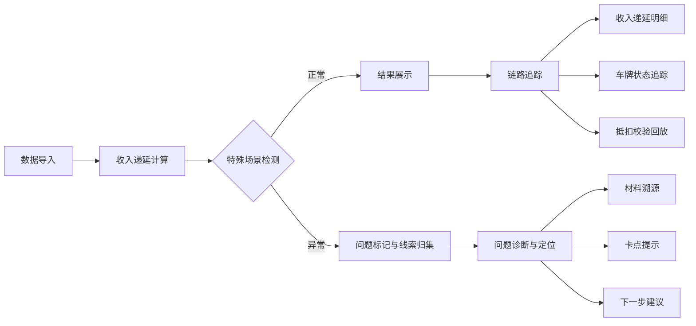
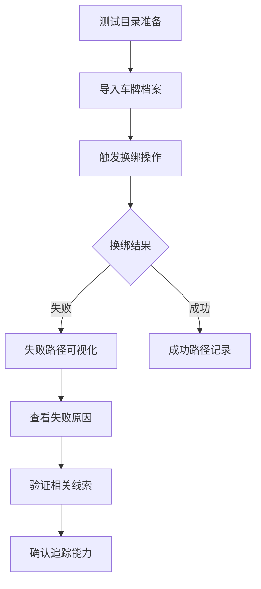

## 1. 产品概述

停车运营财务追踪系统是一款面向停车运营财务人员的专业工具，解决车牌档案变动导致包月收入递延重新计算的追踪难题。系统将车牌档案、临停流水、换绑记录等线索自动归集，支持从计算结果反向追踪到收入递延明细、车牌状态和抵扣校验全过程。

- **核心价值**：将分散的财务线索智能关联，实现问题可追溯、流程可追踪、责任可定位
- **目标用户**：停车运营财务人员、审计人员、运营管理人员

## 2. 核心功能

### 2.1 用户角色

| 角色 | 注册方式 | 核心权限 |
|------|----------|----------|
| 财务人员 | 系统账号 | 数据导入、收入递延计算、全链路追踪、结果导出 |
| 运营人员 | 系统账号 | 数据查看、问题标记、流程跟进 |

### 2.2 功能模块

1. **工作台**：事件概览、待处理问题、计算结果统计
2. **数据导入**：样例数据导入、自定义数据上传、导入校验
3. **收入递延计算**：自动计算引擎、计算规则配置、结果预览
4. **事件追踪中心**：线索归集、问题定位、流程追踪、材料溯源
5. **链路追踪**：结果反向追踪、车牌状态追踪、抵扣校验追踪
6. **车牌换绑测试**：失败路径模拟、异常场景测试、结果验证

### 2.3 页面详情

| 页面名称 | 模块名称 | 功能描述 |
|-----------|-------------|---------------------|
| 工作台 | 事件概览卡片 | 展示待处理事件、计算状态、问题统计 |
| 工作台 | 快捷操作区 | 快速导入、新建计算、查看最近结果 |
| 数据导入 | 样例导入 | 一键导入预置测试数据，包含正常/异常场景 |
| 数据导入 | 文件上传 | 支持Excel/CSV格式上传，实时校验数据完整性 |
| 收入递延计算 | 计算面板 | 参数配置、触发计算、进度展示 |
| 收入递延计算 | 结果列表 | 计算结果展示、图表可视化、明细钻取 |
| 事件追踪中心 | 线索归集 | 自动关联相关数据，时间线展示事件全貌 |
| 事件追踪中心 | 问题诊断 | 定位卡点、提示缺失材料、推荐下一步操作 |
| 链路追踪 | 追踪视图 | 从结果反向追溯到原始单据的完整链路 |
| 链路追踪 | 状态面板 | 车牌状态变更历史、抵扣校验过程回放 |
| 换绑测试 | 场景模拟 | 选择预设失败场景，模拟车牌换绑流程 |
| 换绑测试 | 结果验证 | 检查失败路径是否可见，验证追踪能力 |

## 3. 核心流程

### 3.1 收入递延计算与追踪流程

财务人员导入车牌档案等数据后，系统自动计算包月收入递延。当检测到车牌换绑、退款跨月或临停抵扣等特殊场景时，系统标记问题并归集所有相关线索。用户可从任意计算结果出发，反向追踪到收入递延明细、车牌状态变更历史和抵扣校验全过程。

### 3.2 车牌换绑失败路径测试流程

同事在测试目录中导入车牌档案数据，系统模拟车牌换绑的失败场景。关键验证点：失败路径是否可见、问题原因是否准确、相关线索是否完整归集、追踪链路是否通畅。

## 4. 用户界面设计

### 4.1 设计风格

- **主色调**：深蓝色系（#1e3a5f），传达专业、可信赖的财务系统气质
- **辅助色**：橙色（#f59e0b）用于告警和问题标记，绿色（#10b981）表示正常状态
- **按钮风格**：圆角矩形，hover时有轻微上浮效果和阴影变化
- **字体**：标题使用 Noto Sans SC Bold，正文使用 Noto Sans SC Regular
- **布局风格**：卡片式布局，左侧导航+右侧内容区，信息层次分明
- **图标风格**：线性图标，保持简洁专业

### 4.2 页面设计概览

| 页面名称 | 模块名称 | UI元素 |
|-----------|-------------|-------------|
| 工作台 | 事件概览 | 统计卡片、环形进度图、问题列表、渐变色背景 |
| 数据导入 | 导入面板 | 拖拽上传区、进度条、校验结果提示、样例数据卡片 |
| 事件追踪中心 | 时间线 | 垂直时间线、事件节点、关联数据标签、状态指示器 |
| 链路追踪 | 追踪视图 | 横向流程图、可点击节点、链路高亮、详情浮层 |
| 换绑测试 | 场景模拟 | 场景选择器、步骤指示器、失败高亮、验证结果面板 |

### 4.3 响应式

- 桌面端优先设计，保持专业财务系统的信息密度
- 平板端适配：导航折叠、卡片流式布局
- 移动端：简化视图，核心功能优先展示

### 4.4 交互动效

- 页面加载：元素淡入+轻微上移动画，错落延迟
- 卡片悬浮：轻微上浮+阴影加深
- 时间线展开：平滑过渡+节点高亮
- 问题标记：脉冲动画提醒用户注意
- 链路追踪：节点连线逐步绘制动画
