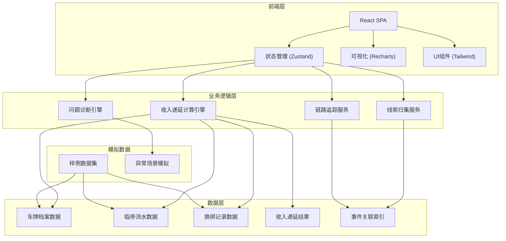
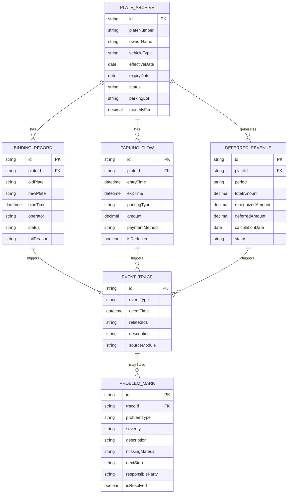

## 1. 架构设计



## 2. 技术描述

- **前端框架**：React@18 + TypeScript
- **构建工具**：Vite
- **样式方案**：TailwindCSS@3
- **状态管理**：Zustand（轻量级，适合业务复杂但无需Redux的场景）
- **数据可视化**：Recharts（图表展示）
- **路由管理**：React Router@6
- **后端**：无后端，纯前端模拟（使用Mock数据）
- **数据持久化**：LocalStorage（保存用户导入的数据和计算状态）

## 3. 路由定义

| 路由 | 页面名称 | 功能说明 |
|-------|---------|---------|
| / | 工作台 | 事件概览、统计卡片、快捷操作 |
| /import | 数据导入 | 样例导入、文件上传、数据校验 |
| /calculation | 收入递延计算 | 计算面板、结果列表、图表展示 |
| /tracking | 事件追踪中心 | 线索归集、时间线、问题诊断 |
| /chain-trace | 链路追踪 | 反向追踪、状态面板、校验回放 |
| /bind-test | 车牌换绑测试 | 场景模拟、失败路径、结果验证 |

## 4. 数据模型

### 4.1 实体关系图



### 4.2 核心数据结构定义

```typescript
// 车牌档案
interface PlateArchive {
  id: string;
  plateNumber: string;
  ownerName: string;
  vehicleType: 'private' | 'commercial' | 'temporary';
  effectiveDate: string;
  expiryDate: string;
  status: 'active' | 'expired' | 'suspended' | 'transferred';
  parkingLot: string;
  monthlyFee: number;
  createdAt: string;
  updatedAt: string;
}

// 换绑记录
interface BindingRecord {
  id: string;
  plateId: string;
  oldPlate: string;
  newPlate: string;
  bindTime: string;
  operator: string;
  status: 'pending' | 'success' | 'failed';
  failReason?: string;
  failStep?: 'validation' | 'approval' | 'system' | 'data';
}

// 临停流水
interface ParkingFlow {
  id: string;
  plateId: string;
  plateNumber: string;
  entryTime: string;
  exitTime: string;
  parkingType: 'temporary' | 'monthly';
  duration: number;
  amount: number;
  paymentMethod: string;
  isDeducted: boolean;
  deductionSource?: string;
}

// 收入递延结果
interface DeferredRevenue {
  id: string;
  plateId: string;
  plateNumber: string;
  period: string;
  totalAmount: number;
  recognizedAmount: number;
  deferredAmount: number;
  calculationDate: string;
  status: 'normal' | 'warning' | 'error';
  warnings: string[];
  errors: string[];
}

// 事件追踪
interface EventTrace {
  id: string;
  eventType: 'plate_change' | 'refund' | 'deduction' | 'calculation' | 'binding';
  eventTime: string;
  relatedPlateIds: string[];
  relatedRecordIds: string[];
  description: string;
  sourceModule: string;
  operator?: string;
}

// 问题标记
interface ProblemMark {
  id: string;
  traceId: string;
  problemType: 'cross_month_refund' | 'binding_failure' | 'deduction_mismatch' | 'data_inconsistency';
  severity: 'low' | 'medium' | 'high' | 'critical';
  description: string;
  triggerSource: string;
  stuckPoint: string;
  missingMaterial: string[];
  nextSteps: string[];
  responsibleParty: string;
  isResolved: boolean;
}

// 链路节点
interface ChainNode {
  id: string;
  type: 'archive' | 'flow' | 'binding' | 'revenue' | 'problem';
  title: string;
  status: 'normal' | 'warning' | 'error';
  data: any;
  prevNodeId?: string;
  nextNodeId?: string;
}
```

## 5. 核心模块设计

### 5.1 收入递延计算引擎

```typescript
class DeferredRevenueEngine {
  calculate(plate: PlateArchive, flows: ParkingFlow[], period: string): DeferredRevenue;
  detectSpecialScenarios(revenue: DeferredRevenue, bindings: BindingRecord[]): ProblemMark[];
  recalculateOnPlateChange(oldPlate: PlateArchive, newPlate: PlateArchive): DeferredRevenue;
}
```

### 5.2 线索归集服务

```typescript
class ClueAggregator {
  collectByPlate(plateId: string): EventTrace[];
  buildTimeline(traces: EventTrace[]): TimelineEvent[];
  findRelatedProblems(traceId: string): ProblemMark[];
}
```

### 5.3 链路追踪服务

```typescript
class ChainTracer {
  traceFromResult(revenueId: string): ChainNode[];
  tracePlateStatus(plateId: string): StatusChange[];
  replayDeductionValidation(flowId: string): ValidationStep[];
}
```

### 5.4 问题诊断引擎

```typescript
class ProblemDiagnoser {
  diagnoseBindingFailure(bindingId: string): DiagnosisResult;
  suggestNextSteps(problem: ProblemMark): ActionItem[];
  identifyResponsibleParty(problem: ProblemMark): string;
}
```

## 6. 样例数据场景

### 6.1 正常场景
- 车牌档案完整，包月费用正常递延
- 无换绑记录，临停流水与包月抵扣匹配

### 6.2 车牌换绑失败场景
- 旧车牌有未结清的临停费用
- 新车牌档案信息不完整
- 换绑审批流程中断
- 跨月换绑导致收入归属不清

### 6.3 退款跨月场景
- 包月退款发生在费用已确认之后
- 退款金额与原支付金额不匹配

### 6.4 临停抵扣异常场景
- 临停流水找不到对应车牌档案
- 抵扣金额超出包月可用额度
- 抵扣时间不在包月有效期内
