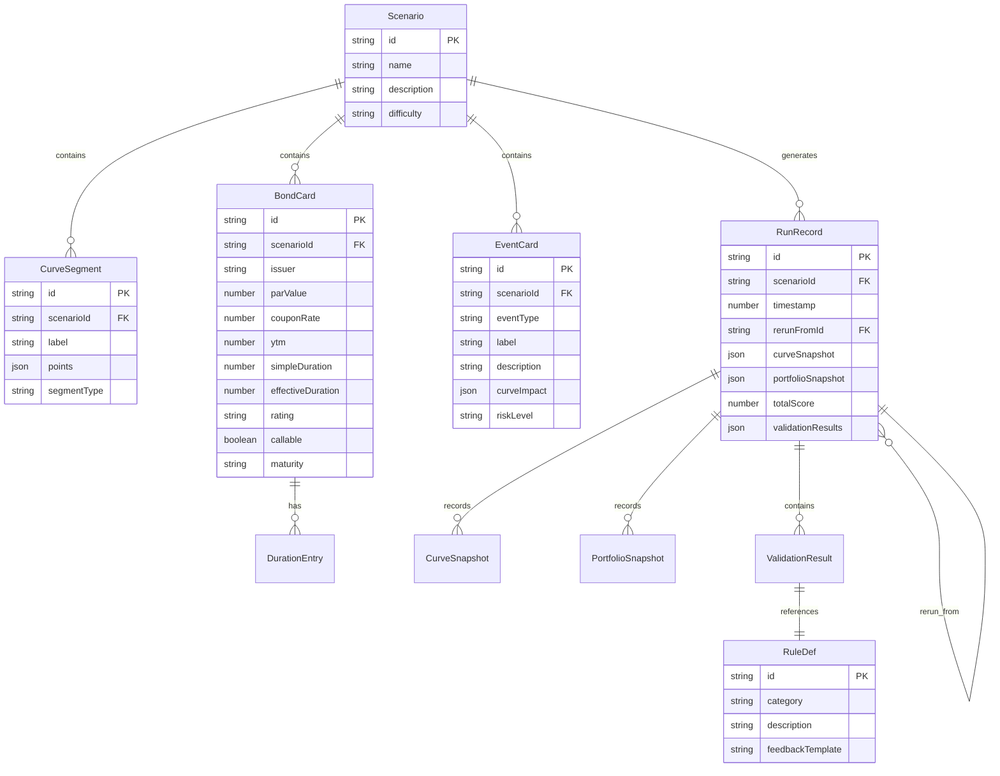

## 1. 架构设计

```mermaid
flowchart TB
    subgraph "前端层"
        "React 18 SPA"
        "Zustand 状态管理"
        "Canvas/SVG 曲线渲染"
    end
    subgraph "业务引擎层"
        "结算引擎"
        "规则校验器"
        "事件模拟器"
    end
    subgraph "数据层"
        "LocalStorage 持久化"
        "快照存储"
        "溯源索引"
    end
    "React 18 SPA" --> "Zustand 状态管理"
    "Zustand 状态管理" --> "结算引擎"
    "Zustand 状态管理" --> "规则校验器"
    "Zustand 状态管理" --> "事件模拟器"
    "结算引擎" --> "LocalStorage 持久化"
    "规则校验器" --> "LocalStorage 持久化"
    "LocalStorage 持久化" --> "快照存储"
    "LocalStorage 持久化" --> "溯源索引"
```

## 2. 技术说明

- **前端**：React@18 + TypeScript + Tailwind CSS@3 + Vite
- **初始化工具**：vite-init (react-ts 模板)
- **状态管理**：Zustand
- **路由**：react-router-dom
- **后端**：无（纯前端，数据持久化至 LocalStorage）
- **曲线渲染**：SVG (d3-scale 辅助坐标映射)
- **拖拽交互**：原生 Pointer Events + 自定义拖拽逻辑
- **图标**：lucide-react

## 3. 路由定义

| 路由 | 用途 |
|------|------|
| / | 首页/关卡选择 |
| /battle/:scenarioId | 拼图战场页 |
| /settlement/:scenarioId/:runId | 结算复盘页 |
| /records | 课堂记录页 |
| /records/:scenarioId/:runId | 单次记录溯源详情 |

## 4. 数据模型

### 4.1 数据模型定义



### 4.2 核心类型定义

```typescript
interface CurvePoint {
  x: number;
  y: number;
  locked: boolean;
}

interface CurveSegment {
  id: string;
  label: string;
  points: CurvePoint[];
  segmentType: 'normal' | 'inverted' | 'flat';
}

interface BondCard {
  id: string;
  issuer: string;
  parValue: number;
  couponRate: number;
  ytm: number;
  simpleDuration: number;
  effectiveDuration: number;
  rating: 'AAA' | 'AA' | 'A' | 'BBB' | 'BB' | 'B';
  callable: boolean;
  maturity: string;
}

interface EventCard {
  id: string;
  eventType: 'rate_hike' | 'recession' | 'liquidity_crisis' | 'credit_spread';
  label: string;
  description: string;
  curveImpact: {
    shortEndShift: number;
    longEndShift: number;
    spreadWidening: number;
  };
  riskLevel: 'low' | 'medium' | 'high';
}

interface ValidationResult {
  ruleId: string;
  passed: boolean;
  actualValue: number;
  threshold: number;
  feedback: string;
}

interface RunRecord {
  id: string;
  scenarioId: string;
  timestamp: number;
  rerunFromId: string | null;
  curveSnapshot: CurveSegment[];
  portfolioSnapshot: BondCard[];
  activeEvents: EventCard[];
  totalScore: number;
  validationResults: ValidationResult[];
}
```

## 5. 结算引擎逻辑

### 5.1 组合久期计算
- 简单久期加权：`portfolioDuration = Σ(bond.simpleDuration × bond.parValue) / totalParValue`
- 有效久期加权：`portfolioEffDuration = Σ(bond.effectiveDuration × bond.parValue) / totalParValue`
- 久期缺口：`durationGap = portfolioEffDuration - targetDuration`

### 5.2 VaR 计算
- 参数法 VaR：`VaR = portfolioValue × durationGap × yieldChange × confidenceZ`

### 5.3 曲线反向检测
- 检查短端利率 > 长端利率 → 标记曲线反向
- 反向时触发 CR-02 规则校验

### 5.4 事件叠加处理
- 多事件曲线冲击叠加：`finalCurve = baseCurve + Σ(event.curveImpact)`
- 信用利差叠加：`finalSpread = baseSpread + Σ(event.spreadWidening)`

## 6. 溯源机制

- 每次操作生成 `RunRecord`，包含完整快照
- `rerunFromId` 字段链接至原始记录，形成重跑链
- 从结算结果可一路点击回溯至：曲线形态 → 债券卡参数 → 事件配置 → 原始关卡
- 修改债券卡后重跑，系统自动保存新旧快照并生成差异报告
