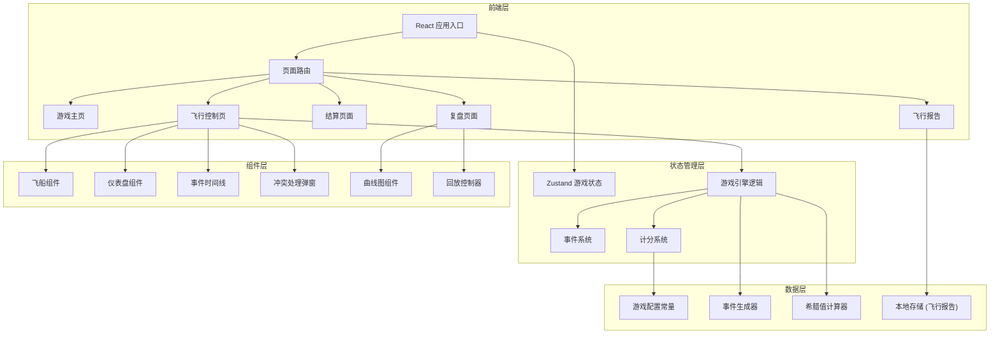
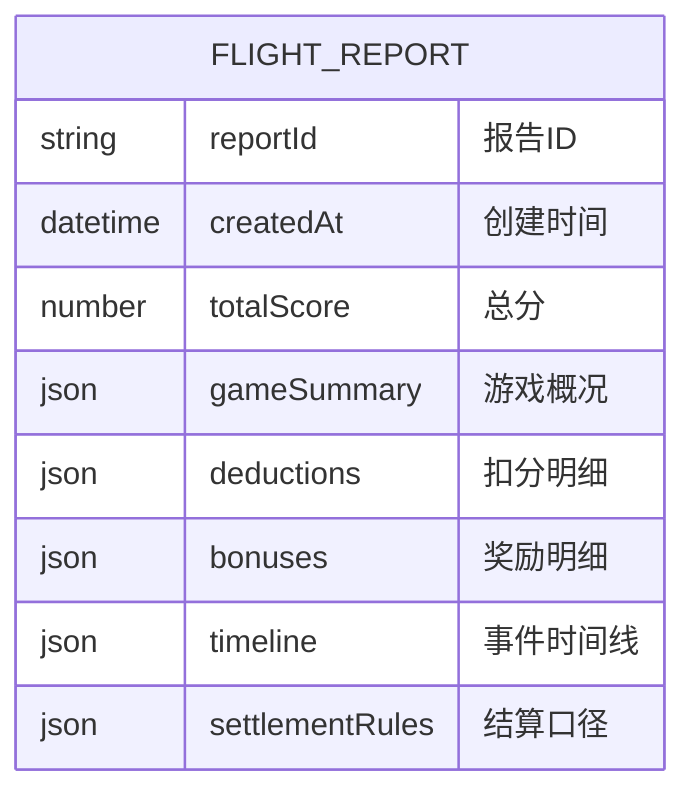

## 1. 架构设计



## 2. 技术描述

- **前端框架**: React@18 + TypeScript
- **构建工具**: Vite@5
- **样式方案**: TailwindCSS@3 + CSS变量
- **状态管理**: Zustand（轻量级，适合游戏状态）
- **图表库**: Chart.js + react-chartjs-2
- **动画库**: Framer Motion（复杂UI动画）
- **图标**: Lucide React（线性科幻风格图标）
- **后端**: 无后端，纯前端应用
- **数据存储**: LocalStorage（保存飞行报告）
- **初始化工具**: vite-init

## 3. 路由定义

| 路由 | 页面 | 功能描述 |
|-------|------|----------|
| `/` | 游戏主页 | 游戏介绍、规则说明、开始入口 |
| `/flight` | 飞行控制页 | 核心游戏界面，飞船驾驶、希腊值监控、事件处理 |
| `/settlement` | 结算页面 | 最终得分、扣分明细、结算口径说明 |
| `/review` | 复盘页面 | 事件回放、希腊值曲线、决策分析 |
| `/report` | 飞行报告 | 结构化报告展示、一键分享 |

## 4. 核心状态定义

```typescript
// 游戏状态接口
interface GameState {
  status: 'idle' | 'playing' | 'paused' | 'settled';
  time: number; // 游戏时间（秒）
  score: Score;
  position: OptionPosition;
  greeks: Greeks;
  events: GameEvent[];
  timeline: TimelineItem[];
  conflicts: ConflictEvent[];
  ship: ShipState;
  margin: MarginState;
  replayData: ReplayFrame[];
}

// 期权仓位
interface OptionPosition {
  type: 'call' | 'put';
  strike: number;
  expiry: number; // 剩余天数
  underlying: number; // 标的价格
  quantity: number;
  costBasis: number;
}

// 希腊字母
interface Greeks {
  delta: number;
  gamma: number;
  vega: number;
  theta: number;
  rho: number;
  deltaHistory: DataPoint[];
  gammaHistory: DataPoint[];
  vegaHistory: DataPoint[];
  thetaHistory: DataPoint[];
}

// 游戏事件
interface GameEvent {
  id: string;
  type: 'volatility_storm' | 'delta_surge' | 'gamma_gate' | 'margin_warning' | 'compound';
  timestamp: number;
  actualArrivalTime?: number; // 实际到达时间（用于延迟事件）
  severity: 'low' | 'medium' | 'high' | 'critical';
  data: Record<string, number>;
  handled: boolean;
  handledAt?: number;
  correctResponse?: string;
  playerResponse?: string;
}

// 冲突事件（三方信息冲突）
interface ConflictEvent {
  id: string;
  timestamp: number;
  mainInfo: PositionInfo;
  volatilityStorm: VolatilityInfo;
  deltaInstrument: DeltaInfo;
  trace: ConflictTrace; // 自动留痕
  resolution?: 'main' | 'volatility' | 'delta' | 'reject_all';
  resolvedAt?: number;
}

// 事件时间线
interface TimelineItem {
  id: string;
  timestamp: number;
  type: string;
  label: string;
  color: string;
  delayed?: boolean;
  actualArrivalTime?: number;
}

// 得分
interface Score {
  baseScore: number;
  riskDeductions: DeductionItem[];
  bonuses: BonusItem[];
  total: number;
}

// 飞船状态
interface ShipState {
  x: number; // 左右位置 (-100 to 100)
  y: number; // 上下位置
  velocity: number;
  acceleration: number;
  direction: 'left' | 'right' | 'center';
}

// 保证金状态
interface MarginState {
  current: number;
  required: number;
  ratio: number; // current / required
  warnings: MarginWarning[];
}
```

## 5. 游戏引擎核心逻辑

### 5.1 事件生成器

```typescript
// 事件触发概率配置
const EVENT_CONFIG = {
  volatilityStorm: { probability: 0.08, minInterval: 15 },
  deltaSurge: { probability: 0.1, minInterval: 10 },
  gammaGate: { probability: 0.05, minInterval: 30, delay: [5, 15] }, // 延迟5-15秒到达
  marginWarning: { probability: 0.06, minInterval: 20 },
  compoundEvent: { probability: 0.03, minInterval: 45 }, // 复合事件
};

// 复合事件：方向误判 + 保证金不足 + 波动连跳晚到
interface CompoundEvent {
  directionMistake: {
    timestamp: number;
    expectedDirection: 'up' | 'down';
    playerDirection: 'up' | 'down';
  };
  marginInsufficient: {
    timestamp: number;
    marginRatio: number;
  };
  volatilityJumps: Array<{
    expectedTimestamp: number;
    actualTimestamp: number;
    volatilityChange: number;
  }>;
}
```

### 5.2 希腊值计算引擎

```typescript
// Black-Scholes 希腊值计算
class GreeksCalculator {
  static calculateDelta(S: number, K: number, T: number, r: number, sigma: number, type: 'call' | 'put'): number;
  static calculateGamma(S: number, K: number, T: number, r: number, sigma: number): number;
  static calculateVega(S: number, K: number, T: number, r: number, sigma: number): number;
  static calculateTheta(S: number, K: number, T: number, r: number, sigma: number, type: 'call' | 'put'): number;
}

// Gamma门延迟补数据机制
class GammaGate {
  pendingUpdates: Array<{ timestamp: number; gamma: number }>;
  delaySeconds: number;
  
  // 延迟推送Gamma更新
  pushUpdate(timestamp: number, gamma: number): void;
  
  // 获取当前可用的Gamma值（可能是延迟后的值）
  getAvailableGamma(currentTime: number): { gamma: number; isDelayed: boolean; actualTime: number };
}
```

### 5.3 计分规则

```typescript
// 扣分规则
const DEDUCTION_RULES = {
  unhandled_volatility: { points: 50, reason: '未及时应对波动率风暴' },
  delta_mismatch: { points: 30, reason: 'Delta对冲不及时' },
  gamma_gate_misjudgment: { points: 40, reason: 'Gamma门延迟数据判断错误' },
  conflict_wrong_resolution: { points: 60, reason: '三方信息冲突判断错误' },
  direction_mistake: { points: 45, reason: '方向误判' },
  margin_call: { points: 70, reason: '保证金不足触发追缴' },
  late_arrival_misjudgment: { points: 35, reason: '晚到数据判断错误' },
  compound_event_failure: { points: 100, reason: '复合事件处理失败' },
};

// 奖励规则
const BONUS_RULES = {
  perfect_conflict_resolution: 80,
  early_volatility_response: 40,
  delta_neutral_maintained: 50,
  no_margin_warnings: 60,
  correct_compound_event: 120,
};
```

## 6. 结算口径说明（飞行报告核心内容）

```
结算口径说明
============

1. 希腊值计算方法
   - Delta: N(d1) 看涨期权，N(d1)-1 看跌期权
   - Gamma: N'(d1)/(S*σ*√T)
   - Vega: S*N'(d1)*√T/100
   - Theta: 按年波动率折算为每日衰减

2. 时间权重
   - 事件处理时间在5秒内：全额计分
   - 5-10秒：70%计分
   - 10秒以上：30%计分
   - 未处理：0%

3. 冲突处理规则
   - 三者冲突时必须先点击"留痕"按钮，10秒内未留痕扣20分
   - 留痕后30秒内需做出判断，超时按错误处理
   - 判断标准：以标的价格变动方向为准，结合波动率变化幅度

4. 复合事件顺序认定
   - 按事件实际发生时间排序，而非玩家感知时间
   - 晚到数据标注"延迟X秒到达"
   - 处理顺序影响最终得分：正确识别先后顺序额外加20分

5. 保证金计算
   - 维持保证金 = 仓位名义价值 * 15%
   - 预警线：保证金比率 < 1.5
   - 追缴线：保证金比率 < 1.2
   - 爆仓线：保证金比率 < 1.0（游戏结束）
```

## 7. 数据模型（本地存储）



### 本地存储键名
- `flight_reports`: 飞行报告列表（JSON数组）
- `last_game_state`: 上次游戏状态（用于继续游戏）
- `game_settings`: 用户游戏设置
