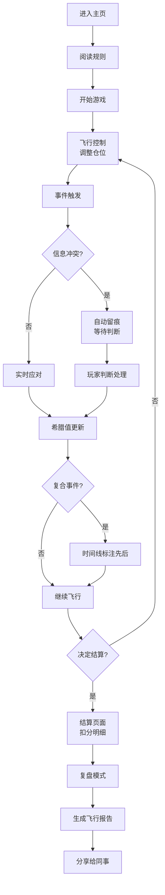

## 1. 产品概述

"期权希腊字母飞船"是一款面向金融从业者的期权知识培训游戏，通过太空飞船驾驶的隐喻，帮助玩家理解Delta、Gamma、Vega等希腊字母在实际期权交易中的作用，以及风险管理的重要性。

- **核心目标**：让金融培训师和学员在交互式游戏中直观理解期权希腊字母的动态变化、风险事件的先后顺序、以及冲突信息的处理原则
- **目标用户**：金融培训师、期权交易员、风险管理专员
- **市场价值**：填补金融衍生品教学中"动态过程可视化"的空白，解决Gamma门延迟补数据、多方信息冲突等真实场景下的判断难题

## 2. 核心功能

### 2.1 用户角色

| 角色 | 注册方式 | 核心权限 |
|------|----------|----------|
| 玩家 | 无需注册，直接使用 | 完整游戏体验、报告生成与分享 |

### 2.2 功能模块

1. **游戏主页**：游戏介绍、开始按钮、规则说明
2. **飞行控制页**：飞船驾驶、希腊值仪表盘、实时仓位信息、事件日志
3. **结算页面**：最终得分、风险警报扣分明细、事件时间线
4. **复盘页面**：完整事件回放、关键决策点标记、希腊值变化曲线
5. **飞行报告**：可分享的结构化报告，包含结算口径说明

### 2.3 页面详情

| 页面名称 | 模块名称 | 功能描述 |
|-----------|-------------|---------------------|
| 游戏主页 | 英雄区域 | 游戏标题、科幻风格视觉、开始游戏入口 |
| 游戏主页 | 规则说明 | 希腊字母对应关系、操作指南、评分规则 |
| 飞行控制页 | 飞船操控区 | 方向控制（对应仓位调整）、加速/减速（对应仓位大小） |
| 飞行控制页 | 希腊值仪表盘 | Delta、Gamma、Vega、Theta实时数值与变化趋势 |
| 飞行控制页 | 主信息面板 | 期权仓位核心数据：行权价、到期日、标的价格 |
| 飞行控制页 | 波动率风暴 | 随机波动率事件，Vega剧烈波动，需要及时应对 |
| 飞行控制页 | Delta仪表 | Delta动态监控，Gamma门延迟补数据机制 |
| 飞行控制页 | 事件冲突处理 | 三方信息冲突时自动留痕，等待玩家判断 |
| 飞行控制页 | 控制按钮 | 开始、暂停、重开、结算 |
| 飞行控制页 | 事件时间线 | 实时显示事件发生顺序，标注延迟到达事件 |
| 结算页面 | 得分总览 | 最终得分、基础分、风险扣分、奖励分 |
| 结算页面 | 扣分明细 | 风险警报逐条扣分说明，包含事件类型、时间、处理结果 |
| 结算页面 | 结算口径 | 希腊值计算方法、时间权重、冲突处理规则说明 |
| 复盘页面 | 事件回放 | 完整游戏过程回放，可暂停、快进、跳转到关键节点 |
| 复盘页面 | 希腊值曲线 | Delta、Gamma、Vega全程变化曲线图 |
| 复盘页面 | 决策分析 | 关键决策点标记，正确/错误决策对比 |
| 飞行报告 | 报告生成 | 结构化HTML报告，包含所有核心数据 |
| 飞行报告 | 一键分享 | 复制链接/导出文本，直接发送给同事 |

## 3. 核心流程

玩家进入游戏主页 → 阅读规则后开始游戏 → 驾驶飞船（调整期权仓位）→ 应对各种事件（波动率风暴、Delta突变、Gamma门延迟）→ 处理三方信息冲突（先留痕再判断）→ 实时监控希腊值变化 → 遇到方向误判+保证金不足+波动连跳晚到等复合事件 → 决定结算时机 → 查看结算页面与扣分明细 → 进入复盘模式分析决策 → 生成飞行报告分享给同事。

## 4. 用户界面设计

### 4.1 设计风格

**复古未来主义太空风格**：
- **主色调**：深空蓝(#0a1628) + 霓虹青(#00f5ff) + 警报红(#ff3366) + 数据绿(#00ff88)
- **辅助色**：琥珀黄(#ffaa00)用于警告、紫色(#aa66ff)用于Gamma门特殊标记
- **按钮风格**：科幻发光边框，圆角8px，hover时发光效果增强
- **字体**：
  - 标题：Orbitron（太空科技感）
  - 数据面板：JetBrains Mono（等宽字体，数字对齐）
  - 正文：Noto Sans SC（清晰易读）
- **布局风格**：仪表盘式布局，多面板信息密度高但层次分明，关键数据突出显示
- **图标风格**：线性科幻图标，带发光效果；emoji配合使用：🚀📊⚠️💥📈

### 4.2 页面设计概述

| 页面名称 | 模块名称 | UI元素 |
|-----------|-------------|-------------|
| 游戏主页 | 英雄区域 | 全屏星空背景、动态星空粒子、飞船动画入场、发光标题 |
| 游戏主页 | 规则卡片 | 玻璃拟态卡片、悬停上浮动画、希腊字母图标 |
| 飞行控制页 | 主仪表盘 | 深色半透明面板、霓虹边框、实时数据跳动动画 |
| 飞行控制页 | 飞船区域 | 2D侧视飞船、左右移动动画、尾部火焰粒子效果 |
| 飞行控制页 | 事件时间线 | 左侧垂直时间轴、不同颜色标记事件类型、延迟事件特殊标记 |
| 飞行控制页 | 冲突提示 | 红色闪烁边框、事件留痕按钮、倒计时计时器 |
| 结算页面 | 得分面板 | 大数字动画、环形进度条、扣分项目展开/收起 |
| 结算页面 | 口径说明 | 可折叠面板、公式展示、计算示例 |
| 复盘页面 | 曲线图 | Chart.js多线图、可交互数据点、关键事件垂直线标记 |
| 复盘页面 | 回放控制 | 播放/暂停、进度条、速度调节、关键节点跳转 |
| 飞行报告 | 报告卡片 | 结构化布局、一键复制按钮、导出为文本 |

### 4.3 响应性

- **桌面优先设计**：核心游戏体验面向桌面用户，多面板布局充分利用大屏幕
- **平板适配**：面板可堆叠，保留核心操控区域
- **移动端**：简化布局，保留关键仪表盘和控制按钮，适配触控操作
- **触控优化**：按钮最小尺寸48x48px，滑动手势支持飞船方向控制

### 4.4 游戏场景设计

**太空驾驶舱氛围**：
- **背景**：动态星空，星星缓慢移动，偶尔有流星划过
- **光照**：仪表盘发光为主光源，整体偏暗营造夜间驾驶感
- **相机**：固定视角跟随飞船，小幅度震动模拟飞行感
- **构图**：飞船居中偏下，仪表盘环绕四周，时间线在左侧，事件提示在顶部
- **交互动画**：
  - 飞船移动：平滑过渡，尾部火焰随加速度变化
  - 希腊值变化：数字滚动动画，指针摆动
  - 风险事件：屏幕边缘红色闪烁，警报音效
  - 信息冲突：三个数据源面板同时闪烁，留痕按钮脉动
- **后处理**：CRT屏幕扫描线效果，轻微色差模拟老旧显示器
- **性能预算**：单页面动画不超过10个，Canvas粒子控制在200以内
