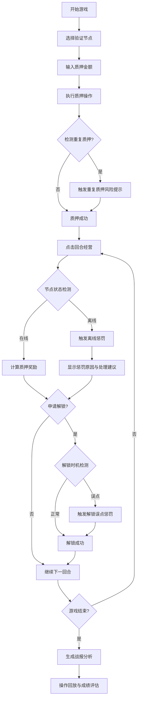

## 1. 产品概述

Web3质押矿场教育模拟器是一款面向区块链课堂培训的交互式教学工具，通过回合制经营模拟让学员深入理解质押机制的核心痛点。产品聚焦三大高频问题场景——离线惩罚、重复质押、解锁误点，让学员在实战中掌握风险识别与应对策略。

- 核心价值：将抽象的质押机制转化为可操作的决策体验，每一步选择都产生可追溯的后果
- 目标用户：区块链培训讲师、Web3社区教育运营、DeFi协议初学者

## 2. 核心功能

### 2.1 用户角色
| 角色 | 注册方式 | 核心权限 |
|------|----------|----------|
| 学员 | 无需注册，直接开始 | 进行质押决策、查看实时状态、阅读战报分析 |
| 讲师 | 无需注册 | 查看学员操作路径、导出回放记录、使用教学案例 |

### 2.2 功能模块
1. **主游戏界面**：验证节点选择、质押操作、回合经营控制
2. **实时状态面板**：奖励池展示、质押状态、离线监控
3. **战报分析系统**：触发事件追溯、原因说明、处理建议
4. **历史回看中台**：操作步骤回放、状态变化对比、成绩影响分析

### 2.3 页面详情
| 页面名称 | 模块名称 | 功能描述 |
|---------|----------|----------|
| 游戏主页 | 节点选择区 | 展示4个验证节点，显示历史在线率、收益率、惩罚系数 |
| 游戏主页 | 操作控制台 | 质押金额输入、解锁申请、回合推进按钮 |
| 游戏主页 | 奖励池面板 | 实时显示总质押量、累计奖励、惩罚扣除明细 |
| 事件弹窗 | 惩罚通知 | 离线惩罚触发时显示具体节点、时长、惩罚金额、原因说明、处理建议 |
| 战报页面 | 事件时间线 | 按时间顺序展示所有触发事件，点击查看详情 |
| 战报页面 | 操作回放 | 可视化展示每一步操作如何影响后续状态 |
| 战报页面 | 成绩分析 | 统计最终收益率、风险事件次数、决策质量评分 |

## 3. 核心流程

学员进入游戏后选择验证节点进行质押，每回合经营会触发随机事件。当选择的节点离线时触发离线惩罚，重复质押同一节点会产生额外风险，解锁时机不当会造成收益损失。每一步决策都被记录，游戏结束后生成完整战报供教学复盘使用。

## 4. 用户界面设计

### 4.1 设计风格
- **主色调**：深科技蓝(#1a1a2e) + 警示红(#e94560) + 成功绿(#0f4c75)
- **辅助色**：金色(#d4af37)用于奖励池，紫色(#9d4edd)用于特殊事件
- **按钮风格**：圆角矩形，悬停时有发光效果，禁用状态灰度显示
- **字体**：标题使用 Orbitron (科技感)，正文使用 JetBrains Mono (等宽易读)
- **布局风格**：卡片式模块化布局，左侧操作区，右侧状态区，底部事件日志
- **视觉元素**：数据仪表盘风格，带脉冲动画的状态指示器，故障时闪烁告警

### 4.2 页面设计概述
| 页面名称 | 模块名称 | UI 元素 |
|---------|----------|---------|
| 游戏主页 | 节点卡片 | 头像、名称、在线率(环形进度条)、收益率、风险等级标签 |
| 游戏主页 | 操作面板 | 滑块输入、确认按钮、倒计时动画 |
| 游戏主页 | 状态仪表盘 | 数字跳动效果、趋势箭头、颜色分级指示 |
| 事件弹窗 | 惩罚通知 | 红色渐变背景、大号警告图标、分栏展示原因和建议 |
| 战报页面 | 时间线 | 垂直时间轴、彩色节点标记、可折叠详情 |
| 战报页面 | 回放区域 | 播放控制条、状态快照对比、进度滑块 |

### 4.3 响应式
- 桌面端：三栏布局(操作区+状态区+日志区)，1200px以上最佳体验
- 平板端：两栏布局，操作区在上，状态区在下
- 移动端：单列流式布局，重点保留核心操作功能

### 4.4 动效设计
- 页面加载：元素从底部渐入，按优先级延迟出现
- 质押操作：金额数字滚动动画，成功后节点卡片发光脉冲
- 惩罚触发：屏幕轻微震动，红色边框闪烁，警告图标弹跳
- 状态更新：数字平滑过渡，进度条缓动填充
- 战报回放：时间线节点逐个点亮，状态面板同步切换
