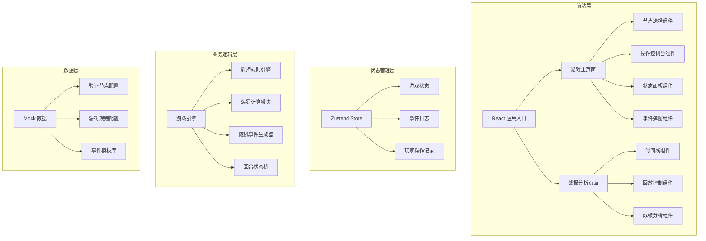

## 1. 架构设计



## 2. 技术描述

- **前端框架**：React@18 + TypeScript + Vite
- **状态管理**：Zustand (轻量、易用，适合游戏状态追踪)
- **样式方案**：TailwindCSS@3 + CSS Modules
- **动画库**：Framer Motion (复杂交互动效)
- **图表可视化**：Recharts (奖励趋势图、惩罚分布图)
- **构建工具**：Vite (热更新快，开发体验佳)
- **后端**：无后端，纯前端应用，数据存储于 LocalStorage
- **数据持久化**：LocalStorage 存储游戏进度和战报记录

## 3. 路由定义

| 路由 | 用途 |
|------|------|
| / | 游戏主页面 - 质押操作、回合经营、实时状态 |
| /battle-report | 战报分析页面 - 事件时间线、操作回放、成绩评估 |

## 4. 类型定义

```typescript
// 验证节点
interface ValidatorNode {
  id: string;
  name: string;
  avatar: string;
  uptime: number; // 历史在线率 0-100
  yieldRate: number; // 年化收益率 %
  penaltyCoefficient: number; // 惩罚系数
  riskLevel: 'low' | 'medium' | 'high';
  isOnline: boolean;
}

// 质押记录
interface StakeRecord {
  id: string;
  nodeId: string;
  amount: number;
  timestamp: number;
  round: number;
  isDuplicate: boolean;
}

// 解锁记录
interface UnlockRecord {
  id: string;
  stakeId: string;
  amount: number;
  requestRound: number;
  actualUnlockRound: number;
  isMisclick: boolean;
  penaltyAmount: number;
}

// 惩罚事件
interface PenaltyEvent {
  id: string;
  type: 'offline' | 'duplicate' | 'unlock_misclick';
  nodeId?: string;
  round: number;
  amount: number;
  reason: string;
  suggestion: string;
  timestamp: number;
}

// 游戏状态
interface GameState {
  currentRound: number;
  maxRounds: number;
  totalBalance: number;
  stakeRecords: StakeRecord[];
  unlockRecords: UnlockRecord[];
  penaltyEvents: PenaltyEvent[];
  rewardPool: number;
  totalPenalty: number;
  selectedNodeId: string | null;
  isGameOver: boolean;
  operationLog: OperationLog[];
}

// 操作日志
interface OperationLog {
  id: string;
  round: number;
  type: 'stake' | 'unlock' | 'round_advance' | 'penalty' | 'reward';
  description: string;
  stateSnapshot: Partial<GameState>;
  timestamp: number;
}
```

## 5. 核心模块设计

### 5.1 游戏引擎模块
```
src/game/
├── engine.ts          # 主游戏引擎
├── rules.ts           # 规则引擎
├── penalty.ts         # 惩罚计算
├── events.ts          # 事件生成器
└── types.ts           # 类型定义
```

### 5.2 状态管理模块
```
src/store/
├── useGameStore.ts    # 游戏状态 store
└── useReplayStore.ts  # 回放状态 store
```

### 5.3 组件结构
```
src/components/
├── game/
│   ├── NodeCard.tsx       # 节点卡片
│   ├── OperationPanel.tsx # 操作面板
│   ├── StatusDashboard.tsx # 状态仪表盘
│   └── EventModal.tsx     # 事件弹窗
└── report/
    ├── Timeline.tsx       # 事件时间线
    ├── ReplayPlayer.tsx   # 回放控制器
    └── ScoreAnalysis.tsx  # 成绩分析
```

## 6. 数据配置

### 6.1 验证节点配置
| 节点名称 | 在线率 | 收益率 | 惩罚系数 | 风险等级 |
|---------|--------|--------|----------|----------|
| 稳健节点 Alpha | 99.5% | 4.2% | 0.8x | 低 |
| 平衡节点 Beta | 97.8% | 5.8% | 1.0x | 中 |
| 高收益节点 Gamma | 92.3% | 8.5% | 1.5x | 高 |
| 实验节点 Delta | 85.0% | 12.0% | 2.0x | 极高 |

### 6.2 惩罚规则配置
- **离线惩罚**：每回合离线扣除该节点质押金额的 2-5%（根据节点风险等级）
- **重复质押风险**：同一节点重复质押增加 30% 惩罚系数
- **解锁误点**：在奖励结算前 2 回合内解锁，扣除预期奖励的 50%

### 6.3 离线惩罚文案模板
```
原因说明：
- 节点 [节点名称] 在第 X 回合检测到离线状态
- 该节点历史在线率为 XX%，属于 [风险等级] 风险节点
- 本次离线持续时间：1 回合
- 惩罚计算公式：质押金额 × 基础惩罚率 × 惩罚系数

处理建议：
1. 立即转移部分质押至高在线率节点
2. 设置节点离线告警通知
3. 分散质押到多个节点降低单点风险
4. 下次选择节点时优先考虑在线率 >98% 的节点
```
