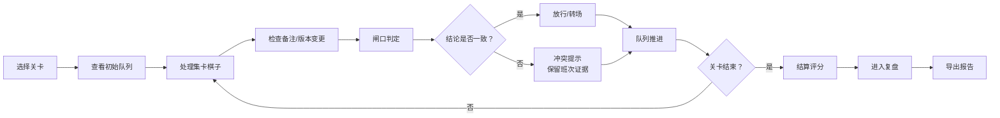
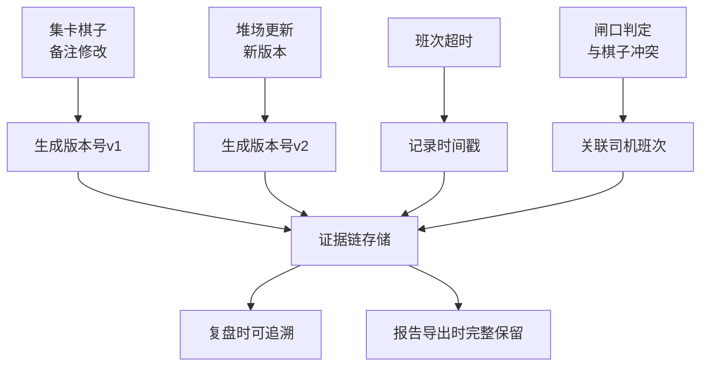

## 1. 产品概述

港口集卡排队棋是一款面向港口培训主管的实操训练游戏，用于培训和考核闸口调度人员对集卡排队规则的掌握程度。游戏通过模拟集卡棋子备注变更、堆场版本更新、闸口结论冲突等真实场景，帮助学员建立证据意识，避免凭印象判断导致的前后口径混乱。

### 1.1 核心问题
- 集卡棋子备注修改后，新版本覆盖旧版本导致证据丢失
- 闸口结论与集卡棋子信息不一致时，缺乏班次记录作为佐证
- 人工核验闸口拥堵和预约过号时容易凭印象判断
- 班次超时记录常被新版本覆盖，无法追溯历史
- 培训过程中缺乏完整的规则反馈、失败提示和回放机制

### 1.2 目标用户
| 用户角色 | 核心需求 |
|----------|----------|
| 港口培训主管 | 设计考核关卡、查看学员复盘、导出培训报告 |
| 闸口调度学员 | 学习排队规则、完成关卡挑战、查看错误详情 |

---

## 2. 核心功能

### 2.1 用户角色
| 角色 | 进入方式 | 核心权限 |
|------|----------|----------|
| 培训学员 | 直接进入 | 关卡挑战、规则学习、复盘回放、个人报告导出 |
| 培训主管 | 模式切换 | 关卡配置、全量复盘、批量报告导出 |

### 2.2 功能模块
1. **关卡选择页**：关卡列表、难度说明、历史成绩
2. **游戏主界面**：排队队列、集卡棋子、闸口判定、堆场格、规则提示
3. **复盘页面**：步骤回放、冲突高亮、证据详情、报告导出
4. **规则说明**：完整规则手册、案例解析

### 2.3 页面详情
| 页面名称 | 模块名称 | 功能描述 |
|----------|----------|----------|
| 关卡选择页 | 关卡列表 | 展示3个关卡，显示难度星级、最佳成绩、完成状态 |
| 关卡选择页 | 学习入口 | 规则手册、历史复盘入口 |
| 游戏主界面 | 排队队列 | 显示待处理集卡列表，支持拖拽排序 |
| 游戏主界面 | 集卡棋子卡片 | 显示车牌、司机班次、预约号、备注、版本号 |
| 游戏主界面 | 闸口判定区 | 选择放行/暂扣/转场，显示闸口结论 |
| 游戏主界面 | 堆场格 | 显示当前堆场版本，支持版本更新提示 |
| 游戏主界面 | 规则反馈面板 | 实时提示当前操作是否符合规则 |
| 游戏主界面 | 冲突提示条 | 集卡与闸口结论不一致时高亮预警 |
| 游戏主界面 | 失败弹窗 | 显示错误原因、违反规则、相关证据 |
| 复盘页面 | 时间轴 | 步骤回放控制（播放/暂停/上一步/下一步） |
| 复盘页面 | 冲突详情 | 高亮显示所有冲突点，点击查看证据 |
| 复盘页面 | 证据面板 | 司机班次记录、版本历史、超时记录 |
| 复盘页面 | 报告导出 | 生成PDF/CSV报告，闸口结论与页面一致 |
| 规则说明页 | 规则列表 | 分类展示排队规则、判定标准、处罚条款 |

---

## 3. 核心流程

### 3.1 游戏主流程

### 3.2 证据留存机制

---

## 4. 用户界面设计

### 4.1 设计风格
采用**工业/港口主题**设计风格：
- **主色调**：深海蓝 `#0F3460`（代表港口专业感）、橙红 `#E94560`（冲突预警）
- **辅助色**：港口绿 `#21BF73`（放行通过）、警告黄 `#FFB703`（待处理）
- **按钮风格**：硬朗矩形，轻微倒角，工业风边框
- **字体**：标题用 `Noto Sans SC Bold`，正文用 `Noto Sans SC Regular`，数字用等宽字体 `JetBrains Mono`
- **布局风格**：模块化卡片布局，模拟港口调度控制台
- **图标风格**：线性图标，使用集卡、闸口、堆场、时钟等港口元素

### 4.2 页面设计概览
| 页面名称 | 模块名称 | UI 元素 |
|----------|----------|----------|
| 关卡选择页 | 关卡卡片 | 港口集装箱风格卡片，3D悬停效果，难度进度条 |
| 游戏主界面 | 队列区 | 横向滚动集卡队列，拖拽排序动画，版本标签角标 |
| 游戏主界面 | 闸口区 | 闸口建筑造型，三色信号灯状态（绿/黄/红） |
| 游戏主界面 | 冲突提示 | 红色闪烁边框，震动动画，证据标记图标 |
| 游戏主界面 | 失败弹窗 | 半透明深色遮罩，错误原因列表，证据链展示 |
| 复盘页面 | 时间轴 | 线性时间轴，冲突点红色标记，点击跳转 |
| 复盘页面 | 证据面板 | 可折叠卡片，版本对比高亮，时间戳记录 |
| 复盘页面 | 导出按钮 | 悬浮在右下角，点击显示格式选择（PDF/CSV） |

### 4.3 交互细节
- **集卡拖拽**：抓起时阴影加深，放下时弹性动画
- **版本更新**：旧版本淡出，新版本滑入，带"NEW"标签动画
- **冲突发生**：页面轻微震动，冲突区域红光闪烁
- **规则反馈**：底部滑入提示条，正确绿色、错误红色，2秒后自动消失
- **回放控制**：时间轴拖拽定位，播放速度可调（0.5x/1x/2x）

### 4.4 响应式
- **桌面端优先**：1280px 以上完整布局，左右分栏
- **平板适配**：960-1280px 上下堆叠，保留核心功能
- **触控优化**：按钮最小尺寸 44x44px，拖拽区域扩大

---

## 5. 数据一致性规则

### 5.1 闸口结论一致性
- 页面显示的闸口结论、终端日志、导出报告三者必须完全一致
- 报告中包含：闸口编号、判定时间、操作人员、判定结果、关联证据链
- CSV导出时使用UTF-8编码，避免中文乱码

### 5.2 证据不可篡改性
- 版本记录一旦生成不可修改，新版本仅追加不覆盖
- 班次超时记录带时间戳和操作人签名
- 所有变更操作记录在操作日志中，复盘时完整展示
