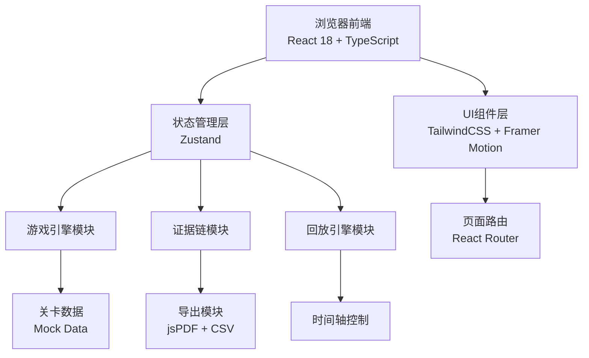
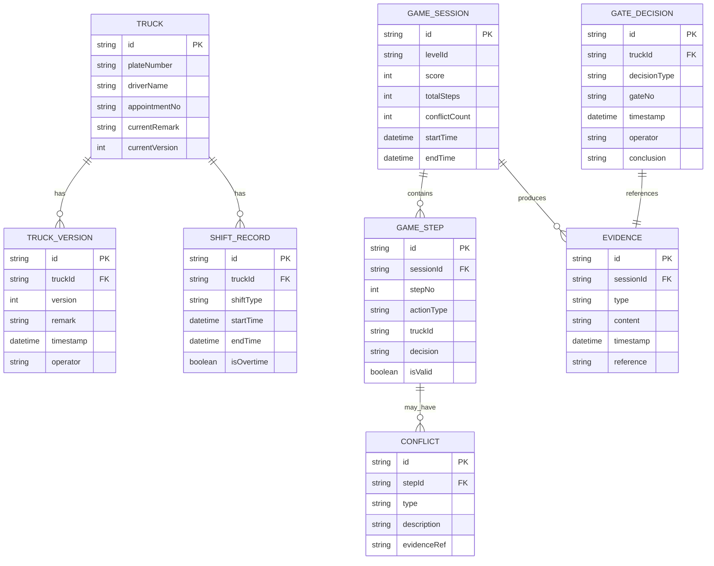

## 1. 架构设计



---

## 2. 技术栈说明

| 层级 | 技术选型 | 版本 | 说明 |
|------|----------|------|------|
| 前端框架 | React | 18.x | 函数式组件 + Hooks |
| 开发语言 | TypeScript | 5.x | 类型安全 |
| 构建工具 | Vite | 5.x | 快速开发构建 |
| 样式方案 | TailwindCSS | 3.x | 原子化CSS |
| 状态管理 | Zustand | 4.x | 轻量状态管理 |
| 路由管理 | React Router | 6.x | 单页路由 |
| 动画库 | Framer Motion | 11.x | 交互动画 |
| 拖拽库 | @dnd-kit/core | 6.x | 集卡拖拽排序 |
| 导出库 | jspdf | 2.x | PDF报告导出 |
| 图标库 | lucide-react | 0.x | 线性图标 |
| 字体 | Noto Sans SC | - | Google Fonts |

---

## 3. 目录结构

```
src/
├── components/           # 公共组件
│   ├── TruckCard.tsx     # 集卡棋子卡片
│   ├── GateArea.tsx      # 闸口判定区
│   ├── YardSlot.tsx      # 堆场格
│   ├── QueueArea.tsx     # 排队队列区
│   ├── RuleFeedback.tsx  # 规则反馈提示
│   ├── ConflictAlert.tsx # 冲突提示
│   ├── FailureModal.tsx  # 失败弹窗
│   ├── Timeline.tsx      # 复盘时间轴
│   ├── EvidencePanel.tsx # 证据面板
│   └── ExportButton.tsx  # 导出按钮
├── pages/                # 页面
│   ├── LevelSelect.tsx   # 关卡选择页
│   ├── GameBoard.tsx     # 游戏主界面
│   ├── ReviewPage.tsx    # 复盘页面
│   └── RuleBook.tsx      # 规则说明页
├── store/                # 状态管理
│   ├── gameStore.ts      # 游戏状态
│   └── reviewStore.ts    # 复盘状态
├── engine/               # 游戏引擎
│   ├── gameEngine.ts     # 游戏核心逻辑
│   ├── ruleEngine.ts     # 规则校验引擎
│   ├── evidenceEngine.ts # 证据链引擎
│   └── replayEngine.ts   # 回放引擎
├── data/                 # 数据
│   ├── levels.ts         # 关卡配置
│   └── rules.ts          # 规则定义
├── types/                # 类型定义
│   └── index.ts          # 全局类型
├── utils/                # 工具函数
│   ├── export.ts         # 导出工具
│   └── consistency.ts    # 一致性校验
├── App.tsx
├── main.tsx
└── index.css
```

---

## 4. 路由定义

| 路由路径 | 页面 | 说明 |
|----------|------|------|
| `/` | 关卡选择页 | 默认入口，展示关卡列表 |
| `/game/:levelId` | 游戏主界面 | 关卡游戏界面 |
| `/review/:sessionId` | 复盘页面 | 对局复盘，支持回放 |
| `/rules` | 规则说明页 | 完整规则手册 |

---

## 5. 数据模型

### 5.1 核心类型定义



### 5.2 关卡数据结构

```typescript
interface Level {
  id: string;
  name: string;
  difficulty: 1 | 2 | 3;
  description: string;
  initialTrucks: Truck[];
  events: LevelEvent[];
  passScore: number;
  timeLimit?: number;
}

interface LevelEvent {
  triggerStep: number;
  type: 'remark_change' | 'yard_update' | 'gate_conflict' | 'shift_overtime';
  truckId?: string;
  data: Record<string, unknown>;
}
```

---

## 6. 核心模块设计

### 6.1 游戏引擎 (gameEngine.ts)

```typescript
class GameEngine {
  constructor(level: Level);
  startSession(): GameSession;
  processDecision(truckId: string, decision: GateDecision): StepResult;
  checkRuleViolation(truck: Truck, decision: GateDecision): RuleViolation | null;
  triggerEvent(step: number): LevelEvent | null;
  endSession(): GameResult;
}
```

**职责**：
- 管理游戏会话生命周期
- 处理玩家决策
- 触发关卡事件（备注变更、堆场更新等）
- 结算游戏分数

### 6.2 规则引擎 (ruleEngine.ts)

```typescript
class RuleEngine {
  validateQueueOrder(trucks: Truck[]): ValidationResult;
  validateGateDecision(truck: Truck, decision: GateDecision): ValidationResult;
  checkAppointmentOverdue(truck: Truck): boolean;
  checkShiftOvertime(shift: ShiftRecord): boolean;
  checkYardVersionConflict(truck: Truck, yardVersion: number): boolean;
}
```

**职责**：
- 校验排队顺序是否合规
- 校验闸口判定是否符合规则
- 检测预约过号、班次超时
- 检测堆场版本冲突

### 6.3 证据链引擎 (evidenceEngine.ts)

```typescript
class EvidenceEngine {
  recordVersionChange(truck: Truck, oldRemark: string, newRemark: string): Evidence;
  recordShiftOvertime(shift: ShiftRecord): Evidence;
  recordGateConflict(truck: Truck, decision: GateDecision, expected: string): Evidence;
  recordYardUpdate(oldVersion: number, newVersion: number): Evidence;
  getEvidenceChain(sessionId: string): Evidence[];
}
```

**职责**：
- 记录所有版本变更
- 记录班次超时
- 记录闸口冲突
- 构建完整证据链
- 确保证据不可篡改（带时间戳）

### 6.4 回放引擎 (replayEngine.ts)

```typescript
class ReplayEngine {
  loadSession(sessionId: string): ReplayState;
  play(speed: number): void;
  pause(): void;
  stepForward(): ReplayState;
  stepBackward(): ReplayState;
  seekTo(stepNo: number): ReplayState;
  getCurrentState(): ReplayState;
}
```

**职责**：
- 加载历史对局数据
- 控制回放播放/暂停/快进/后退
- 时间轴精确定位
- 高亮冲突点和证据

### 6.5 导出模块 (export.ts)

```typescript
function exportToPDF(session: GameSession, evidences: Evidence[]): Blob;
function exportToCSV(session: GameSession, evidences: Evidence[]): Blob;
function generateSummary(session: GameSession): string;
function verifyConsistency(pageData: unknown, exportData: unknown): boolean;
```

**职责**：
- 导出PDF报告
- 导出CSV数据
- 生成闸口结论摘要
- 校验页面与导出数据一致性

---

## 7. 状态管理设计

### 7.1 Game Store (gameStore.ts)

```typescript
interface GameState {
  session: GameSession | null;
  currentStep: number;
  trucks: Truck[];
  yardVersion: number;
  decisions: GateDecision[];
  conflicts: Conflict[];
  feedback: RuleFeedback | null;
  isFailureModalOpen: boolean;
  failureReason: string | null;
}
```

### 7.2 Review Store (reviewStore.ts)

```typescript
interface ReviewState {
  session: GameSession | null;
  replayStep: number;
  isPlaying: boolean;
  playSpeed: number;
  selectedEvidence: Evidence | null;
  highlightedConflict: Conflict | null;
  steps: GameStep[];
  evidences: Evidence[];
}
```

---

## 8. 一致性保障机制

### 8.1 数据一致性校验
```typescript
// 闸口结论三重一致性校验
function validateGateConclusionConsistency(
  pageDisplay: GateDecision,
  terminalLog: GateDecision,
  exportData: GateDecision
): boolean {
  return (
    pageDisplay.conclusion === terminalLog.conclusion &&
    terminalLog.conclusion === exportData.conclusion &&
    pageDisplay.timestamp.getTime() === terminalLog.timestamp.getTime() &&
    terminalLog.timestamp.getTime() === exportData.timestamp.getTime()
  );
}
```

### 8.2 证据不可篡改
- 所有证据记录生成时添加SHA-256哈希
- 版本记录采用追加模式，永不修改历史数据
- 操作日志完整记录用户每一步操作

---

## 9. Mock 数据规划

预置3个关卡的完整Mock数据：
- **关卡1（入门）**：5辆集卡，1次备注变更，无冲突
- **关卡2（进阶）**：8辆集卡，2次备注变更，1次堆场更新，1次闸口冲突
- **关卡3（挑战）**：12辆集卡，3次备注变更，2次堆场更新，2次闸口冲突，1次班次超时

每个关卡包含完整的：
- 初始集卡队列数据
- 事件触发时间表
- 预期正确决策序列
- 评分标准配置
