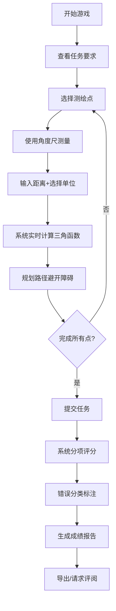
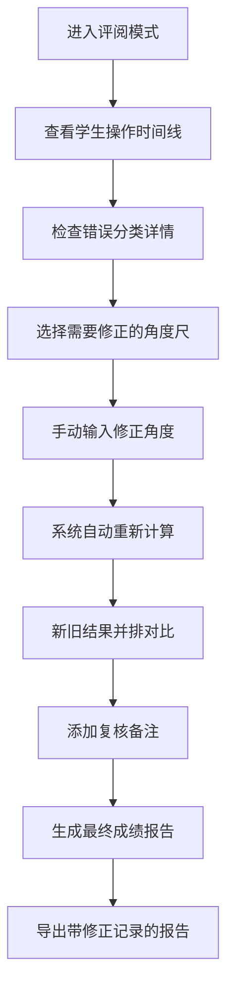

## 1. 产品概述
"几何测绘探险"是一款面向中学生的数学教育游戏，通过模拟地形测绘任务，让玩家在实际操作中理解三角函数、角度测量、距离计算和路径规划的几何知识。游戏强调**可复核的成绩报告**和**规则化的错误分析**，帮助数学老师准确评估学生对几何知识的掌握程度。

- 核心目标：让玩家在操作中感受三角计算和路径选择的取舍，而非简单点击得分
- 目标用户：中学生（玩家）、数学老师（评阅者）
- 核心价值：将抽象的几何知识转化为可操作的测绘任务，提供详细可追溯的错误分析

## 2. 核心特性

### 2.1 用户角色

| 角色 | 使用方式 | 核心权限 |
|------|----------|----------|
| 学生玩家 | 直接进入游戏 | 进行测绘任务、查看个人成绩报告、导出成绩 |
| 数学老师 | 评阅模式入口 | 手动修正角度尺、对比新旧结果、查看详细复核记录 |

### 2.2 功能模块

1. **游戏主界面**：地形画布、测绘工具栏、实时计算面板
2. **测绘任务系统**：测绘点选择、角度测量、距离计算、路径规划
3. **地形障碍系统**：障碍物检测、穿越判定、绕路计算
4. **成绩报告系统**：分项得分、错误分类、规则追溯
5. **老师评阅系统**：手动修正入口、新旧结果并排对比、复核详情
6. **成绩导出系统**：完整记录导出、测绘点-角度尺-成绩对应关系

### 2.3 页面详情

| 页面名称 | 模块名称 | 功能描述 |
|---------|----------|----------|
| 游戏主界面 | 地形画布 | 显示等高线地形、测绘目标点、障碍物区域 |
| 游戏主界面 | 测绘工具栏 | 角度尺、测距仪、路径笔、重置按钮 |
| 游戏主界面 | 实时计算面板 | 显示当前角度、距离、三角函数值、预计得分 |
| 游戏主界面 | 任务提示区 | 显示当前任务要求、单位要求、角度范围限制 |
| 成绩报告页 | 分项得分卡 | 测绘点得分、角度计算得分、路径选择得分、单位规范得分 |
| 成绩报告页 | 错误分类面板 | 角度越界错误、距离单位错误、障碍穿越错误分别展示 |
| 成绩报告页 | 规则追溯区 | 每条扣分对应具体几何规则，标注是三角计算还是路径选择问题 |
| 成绩报告页 | 操作时间线 | 测绘点、地形障碍、成绩记录按时间顺序展开，可追溯每步操作 |
| 老师评阅页 | 手动修正入口 | 角度尺数值修正、距离单位调整 |
| 老师评阅页 | 新旧结果对比 | 左右并排展示修正前后的计算结果和得分变化 |
| 老师评阅页 | 复核详情面板 | 显示测绘点ID、角度尺参数、成绩计算的完整对应关系 |
| 成绩导出页 | 导出配置 | 选择导出格式、包含复核详情、生成时间戳 |

## 3. 核心流程

### 3.1 玩家游戏流程

玩家进入游戏后，首先查看任务要求（需要测量哪些点、角度范围限制、单位要求），然后在地形上选择测绘点，使用角度尺测量两点间的角度，输入距离并选择单位，系统实时计算三角函数值。玩家需要规划路径避开障碍物，完成所有测绘点后提交。系统根据每步操作进行评分，将错误按类型分类并标注违反的具体规则。最后生成可追溯的成绩报告，玩家可导出或请求老师评阅。

### 3.2 老师评阅流程

老师收到评阅请求后，查看学生的完整操作时间线和错误分类。针对角度尺测量可能存在的误差，老师可以手动修正角度数值，系统自动重新计算所有相关的三角函数值和得分。修正前后的结果并排展示，老师可以添加复核备注，最终生成包含修正记录的最终成绩报告。

## 4. 界面设计

### 4.1 设计风格

采用**科技教育风**，结合几何元素和地形测绘主题：

- **主色调**：深蓝 (#0F3460) 作为主色，代表专业和可信赖
- **辅助色**：橙色 (#E94560) 标注错误，绿色 (#16C79A) 标注正确，金色 (#FFD93D) 标注修正
- **中性色**：浅灰蓝背景 (#F5F7FA)，深灰文字 (#2C3E50)
- **字体**：标题使用 'Orbitron' 科技感字体，正文使用 'Inter' 清晰易读
- **按钮风格**：圆角矩形，微立体阴影，点击有按压反馈
- **图标风格**：线性几何图标，测绘工具风格统一

### 4.2 页面设计概览

| 页面名称 | 模块名称 | UI 元素 |
|---------|----------|---------|
| 游戏主界面 | 地形画布 | 等距投影地形，等高线用虚线表示，测绘点用发光圆点标记，障碍物用红色斜线填充，操作路径用蓝色虚线连接 |
| 游戏主界面 | 测绘工具栏 | 左侧垂直工具栏，角度尺为半圆量角器图标，测距仪为直尺图标，路径笔为铅笔图标，悬停有工具提示 |
| 游戏主界面 | 实时计算面板 | 右侧半透明卡片，显示 sin/cos/tan 值，单位换算，预计得分，颜色随正确性变化 |
| 游戏主界面 | 任务提示区 | 顶部横幅，显示当前任务进度，角度范围限制用红色标记，单位要求用徽章展示 |
| 成绩报告页 | 分项得分卡 | 四个圆角卡片横向排列，每个卡片显示得分、满分、等级徽章，底部有进度条 |
| 成绩报告页 | 错误分类面板 | 三栏布局，每栏对应一种错误类型，错误项可展开查看规则说明 |
| 成绩报告页 | 操作时间线 | 垂直时间线，每个节点显示操作类型、时间戳、结果，点击可在画布上定位 |
| 老师评阅页 | 新旧结果对比 | 左右分栏，左侧旧结果用灰色边框，右侧新结果用金色边框，差异处用高亮标记 |
| 老师评阅页 | 复核详情 | 三列表格：测绘点ID、角度尺参数、成绩计算，行背景交替，点击行高亮对应画布元素 |

### 4.3 响应式设计

- **桌面端优先**：游戏画布占 60% 宽度，控制面板占 40%
- **平板适配**：控制面板改为底部抽屉，可滑动展开
- **触摸优化**：测绘点点击区域扩大到 48x48px，角度尺支持双指旋转

### 4.4 交互与动画

- **页面加载**：元素从下往上 staggered 进入，延迟 100ms
- **测绘点选择**：圆点向外扩散波纹动画，选中后发光增强
- **角度旋转**：角度尺随鼠标旋转，实时显示角度数值，超过限制时边框变红
- **错误反馈**：错误项左右抖动，然后展开错误说明
- **修正对比**：修正后数值从旧值平滑过渡到新值，背景高亮渐变
