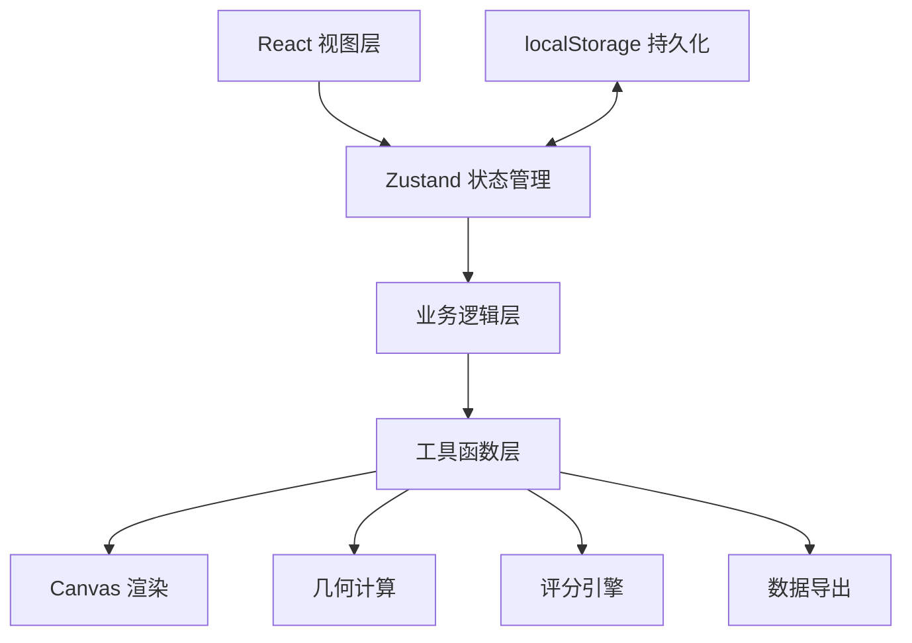
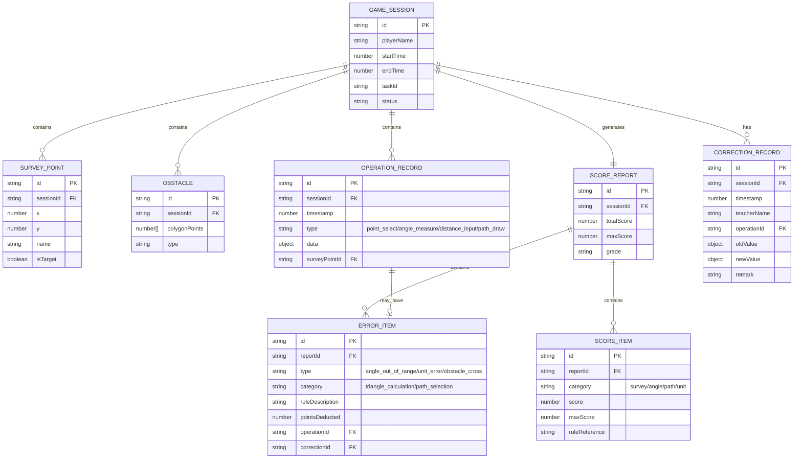

## 1. 架构设计

本项目为纯前端单页应用，无需后端服务，所有数据存储在浏览器 localStorage 中。架构分为视图层、状态管理层、业务逻辑层和工具层。



## 2. 技术选型

- **前端框架**：React 18 + TypeScript 5
- **构建工具**：Vite 5
- **样式方案**：TailwindCSS 3 + CSS Variables
- **状态管理**：Zustand 4（轻量、易于调试）
- **图标库**：Lucide React（几何风格图标）
- **数据持久化**：localStorage
- **画布渲染**：原生 Canvas 2D API
- **图表展示**：原生 SVG（用于成绩图表，避免引入重型库）

**不使用后端和数据库**：所有数据本地存储，适合教育场景离线使用。

## 3. 路由定义

| 路由 | 页面 | 说明 |
|------|------|------|
| `/` | 首页 | 游戏介绍、开始游戏、进入评阅入口 |
| `/game` | 游戏主界面 | 地形测绘核心玩法 |
| `/report/:sessionId` | 成绩报告页 | 分项得分、错误分类、操作时间线 |
| `/review/:sessionId` | 老师评阅页 | 手动修正、新旧对比、复核详情 |
| `/export/:sessionId` | 成绩导出页 | 导出配置、预览导出内容 |

## 4. 数据模型

### 4.1 核心数据结构



### 4.2 TypeScript 类型定义

```typescript
// 游戏会话
interface GameSession {
  id: string;
  playerName: string;
  startTime: number;
  endTime?: number;
  taskId: string;
  status: 'playing' | 'submitted' | 'reviewed';
  surveyPoints: SurveyPoint[];
  obstacles: Obstacle[];
  operations: OperationRecord[];
  scoreReport?: ScoreReport;
  corrections: CorrectionRecord[];
}

// 测绘点
interface SurveyPoint {
  id: string;
  x: number;
  y: number;
  name: string;
  isTarget: boolean;
  measured?: boolean;
}

// 障碍物
interface Obstacle {
  id: string;
  polygonPoints: { x: number; y: number }[];
  type: 'building' | 'water' | 'restricted';
}

// 操作记录
interface OperationRecord {
  id: string;
  timestamp: number;
  type: 'point_select' | 'angle_measure' | 'distance_input' | 'path_draw';
  surveyPointId?: string;
  data: {
    angle?: number;
    distance?: number;
    unit?: 'm' | 'km' | 'cm';
    pathPoints?: { x: number; y: number }[];
    fromPoint?: string;
    toPoint?: string;
  };
}

// 错误项
interface ErrorItem {
  id: string;
  type: 'angle_out_of_range' | 'unit_error' | 'obstacle_cross';
  category: 'triangle_calculation' | 'path_selection';
  ruleDescription: string;
  ruleReference: string;
  pointsDeducted: number;
  operationId: string;
  corrected?: boolean;
}

// 评分项
interface ScoreItem {
  id: string;
  category: 'survey' | 'angle' | 'path' | 'unit';
  categoryName: string;
  score: number;
  maxScore: number;
  ruleReference: string;
  errors: ErrorItem[];
}

// 成绩报告
interface ScoreReport {
  id: string;
  sessionId: string;
  totalScore: number;
  maxScore: number;
  grade: 'A' | 'B' | 'C' | 'D' | 'F';
  scoreItems: ScoreItem[];
  generatedAt: number;
}

// 修正记录
interface CorrectionRecord {
  id: string;
  timestamp: number;
  teacherName: string;
  operationId: string;
  field: 'angle' | 'unit' | 'distance';
  oldValue: number | string;
  newValue: number | string;
  remark: string;
  recalculatedScores?: ScoreReport;
}
```

## 5. 核心模块设计

### 5.1 几何计算模块 (`src/utils/geometry.ts`)

```typescript
// 三角函数计算
export const calculateTrigonometry = (angle: number) => {
  const rad = (angle * Math.PI) / 180;
  return {
    sin: Math.sin(rad),
    cos: Math.cos(rad),
    tan: Math.tan(rad),
  };
};

// 两点间距离计算
export const calculateDistance = (
  p1: { x: number; y: number },
  p2: { x: number; y: number },
  unit: 'm' | 'km' | 'cm',
  scale: number = 1
) => {
  const pixelDist = Math.sqrt(Math.pow(p2.x - p1.x, 2) + Math.pow(p2.y - p1.y, 2));
  const meters = pixelDist * scale;
  switch (unit) {
    case 'km': return meters / 1000;
    case 'cm': return meters * 100;
    default: return meters;
  }
};

// 角度范围验证
export const validateAngleRange = (angle: number, min: number, max: number) => {
  return angle >= min && angle <= max;
};

// 线段与多边形相交检测（障碍物穿越检测）
export const doesLineIntersectPolygon = (
  line: { x1: number; y1: number; x2: number; y2: number },
  polygon: { x: number; y: number }[]
) => {
  // 实现射线法或分离轴定理
};
```

### 5.2 评分引擎模块 (`src/utils/scoring.ts`)

```typescript
// 评分规则配置
const SCORING_RULES = {
  triangle_calculation: [
    {
      id: 'TRI-001',
      name: '角度范围越界',
      description: '测量角度必须在任务要求的范围内',
      check: (op: OperationRecord, task: Task) => !validateAngleRange(op.data.angle!, task.angleMin, task.angleMax),
      deduction: 10,
      errorType: 'angle_out_of_range',
    },
    {
      id: 'TRI-002',
      name: '距离单位错误',
      description: '距离单位必须与任务要求一致',
      check: (op: OperationRecord, task: Task) => op.data.unit !== task.requiredUnit,
      deduction: 5,
      errorType: 'unit_error',
    },
  ],
  path_selection: [
    {
      id: 'PATH-001',
      name: '路径穿越障碍物',
      description: '测量路径不能穿越障碍物区域',
      check: (op: OperationRecord, obstacles: Obstacle[]) => {
        // 检测路径是否穿越障碍物
      },
      deduction: 15,
      errorType: 'obstacle_cross',
    },
  ],
};

// 生成分项评分
export const generateScoreReport = (
  session: GameSession,
  task: Task
): ScoreReport => {
  // 遍历所有操作记录
  // 应用评分规则
  // 收集错误并分类
  // 计算各分项得分
  // 返回完整报告
};
```

### 5.3 状态管理 (`src/store/gameStore.ts`)

```typescript
import { create } from 'zustand';
import { persist } from 'zustand/middleware';

interface GameState {
  currentSession: GameSession | null;
  sessions: GameSession[];
  currentTool: 'select' | 'angle' | 'distance' | 'path';
  selectedPoint: string | null;
  
  // Actions
  startNewGame: (playerName: string, taskId: string) => void;
  selectSurveyPoint: (pointId: string) => void;
  recordAngleMeasurement: (pointId: string, angle: number) => void;
  recordDistanceInput: (pointId: string, distance: number, unit: string) => void;
  recordPath: (fromPoint: string, toPoint: string, pathPoints: Point[]) => void;
  submitGame: () => ScoreReport;
  applyCorrection: (operationId: string, field: string, newValue: any, teacherName: string, remark: string) => ScoreReport;
  exportReport: (sessionId: string, format: 'json' | 'csv') => string;
}

export const useGameStore = create<GameState>()(
  persist(
    (set, get) => ({
      // 状态和方法实现
    }),
    { name: 'geometry-survey-storage' }
  )
);
```

## 6. 核心组件设计

| 组件路径 | 组件名 | 职责 |
|---------|--------|------|
| `src/components/game/TerrainCanvas.tsx` | `TerrainCanvas` | 地形渲染、测绘点绘制、障碍物绘制、路径绘制 |
| `src/components/game/Toolbar.tsx` | `Toolbar` | 工具选择、操作按钮 |
| `src/components/game/CalculationPanel.tsx` | `CalculationPanel` | 实时三角函数计算、单位换算显示 |
| `src/components/game/TaskBanner.tsx` | `TaskBanner` | 任务要求展示、进度显示 |
| `src/components/report/ScoreCards.tsx` | `ScoreCards` | 分项得分卡片展示 |
| `src/components/report/ErrorClassification.tsx` | `ErrorClassification` | 错误分类面板，按类型展示 |
| `src/components/report/OperationTimeline.tsx` | `OperationTimeline` | 操作时间线，可追溯 |
| `src/components/review/CorrectionPanel.tsx` | `CorrectionPanel` | 手动修正入口 |
| `src/components/review/CompareView.tsx` | `CompareView` | 新旧结果并排对比 |
| `src/components/review/ReviewDetails.tsx` | `ReviewDetails` | 复核详情表格 |
| `src/components/export/ExportPanel.tsx` | `ExportPanel` | 导出配置和预览 |

## 7. 目录结构

```
src/
├── components/
│   ├── game/           # 游戏界面组件
│   ├── report/         # 成绩报告组件
│   ├── review/         # 老师评阅组件
│   ├── export/         # 导出组件
│   └── common/         # 通用组件
├── store/              # Zustand 状态管理
├── utils/              # 工具函数
│   ├── geometry.ts     # 几何计算
│   ├── scoring.ts      # 评分引擎
│   ├── export.ts       # 数据导出
│   └── validation.ts   # 验证规则
├── types/              # TypeScript 类型定义
├── data/               # 任务数据 mock
├── hooks/              # 自定义 hooks
├── App.tsx
├── main.tsx
└── index.css
```
