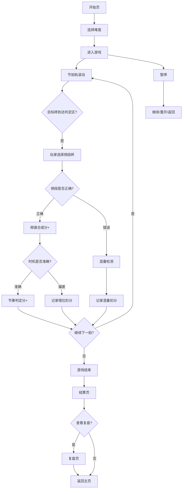

## 1. 产品概述

**傅里叶音乐彩砖**是一款面向音乐科技课堂的浏览器端教育游戏。玩家通过在节拍轨上放置频段砖来合成目标声音，实时观察波形和频谱变化，在游戏中理解傅里叶变换的核心概念。

- 目标用户：音乐科技课程学生、频谱分析入门学习者
- 核心价值：将抽象的频谱分析概念具象化为可操作的彩砖合成玩法，通过"做中学"让学生直观理解频段叠加、混叠、滤波等概念

## 2. 核心功能

### 2.1 功能模块

1. **开始页**：游戏标题、玩法说明、难度选择、开始按钮
2. **游戏主界面**：频段砖选择区、节拍轨、波形/频谱预览、实时状态栏
3. **暂停浮层**：继续、重开、返回主页
4. **结算页**：总分、分项得分、扣分明细、波形回放
5. **复盘页**：逐步回放玩家操作、错误高亮、频段影响说明

### 2.2 页面详情

| 页面名称 | 模块名称 | 功能描述 |
|---------|---------|---------|
| 开始页 | 游戏标题区 | 展示"傅里叶音乐彩砖"标题与动态频谱动画背景 |
| 开始页 | 玩法说明 | 简明图示：选频段→放砖→合成→判定 |
| 开始页 | 难度选择 | 入门（4频段/慢速）/ 进阶（6频段/中速） / 大师（8频段/快速） |
| 游戏主界面 | 频段砖选择区 | 显示可用频段砖（低频/中低/中频/中高/高频），每块砖标注频率范围与颜色 |
| 游戏主界面 | 节拍轨 | 横向滚动的节拍格子，玩家在对应节拍位置放置频段砖；目标砖从右侧滑入 |
| 游戏主界面 | 波形预览 | Canvas 实时绘制当前合成波形与目标波形的对比 |
| 游戏主界面 | 频谱预览 | Canvas 实时绘制频域柱状图，显示各频段强度 |
| 游戏主界面 | 状态栏 | 当前得分、连击数、剩余时间、进度条 |
| 暂停浮层 | 控制按钮 | 继续 / 重开 / 返回主页 |
| 结算页 | 总分展示 | 大字展示总分与评级（S/A/B/C/D） |
| 结算页 | 分项得分 | 频谱合成分、节奏判定分、波形回放分 |
| 结算页 | 扣分明细 | 频段混叠扣分、节拍错位扣分、过度滤波扣分，每项标注影响的频段 |
| 结算页 | 波形回放 | 播放合成波形 vs 目标波形对比动画 |
| 复盘页 | 逐步回放 | 可拖动时间轴，逐步回放玩家每次放砖操作 |
| 复盘页 | 错误高亮 | 混叠/错位/滤波错误用红/黄/橙色标注在节拍轨上 |
| 复盘页 | 影响说明 | 点击错误标注弹出详细说明：该错误影响了哪些频段与结果 |

## 3. 核心流程

玩家进入游戏后，系统生成目标频谱（由多个频段叠加而成的目标声音）。节拍轨从右向左滚动，目标频段砖标记在对应节拍位置。玩家需要在正确时机选择并放置正确的频段砖，合成出接近目标的波形。游戏结束后进入结算页查看评分，可进一步复盘每一步操作。

## 4. 用户界面设计

### 4.1 设计风格

- **主色调**：深色背景（#0a0a1a）搭配霓虹频谱色（低频红 #ff3366 → 中频绿 #33ff99 → 高频蓝 #3366ff）
- **辅助色**：紫 #9966ff（混叠警告）、橙 #ff9933（错位警告）、灰蓝 #6688aa（UI元素）
- **按钮风格**：圆角矩形，微发光边框，hover 时发光增强
- **字体**：标题使用 Orbitron（科技感显示字体），正文使用 Noto Sans SC（中文清晰可读）
- **布局风格**：顶部状态栏 + 中央游戏区 + 底部频段选择区
- **动效**：频段砖放置时脉冲扩散、波形实时流动、连击时屏幕微震

### 4.2 页面设计概述

| 页面名称 | 模块名称 | UI元素 |
|---------|---------|--------|
| 开始页 | 标题区 | Orbitron大标题，频谱渐变色，呼吸灯动效 |
| 开始页 | 说明区 | 四步图示卡片，半透明玻璃态背景 |
| 开始页 | 难度选择 | 三个发光按钮，选中态边框高亮 |
| 游戏主界面 | 频段砖区 | 底部横排彩色砖块，hover放大+发光 |
| 游戏主界面 | 节拍轨 | 横向4轨道，滚动格子线，目标砖虚影 |
| 游戏主界面 | 波形预览 | 左上角Canvas，绿色目标线+白色合成线 |
| 游戏主界面 | 频谱预览 | 右上角Canvas，彩色柱状图 |
| 暂停浮层 | 全屏遮罩 | 毛玻璃背景，居中按钮组 |
| 结算页 | 总分区 | 大字居中，评级字母带光晕 |
| 结算页 | 明细表 | 三列卡片，扣分项带警告色图标 |
| 结算页 | 波形回放 | 底部波形动画，播放/暂停按钮 |
| 复盘页 | 回放控制 | 底部进度条+播放按钮，可拖动 |
| 复盘页 | 错误标注 | 节拍轨上红/黄/橙标记，点击弹tooltip |

### 4.3 响应式设计

- 桌面优先设计，最小宽度 1024px
- 游戏主界面中央区域自适应，侧边波形/频谱面板可折叠
- 触控适配：频段砖点击区域不小于 48px

### 4.4 版本与来源追踪

- 每局游戏生成唯一的 `gameId`（时间戳+随机数）
- 所有频段砖、节拍配置、判定结果均带版本标记 `v1.0`
- 结算页和复盘页展示数据来源标签（如"频谱合成分 · 来自FFT比对算法 v1.0"）
