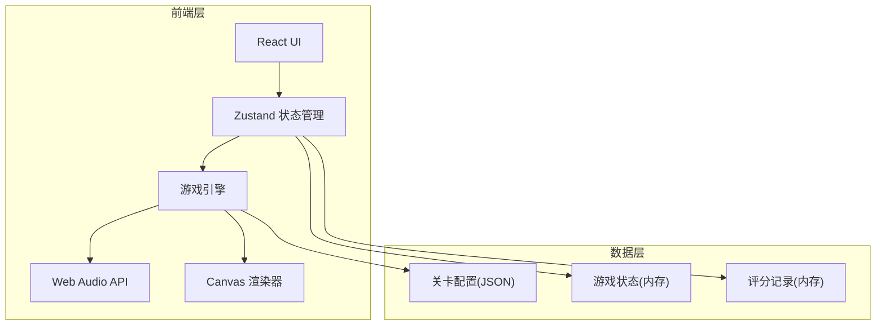

## 1. 架构设计



## 2. 技术说明

- **前端框架**：React 18 + TypeScript + Vite
- **样式方案**：Tailwind CSS 3
- **状态管理**：Zustand
- **音频处理**：Web Audio API（OscillatorNode + GainNode + AnalyserNode）
- **可视化渲染**：Canvas 2D API（波形绘制、频谱柱状图）
- **路由**：react-router-dom v6
- **图标**：lucide-react
- **无后端**：纯前端应用，数据存储在内存中

## 3. 路由定义

| 路由 | 用途 |
|------|------|
| `/` | 开始页：标题、玩法说明、难度选择 |
| `/game` | 游戏主界面：频段砖、节拍轨、波形预览 |
| `/result` | 结算页：总分、分项得分、扣分明细、波形回放 |
| `/review` | 复盘页：逐步回放、错误高亮、影响说明 |

## 4. 核心数据模型

### 4.1 频段砖 (FrequencyBrick)

```typescript
interface FrequencyBrick {
  id: string;
  label: string;
  freqRange: [number, number];
  color: string;
  type: "low" | "mid-low" | "mid" | "mid-high" | "high";
  version: string;
}
```

### 4.2 节拍事件 (BeatEvent)

```typescript
interface BeatEvent {
  beatIndex: number;
  timestamp: number;
  targetBricks: FrequencyBrick[];
  playerBricks: FrequencyBrick[];
  judgment: "perfect" | "good" | "miss" | null;
  spectrumScore: number;
  rhythmScore: number;
  errors: GameError[];
}
```

### 4.3 游戏错误 (GameError)

```typescript
interface GameError {
  type: "aliasing" | "misalignment" | "over-filtering";
  severity: "warning" | "error";
  affectedBricks: string[];
  affectedResults: string[];
  description: string;
  deduction: number;
}
```

### 4.4 游戏状态 (GameState)

```typescript
interface GameState {
  gameId: string;
  difficulty: "beginner" | "intermediate" | "master";
  status: "idle" | "playing" | "paused" | "ended";
  currentBeat: number;
  totalBeats: number;
  bpm: number;
  score: GameScore;
  beatEvents: BeatEvent[];
  availableBricks: FrequencyBrick[];
  targetSpectrum: number[];
  version: string;
}
```

### 4.5 游戏评分 (GameScore)

```typescript
interface GameScore {
  spectrumSynthesisScore: number;
  rhythmJudgmentScore: number;
  waveformPlaybackScore: number;
  aliasingDeduction: number;
  misalignmentDeduction: number;
  overFilteringDeduction: number;
  totalScore: number;
  grade: "S" | "A" | "B" | "C" | "D";
}
```

## 5. 核心算法

### 5.1 频谱合成算法

- 使用 Web Audio API 的 OscillatorNode 按频段生成正弦波
- 叠加各频段波形，通过 AnalyserNode 获取频域数据
- 将玩家合成频谱与目标频谱进行余弦相似度比对，得到频谱合成分

### 5.2 节奏判定算法

- 记录玩家放砖时间与目标时间的差值
- |Δt| < 50ms → Perfect（满分）
- 50ms ≤ |Δt| < 150ms → Good（70%分）
- |Δt| ≥ 150ms → Miss（0分）
- 累计各拍判定得分得到节奏判定分

### 5.3 错误检测算法

- **频段混叠**：检测玩家放置的频段砖频率范围是否有重叠，重叠则标记混叠错误，扣分 = 重叠频段数 × 5
- **节拍错位**：检测连续3拍以上判定为Good或Miss，标记错位警告，扣分 = 错位拍数 × 3
- **过度滤波**：检测玩家是否遗漏目标频段超过50%，标记过度滤波，扣分 = 遗漏频段数 × 8

### 5.4 波形回放评分

- 将玩家合成的完整波形与目标波形进行均方误差(MSE)计算
- 波形回放分 = max(0, 100 - MSE × 系数)
- 结算页展示波形回放扣分说明

## 6. 评分表结构

| 评分项 | 满分 | 来源算法 | 版本 |
|-------|------|---------|------|
| 频谱合成分 | 40 | 余弦相似度比对玩家/目标频谱 | v1.0 |
| 节奏判定分 | 30 | 节拍时间差判定（Perfect/Good/Miss） | v1.0 |
| 波形回放分 | 30 | 玩家/目标波形均方误差 | v1.0 |
| 频段混叠扣分 | - | 重叠频段数 × 5 | v1.0 |
| 节拍错位扣分 | - | 连续错位拍数 × 3 | v1.0 |
| 过度滤波扣分 | - | 遗漏频段数 × 8 | v1.0 |
| **总分** | **100** | **三项得分之和 - 三项扣分之和** | v1.0 |

评级标准：S≥90, A≥75, B≥60, C≥40, D<40
