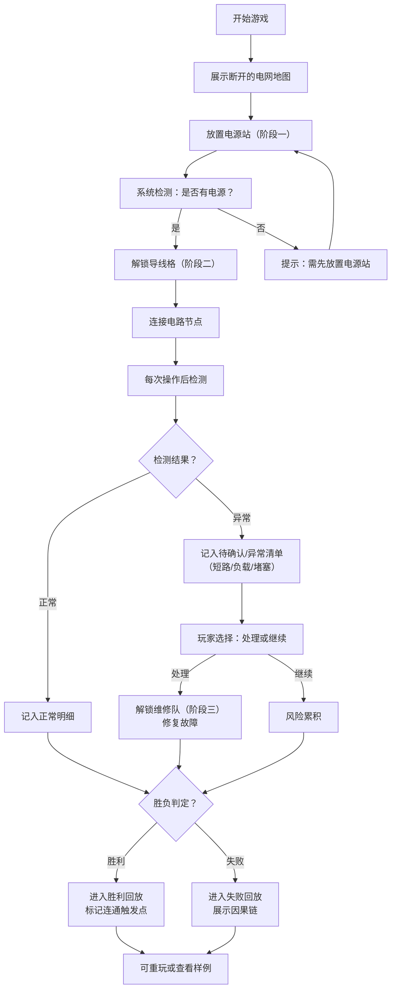

## 1. 产品概述

"电路救援队"是一款面向物理课堂或培训的教育游戏，让学生通过派遣维修队恢复断开的城市电网，直观理解串并联电路原理。区别于传统的输入框答题，游戏将"来源-判断-结果"可视化连线，每一步选择都实时影响局势，胜负后提供清晰的因果分析。

### 核心价值
- **教育目标**：帮助学生从静态图的认知，转向动态电路的理解
- **用户痛点**：物理老师需要直观的教学工具，而非简单的答题系统
- **市场定位**：中学物理课堂、物理社团培训、电路原理科普活动

---

## 2. 核心功能

### 2.1 用户角色

| 角色 | 注册方式 | 核心权限 |
|------|----------|----------|
| 玩家/学生 | 无需注册，直接进入 | 进行游戏、查看操作记录、观看回放 |
| 教师/培训师 | 无需注册，直接进入 | 查看完整回放、分析操作路径、确认分支逻辑 |

### 2.2 功能模块

1. **游戏主界面**：电网可视化地图、元件工具箱、操作记录面板
2. **电路连线系统**：来源-判断-结果可视化连线、路径高亮
3. **异常检测系统**：短路蔓延、负载过高、路径堵塞的识别与标记
4. **回放分析系统**：步骤回溯、关键点标注、失败原因分析
5. **样例演示系统**：正常记录与路径堵塞样例，验证分支逻辑

### 2.3 页面详情

| 页面名称 | 模块名称 | 功能描述 |
|----------|----------|----------|
| 游戏主页 | 电网地图区 | 展示城市电网节点（电源站、变电站、用户端），支持拖拽连线 |
| 游戏主页 | 元件工具箱 | 电源站、导线、维修队等工具，按游戏进度解锁 |
| 游戏主页 | 操作记录面板 | 区分"正常明细"和"待确认/异常清单"，异常项高亮标记 |
| 游戏主页 | 连线可视化层 | 用不同颜色连线展示"来源-判断-结果"逻辑链 |
| 回放页面 | 时间轴控制 | 拖动时间轴回看每一步操作，可暂停、快进 |
| 回放页面 | 触发点标记 | 标记哪一步触发了电路连通或异常 |
| 回放页面 | 失败分析 | 展示失败原因的因果链图 |
| 样例页面 | 双样例对比 | 同时展示正常流程和路径堵塞流程，便于教师确认 |

---

## 3. 核心流程

### 3.1 游戏主流程

1. 游戏开始，展示断开的城市电网地图
2. 第一阶段：放置电源站（优先解锁）
3. 第二阶段：解锁导线格，连接电路节点
4. 第三阶段：解锁维修队，处理故障点
5. 实时检测：每次操作后检查连通性、负载、短路
6. 异常进入"待确认/异常清单"，玩家可选择处理或继续
7. 胜负判定：所有用户端正常供电则胜利，出现不可逆短路/过载则失败
8. 结束后自动进入回放分析

### 3.2 流程图

---

## 4. 用户界面设计

### 4.1 设计风格

- **设计调性**：工业风+未来感，体现电力工程的专业感
- **主色调**：深蓝色（#0F172A）代表电力科技，搭配琥珀色（#F59E0B）代表电流，红色（#EF4444）代表异常
- **辅助色**：青色（#06B6D4）表示连通成功，紫色（#8B5CF6）表示维修队
- **字体**：
  - 标题：Orbitron（科技感等宽字体）
  - 正文：JetBrains Mono（清晰的代码风格字体，便于显示逻辑链）
- **按钮风格**：圆角矩形，带电流发光效果，按下时有电路闭合动画
- **布局风格**：三栏布局，左侧工具箱，中间电网画布，右侧记录面板
- **图标风格**：线性图标，带电路元素（电阻符号、电池符号、闪电符号）

### 4.2 页面设计概述

| 页面名称 | 模块名称 | UI 元素 |
|----------|----------|----------|
| 游戏主页 | 电网画布区 | 深色网格背景，节点用圆形图标，连线用带电流动画的贝塞尔曲线，异常节点闪烁红光 |
| 游戏主页 | 元件工具箱 | 卡片式工具，禁用状态置灰，解锁时有发光动画，已使用的工具保留但不覆盖之前判断 |
| 游戏主页 | 记录面板 | 分"正常明细"和"异常清单"两个标签页，异常项带红色边框，可展开查看详情 |
| 游戏主页 | 逻辑连线层 | 半透明彩色连线：蓝色=来源，黄色=判断，绿色=结果，形成完整逻辑链可视化 |
| 回放页面 | 时间轴 | 底部横向时间轴，关键节点用不同颜色标记：绿色=连通，红色=异常，紫色=维修 |
| 回放页面 | 因果链图 | 右侧展示树状因果图，根节点为最终结果，子节点为各步操作的影响 |
| 样例页面 | 双栏对比 | 左右并排展示两个样例，同步播放时高亮对应步骤 |

### 4.3 响应式设计

- **桌面端优先**：1200px+ 三栏完整布局
- **平板适配**：900-1200px 工具箱改为顶部横向排列，画布和记录保持两栏
- **移动端**：<900px 单栏堆叠，画布支持双指缩放，记录面板改为底部抽屉

### 4.4 动画与交互

1. **电流流动**：连通的导线上有琥珀色光点沿路径流动
2. **放置动画**：放置电源站时有能量向四周扩散的波纹动画
3. **异常告警**：短路/过载时，对应节点红色脉冲闪烁，伴随低频震动
4. **逻辑连线**：完成一个完整判断链时，来源-判断-结果连线依次点亮
5. **回放效果**：回溯时，画布上的操作按时间顺序渐显，已撤销的操作渐隐

---

## 5. 异常处理规则

### 5.1 异常类型与处理

| 异常类型 | 触发条件 | 标记方式 | 处理方式 |
|----------|----------|----------|----------|
| 短路蔓延 | 电源正负极直接连通 | 红色闪烁，记入异常清单 | 需维修队切断短路点 |
| 负载过高 | 单电源供电节点超过5个 | 橙色警告，记入异常清单 | 需增加电源或减少负载 |
| 路径堵塞 | 连线形成闭环但无电源 | 黄色标记，记入待确认 | 检查是否遗漏电源或连线错误 |
| 连接无效 | 导线未连接到有效节点 | 灰色虚线，不记入明细 | 自动提示连接无效 |

### 5.2 样例数据

**样例1：正常流程**
- 步骤1：放置电源站A → 正常
- 步骤2：用导线连接A→B→C → 正常
- 步骤3：放置电源站D → 正常
- 步骤4：连接D→E → 正常
- 步骤5：连接E→C（并联）→ 触发全连通，胜利
- 标记：步骤5为连通触发点

**样例2：路径堵塞**
- 步骤1：放置电源站A → 正常
- 步骤2：连接A→B → 正常
- 步骤3：连接B→C→B（形成闭环）→ 路径堵塞，记入异常
- 步骤4：连接C→D → 因路径堵塞，电力无法送达D
- 步骤5：超时未修复 → 失败
- 回放：标记步骤3为堵塞点，展示因果链：闭环→堵塞→供电失败

---

## 6. 教师功能

1. **分支确认**：样例页面提供"正常"和"堵塞"两个预设样例，无需编写代码即可验证分支逻辑生效
2. **关键步骤导出**：可导出单局游戏的所有关键步骤为JSON或图片
3. **失败原因模板**：常见失败原因自动生成分析报告，可直接用于课堂讲解
4. **进度锁定**：教师可设置工具解锁顺序，强制学生按"电源→导线→维修"的逻辑顺序操作
