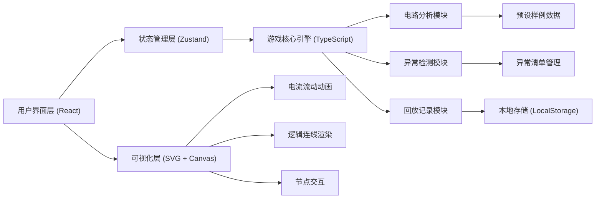
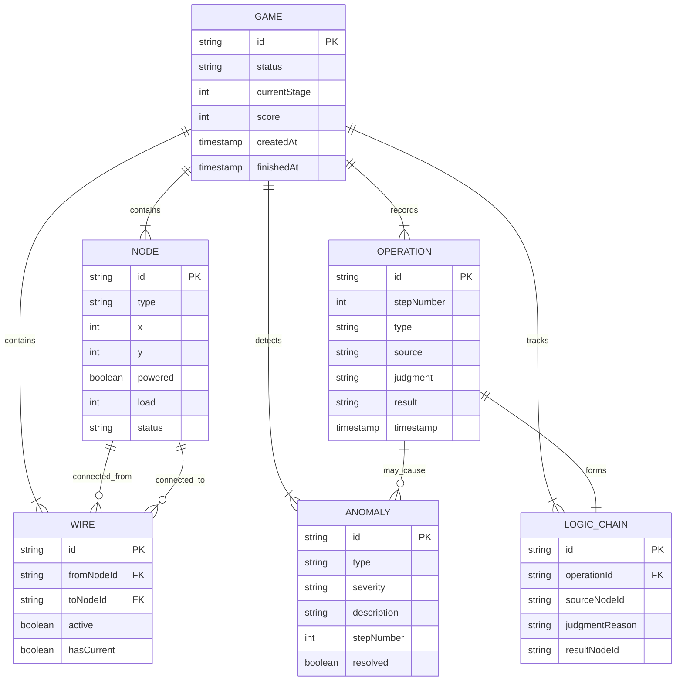

## 1. 架构设计



---

## 2. 技术描述

- **前端框架**：React@18 + TypeScript
- **构建工具**：Vite@5
- **样式方案**：TailwindCSS@3
- **状态管理**：Zustand（轻量级，适合游戏状态追踪）
- **图标库**：Lucide React
- **可视化**：原生 SVG（用于电路图）+ Canvas（用于电流动画特效）
- **动画**：Framer Motion（用于页面过渡和微交互）
- **路由**：React Router DOM@6
- **后端**：无（纯前端应用，数据存储在 LocalStorage）
- **数据库**：无（使用 LocalStorage 存储游戏记录）

---

## 3. 路由定义

| 路由 | 页面组件 | 用途 |
|------|----------|------|
| `/` | `HomePage` | 游戏主页，包含游戏画布、工具箱、记录面板 |
| `/replay/:id` | `ReplayPage` | 回放分析页面，展示时间轴和因果链 |
| `/examples` | `ExamplesPage` | 样例演示页面，双栏对比正常/堵塞流程 |

---

## 4. 数据模型

### 4.1 核心数据模型



### 4.2 TypeScript 类型定义

```typescript
// 节点类型
type NodeType = 'power_station' | 'substation' | 'consumer' | 'fault';

interface Node {
  id: string;
  type: NodeType;
  x: number;
  y: number;
  powered: boolean;
  load: number;
  maxLoad: number;
  status: 'normal' | 'fault' | 'overload' | 'short_circuit';
  label: string;
}

// 导线
interface Wire {
  id: string;
  fromNodeId: string;
  toNodeId: string;
  active: boolean;
  hasCurrent: boolean;
  resistance: number;
}

// 操作类型
type OperationType = 'place_power' | 'place_wire' | 'place_repair' | 'remove_wire';

interface Operation {
  id: string;
  stepNumber: number;
  type: OperationType;
  source: string;
  judgment: string;
  result: string;
  timestamp: number;
  nodeIds?: string[];
  wireId?: string;
}

// 异常类型
type AnomalyType = 'short_circuit' | 'overload' | 'path_blockage' | 'invalid_connection';
type AnomalySeverity = 'warning' | 'error' | 'critical';

interface Anomaly {
  id: string;
  type: AnomalyType;
  severity: AnomalySeverity;
  description: string;
  stepNumber: number;
  resolved: boolean;
  relatedNodeIds: string[];
  relatedWireIds: string[];
}

// 逻辑链（来源-判断-结果）
interface LogicChain {
  id: string;
  operationId: string;
  sourceElement: { type: 'node' | 'wire'; id: string };
  judgment: string;
  resultElement: { type: 'node' | 'wire'; id: string };
  color: string;
}

// 游戏状态
interface GameState {
  id: string;
  status: 'playing' | 'won' | 'lost';
  currentStage: number; // 1: 电源阶段, 2: 导线阶段, 3: 维修阶段
  nodes: Node[];
  wires: Wire[];
  operations: Operation[];
  anomalies: Anomaly[];
  logicChains: LogicChain[];
  unlockedTools: ToolType[];
  score: number;
  timeRemaining: number;
}

// 工具类型
type ToolType = 'power_station' | 'wire' | 'repair_team';
```

---

## 5. 核心模块设计

### 5.1 电路分析模块 (`/src/engine/circuitAnalyzer.ts`)

**核心算法**：
- 使用 BFS/DFS 遍历电路，检测连通性
- 检测短路：电源正负极之间无负载的直接路径
- 检测过载：单电源节点供电的下游节点数超过阈值
- 检测路径堵塞：有向图中检测闭环且无电源输入

**关键函数**：
```typescript
function checkConnectivity(nodes: Node[], wires: Wire[]): Set<string>;
function detectShortCircuit(nodes: Node[], wires: Wire[]): Anomaly | null;
function detectOverload(nodes: Node[], wires: Wire[]): Anomaly | null;
function detectPathBlockage(nodes: Node[], wires: Wire[]): Anomaly | null;
function calculatePowerFlow(nodes: Node[], wires: Wire[]): Node[];
```

### 5.2 异常检测模块 (`/src/engine/anomalyDetector.ts`)

**职责**：
- 每次操作后运行所有检测器
- 将异常分类到"正常明细"或"异常清单"
- 追踪异常的解决状态

### 5.3 回放记录模块 (`/src/engine/replayRecorder.ts`)

**职责**：
- 记录每一步操作的完整状态快照
- 支持按时间轴回溯
- 标记关键触发点（连通、异常、胜负）
- 生成因果链分析

### 5.4 预设样例数据 (`/src/data/examples.ts`)

**样例1：正常流程**
```typescript
const normalExample: GameState = {
  // 5步完成所有节点连通，无异常
  operations: [
    { step: 1, type: 'place_power', nodeId: 'A' },
    { step: 2, type: 'place_wire', from: 'A', to: 'B' },
    { step: 3, type: 'place_wire', from: 'B', to: 'C' },
    { step: 4, type: 'place_power', nodeId: 'D' },
    { step: 5, type: 'place_wire', from: 'D', to: 'E' },
    { step: 6, type: 'place_wire', from: 'E', to: 'C', isParallel: true }
  ],
  triggerPoint: 6 // 第6步触发全连通
};
```

**样例2：路径堵塞**
```typescript
const blockageExample: GameState = {
  operations: [
    { step: 1, type: 'place_power', nodeId: 'A' },
    { step: 2, type: 'place_wire', from: 'A', to: 'B' },
    { step: 3, type: 'place_wire', from: 'B', to: 'C' },
    { step: 4, type: 'place_wire', from: 'C', to: 'B', isCycle: true } // 闭环
  ],
  anomalies: [
    { step: 4, type: 'path_blockage', severity: 'error' }
  ],
  blockagePoint: 4 // 第4步触发路径堵塞
};
```

---

## 6. 组件层级结构

```
src/
├── components/
│   ├── game/
│   │   ├── GameCanvas.tsx      # 游戏主画布
│   │   ├── NodeRenderer.tsx    # 节点渲染组件
│   │   ├── WireRenderer.tsx    # 导线渲染组件
│   │   ├── CurrentAnimation.tsx # 电流动画
│   │   └── LogicChainLayer.tsx # 逻辑链可视化
│   ├── toolbox/
│   │   ├── Toolbox.tsx         # 工具箱
│   │   └── ToolCard.tsx        # 工具卡片
│   ├── records/
│   │   ├── RecordsPanel.tsx    # 记录面板
│   │   ├── NormalList.tsx      # 正常明细
│   │   └── AnomalyList.tsx     # 异常清单
│   ├── replay/
│   │   ├── ReplayTimeline.tsx  # 回放时间轴
│   │   ├── CauseEffectGraph.tsx # 因果链图
│   │   └── TriggerMarker.tsx   # 触发点标记
│   └── examples/
│       ├── ExampleComparison.tsx # 双栏对比
│       └── ExampleCard.tsx     # 样例卡片
├── engine/
│   ├── circuitAnalyzer.ts      # 电路分析
│   ├── anomalyDetector.ts      # 异常检测
│   ├── replayRecorder.ts       # 回放记录
│   └── gameEngine.ts           # 游戏主逻辑
├── store/
│   └── useGameStore.ts         # Zustand 状态管理
├── data/
│   ├── examples.ts             # 预设样例
│   └── initialNodes.ts         # 初始节点配置
├── types/
│   └── index.ts                # 类型定义
├── pages/
│   ├── HomePage.tsx
│   ├── ReplayPage.tsx
│   └── ExamplesPage.tsx
└── App.tsx
```

---

## 7. 关键技术实现点

### 7.1 "来源-判断-结果"可视化

使用 SVG 三层连线：
1. 蓝色层（来源）：连接被选中的工具/节点到判断点
2. 黄色层（判断）：显示判断逻辑的文字标签和连线
3. 绿色层（结果）：连接判断点到操作结果

使用 `LogicChain` 数据结构追踪每条逻辑链，动画依次点亮。

### 7.2 工具解锁与状态保留

- 工具卡片使用 `disabled` 状态控制，已使用的工具保留在工具箱但添加 `used` 样式
- 操作历史记录中保留每一步的判断，后续操作不会覆盖之前的记录
- 使用 `operation.stepNumber` 确保操作顺序可追溯

### 7.3 异常清单管理

- 检测到异常时立即添加到 `anomalies` 数组，不混入正常 `operations`
- 异常项独立渲染，带红色边框和闪烁动画
- 解决异常时标记 `resolved: true`，但保留在清单中不删除

### 7.4 回放与触发点标记

- 每步操作保存完整状态快照（深拷贝）
- 关键事件（连通、异常、胜负）在时间轴上用不同颜色标记
- 点击标记点可跳转到对应步骤，并高亮因果链

### 7.5 样例分支验证

- 两个预设样例使用相同的初始节点配置，但操作序列不同
- 样例页面提供"自动播放"功能，同步播放两个样例
- 在关键步骤（正常样例的连通点、堵塞样例的闭环点）自动暂停并高亮
