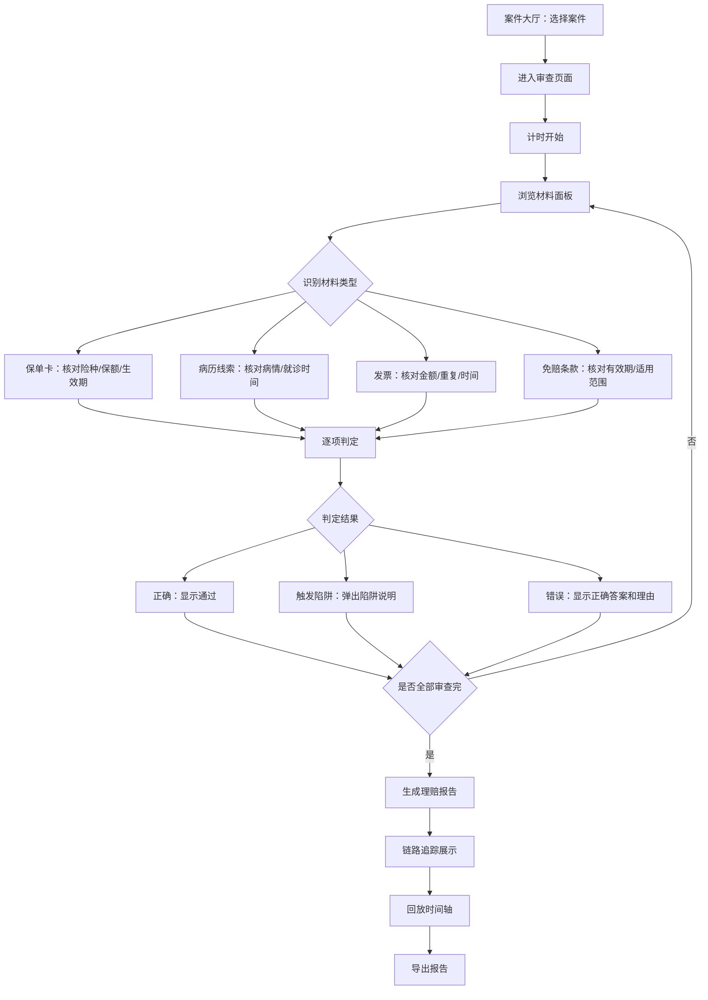

## 1. 产品概述

「保险理赔侦探局」是一款保险理赔审查模拟游戏，玩家扮演理赔侦探，通过审查保单卡、病历线索、发票和免赔条款等材料，在时间压力下做出理赔判定。游戏核心挑战在于识别等待期误判、发票重复、条款过期等常见陷阱，最终输出完整的理赔报告。

- 目标用户：保险培训师、理赔员、保险专业学生
- 核心价值：通过沉浸式案例演练，强化理赔审查中的条款判定能力和陷阱识别意识

## 2. 核心功能

### 2.1 用户角色

| 角色 | 说明 |
|------|------|
| 理赔侦探（玩家） | 审查材料、做出判定、导出报告 |

### 2.2 功能模块

1. **案件大厅页面**：案件列表、案件选择、侦探档案、历史成绩
2. **案件审查页面**：材料面板（保单卡/病历/发票/条款）、判定操作台、计时器、判定反馈弹窗
3. **报告与复盘页面**：理赔报告详情、材料-判定-报告链路追踪、回放时间轴、报告导出

### 2.3 页面详情

| 页面名称 | 模块名称 | 功能描述 |
|----------|----------|----------|
| 案件大厅 | 案件列表 | 展示可用关卡，显示难度标签、完成状态、最佳成绩 |
| 案件大厅 | 侦探档案 | 展示玩家累计审查数、正确率、陷阱识别率 |
| 案件审查 | 材料面板 | 左侧分标签展示保单卡/病历/发票/条款原始材料，标记来源和导入时间 |
| 案件审查 | 判定操作台 | 右侧操作区：逐项判定（通过/拒赔/待查），需填写判定理由 |
| 案件审查 | 计时器 | 顶部倒计时，超时自动提交当前判定 |
| 案件审查 | 判定反馈 | 每项判定后弹出即时反馈：正确/错误/陷阱触发说明 |
| 案件审查 | 材料溯源标记 | 每条材料标注来源人、导入时间，区分原始材料与处理结果 |
| 报告与复盘 | 理赔报告 | 汇总所有判定、陷阱触发、条款引用，按保单卡分组 |
| 报告与复盘 | 链路追踪 | 可视化保单卡→病历线索→判定→报告的完整映射关系 |
| 报告与复盘 | 回放时间轴 | 时间轴回放玩家操作，标注关键判定时刻和陷阱触发点 |
| 报告与复盘 | 报告导出 | 导出JSON报告，包含所有材料原始数据、判定结果、陷阱记录、链路映射 |

## 3. 核心流程

玩家进入案件大厅选择案件 → 进入审查页面，限时内逐项审查材料 → 对每条材料做出判定（通过/拒赔/待查）→ 系统即时反馈判定结果和陷阱说明 → 审查结束后自动生成理赔报告 → 可查看链路追踪和回放 → 导出完整报告

## 4. 用户界面设计

### 4.1 设计风格

- 主色调：深蓝灰（#1a1f2e）侦探事务所氛围 + 琥珀金（#d4a843）高亮重点
- 辅助色：档案纸色（#f5f0e8）材料背景、警示红（#e74c3c）陷阱标记
- 按钮风格：圆角矩形，微阴影，悬停时上浮效果
- 字体：标题使用 Noto Serif SC 衬线体营造严肃感，正文使用系统无衬线字体
- 布局风格：左栏材料面板 + 右栏操作台的双栏布局，顶部状态栏
- 图标风格：线性图标，与侦探/文件主题呼应

### 4.2 页面设计概览

| 页面名称 | 模块名称 | UI元素 |
|----------|----------|--------|
| 案件大厅 | 案件列表 | 卡片式布局，每张卡片含案件编号、难度标签、完成徽章、悬停放大动画 |
| 案件大厅 | 侦探档案 | 侧边栏或顶部条，含统计数字和进度条 |
| 案件审查 | 材料面板 | 左侧标签页切换（保单卡/病历/发票/条款），每条材料为卡片，含来源标签、时间戳、溯源图标 |
| 案件审查 | 判定操作台 | 右侧固定面板，三个判定按钮（通过/拒赔/待查），理由输入框，判定历史列表 |
| 案件审查 | 计时器 | 顶部右侧圆形倒计时，低于30秒变红闪烁 |
| 案件审查 | 判定反馈 | 居中弹窗模态框，绿色勾/红色叉图标，陷阱说明文字，确认按钮 |
| 报告与复盘 | 理赔报告 | 全页报告视图，按保单分组，每项判定含引用条款和材料ID |
| 报告与复盘 | 链路追踪 | 可视化连线图，节点为材料/判定/报告，连线标注关系 |
| 报告与复盘 | 回放时间轴 | 底部横向时间轴，可拖拽进度条，关键节点标注 |
| 报告与复盘 | 报告导出 | 底部操作栏，导出按钮，导出进度提示 |

### 4.3 响应式设计

- 桌面优先设计，审查页面双栏布局需至少1024px宽度
- 平板以下材料面板折叠为底部抽屉，操作台全宽
- 移动端暂不作为主要适配目标

## 5. 关卡设计

### 关卡1：等待期陷阱
- 案件背景：投保后90天内出险，保单含90天等待期
- 材料：1张保单卡（含等待期条款）、1份病历（就诊时间在等待期内）、1张发票
- 陷阱：等待期误判——病历就诊时间与投保时间需精确比对
- 正确判定：拒赔（等待期内出险）

### 关卡2：条款过期与发票重复
- 案件背景：医疗险续保条款已过期，且同一笔费用提交了两次发票
- 材料：1张保单卡、2张发票（其中1张重复）、1份免赔条款（已过期）
- 陷阱：条款过期——免赔条款有效期已过需引用新版；发票重复——两张发票编号相同
- 正确判定：拒赔（条款过期无法引用旧版，重复发票部分拒赔）

### 关卡3：综合陷阱
- 案件背景：重疾险理赔，同时存在等待期问题、条款过期和发票异常
- 材料：1张保单卡、2份病历、3张发票（1张重复）、2份免赔条款（1份过期）
- 陷阱：三类陷阱同时存在，需逐项排查
- 正确判定：部分拒赔，逐项说明理由

## 6. 报告导出规范

导出报告为JSON格式，结构如下：
- `reportMeta`：报告元信息（案件ID、侦探名称、审查时间）
- `policyCards[]`：保单卡原始数据
- `medicalRecords[]`：病历线索原始数据
- `invoices[]`：发票原始数据
- `clauses[]`：免赔条款原始数据
- `judgments[]`：每项判定结果（含材料ID引用、判定结论、理由、陷阱标记）
- `traps[]`：触发的陷阱清单（含陷阱类型、涉及材料ID、正确处理方式）
- `linkageMap[]`：保单卡→病历→判定→报告的完整映射关系
- `replayTimeline[]`：回放时间轴数据（每步操作的时间戳、动作、材料ID）
