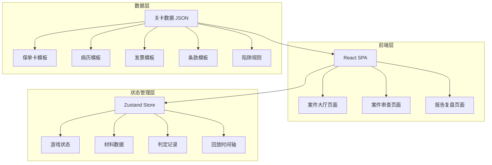
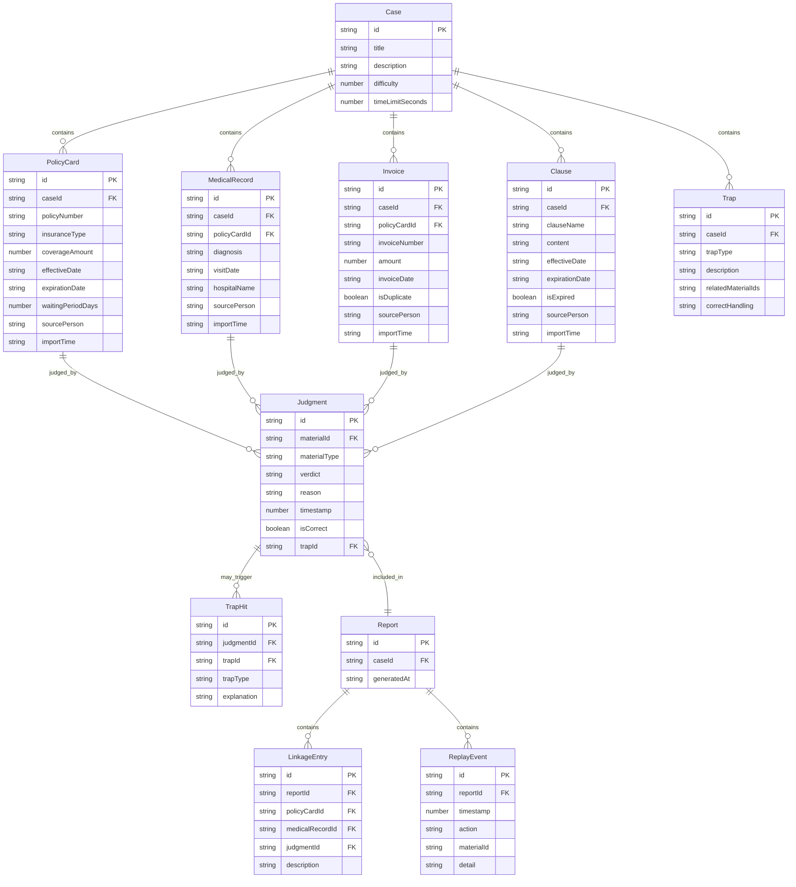

## 1. 架构设计



纯前端架构，无后端服务。所有关卡数据和判定逻辑在前端完成，报告导出为JSON文件下载。

## 2. 技术说明

- 前端：React@18 + TypeScript + Tailwind CSS@3 + Vite
- 初始化工具：vite-init
- 后端：无（纯前端项目）
- 数据库：无（使用内存状态 + JSON静态数据）
- 状态管理：Zustand

## 3. 路由定义

| 路由 | 用途 |
|------|------|
| / | 案件大厅，案件列表和侦探档案 |
| /case/:id | 案件审查页面，材料审查和判定 |
| /report/:id | 报告与复盘页面，报告详情、链路追踪、回放、导出 |

## 4. 数据模型

### 4.1 数据模型定义



### 4.2 核心TypeScript类型

```typescript
type MaterialType = 'policyCard' | 'medicalRecord' | 'invoice' | 'clause'
type Verdict = 'approved' | 'rejected' | 'pending_review'
type TrapType = 'waiting_period' | 'invoice_duplicate' | 'clause_expired'

interface MaterialBase {
  id: string
  caseId: string
  sourcePerson: string
  importTime: string
}

interface PolicyCard extends MaterialBase {
  materialType: 'policyCard'
  policyNumber: string
  insuranceType: string
  coverageAmount: number
  effectiveDate: string
  expirationDate: string
  waitingPeriodDays: number
}

interface MedicalRecord extends MaterialBase {
  materialType: 'medicalRecord'
  policyCardId: string
  diagnosis: string
  visitDate: string
  hospitalName: string
}

interface Invoice extends MaterialBase {
  materialType: 'invoice'
  policyCardId: string
  invoiceNumber: string
  amount: number
  invoiceDate: string
  isDuplicate: boolean
}

interface Clause extends MaterialBase {
  materialType: 'clause'
  clauseName: string
  content: string
  effectiveDate: string
  expirationDate: string
  isExpired: boolean
}

interface Judgment {
  id: string
  materialId: string
  materialType: MaterialType
  verdict: Verdict
  reason: string
  timestamp: number
  isCorrect: boolean
  trapId?: string
}

interface Trap {
  id: string
  caseId: string
  trapType: TrapType
  description: string
  relatedMaterialIds: string[]
  correctHandling: string
  checkFn: (judgments: Judgment[]) => boolean
}

interface LinkageEntry {
  policyCardId: string
  medicalRecordId?: string
  invoiceId?: string
  clauseId?: string
  judgmentId: string
  description: string
}

interface ReplayEvent {
  timestamp: number
  action: string
  materialId?: string
  materialType?: MaterialType
  detail: string
}

interface GameReport {
  reportMeta: {
    caseId: string
    caseTitle: string
    detectiveName: string
    reviewTime: string
    timeUsed: number
  }
  policyCards: PolicyCard[]
  medicalRecords: MedicalRecord[]
  invoices: Invoice[]
  clauses: Clause[]
  judgments: Judgment[]
  traps: Array<{
    trapType: TrapType
    description: string
    relatedMaterialIds: string[]
    correctHandling: string
    wasTriggered: boolean
  }>
  linkageMap: LinkageEntry[]
  replayTimeline: ReplayEvent[]
}
```

## 5. 判定逻辑架构

### 5.1 陷阱检测规则

| 陷阱类型 | 检测逻辑 | 涉及材料 |
|----------|----------|----------|
| 等待期误判 | 病历就诊日期 - 保单生效日期 < 等待期天数 | 保单卡.waitingPeriodDays + 病历.visitDate + 保单卡.effectiveDate |
| 发票重复 | 同一案件内存在相同invoiceNumber的发票 | Invoice.invoiceNumber |
| 条款过期 | 条款expirationDate < 当前案件日期 | Clause.expirationDate + Case模拟日期 |

### 5.2 判定正确性校验

每项材料对应一个预期判定，玩家判定与预期匹配则为正确。陷阱类材料需额外校验玩家是否识别出陷阱。

## 6. 项目目录结构

```
src/
├── pages/
│   ├── CaseHall.tsx          # 案件大厅
│   ├── CaseReview.tsx        # 案件审查
│   └── ReportReplay.tsx      # 报告复盘
├── components/
│   ├── MaterialPanel.tsx     # 材料面板（标签切换）
│   ├── MaterialCard.tsx      # 单条材料卡片
│   ├── JudgmentPanel.tsx     # 判定操作台
│   ├── JudgmentFeedback.tsx  # 判定反馈弹窗
│   ├── Timer.tsx             # 计时器
│   ├── LinkageView.tsx       # 链路追踪可视化
│   ├── ReplayTimeline.tsx    # 回放时间轴
│   ├── ReportExport.tsx      # 报告导出
│   └── TrapAlert.tsx         # 陷阱提示
├── store/
│   └── gameStore.ts          # Zustand游戏状态
├── data/
│   └── cases.ts              # 关卡数据
├── utils/
│   ├── trapChecker.ts        # 陷阱检测逻辑
│   ├── judgmentValidator.ts  # 判定校验逻辑
│   └── reportExporter.ts     # 报告导出逻辑
└── types/
    └── index.ts              # TypeScript类型定义
```
