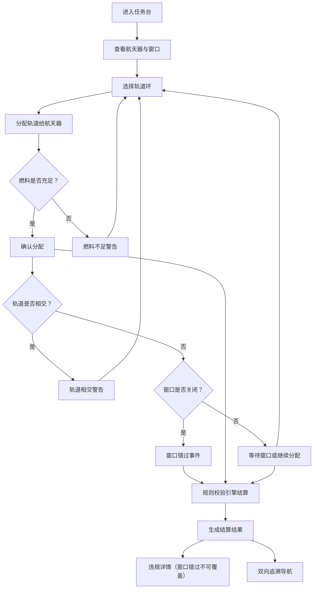

## 1. 产品概述

"太空轨道预算赛"是一款策略决策型网页游戏，面向科普馆教学场景。玩家扮演航天任务规划师，在有限的燃料预算内为航天器选择最优轨道环组合，体验轨道推进与燃料结算之间的取舍。系统提供完整的规则校验与错误定位机制，确保"窗口错过"等关键事件不会被后续错误覆盖，并支持航天器→结果、结果→轨道环的双向追溯。

- 解决科普馆月底/课前靠临时表格凑数据的痛点，提供结构化、可追溯的任务记录管理
- 让玩家在操作中真正感受到轨道推进与燃料结算的决策压力，而非简单点击得分

## 2. 核心功能

### 2.1 用户角色

| 角色 | 进入方式 | 核心权限 |
|------|----------|----------|
| 玩家（学生） | 直接进入 | 操作航天器、选择轨道、查看结果与错误定位 |
| 老师 | 直接进入 | 查看所有玩家历史记录、追溯链路、样例数据管理 |

### 2.2 功能模块

1. **任务台（主页面）**：航天器列表、当前燃料预算、轨道环选择面板、飞行日志时间线
2. **结果审查页**：任务结算结果、规则违反详情、双向追溯导航
3. **数据管理页**：样例数据浏览（含缺字段/晚补/备注改过的记录）、历史回溯

### 2.3 页面详情

| 页面名称 | 模块名称 | 功能描述 |
|----------|----------|----------|
| 任务台 | 航天器面板 | 展示航天器状态（在轨/离轨/窗口待命）、已分配轨道环、剩余燃料，点击可展开详情 |
| 任务台 | 轨道选择器 | 可视化轨道环列表，显示每个轨道的燃料消耗、推进增量、窗口时间；玩家可拖拽/点击分配轨道给航天器 |
| 任务台 | 燃料预算条 | 实时显示总预算与已消耗量，燃料不足时高亮警告 |
| 任务台 | 飞行日志 | 时间线形式记录每次操作：轨道分配、燃料结算、窗口状态，标注缺字段/晚补/备注改过的记录 |
| 任务台 | 窗口倒计时 | 当前发射窗口剩余时间，错过窗口触发"窗口错过"事件 |
| 结果审查 | 结算总览 | 显示本次任务总分、轨道推进得分、燃料效率得分 |
| 结果审查 | 违规详情 | 列出所有规则违反，每条标注具体规则（轨道推进规则/燃料结算规则/窗口规则）及涉及的航天器和轨道环 |
| 结果审查 | 追溯导航 | 从航天器钻取到最终结果，从结果反查到轨道环，双向链路 |
| 数据管理 | 样例数据表 | 浏览航天器/轨道环/飞行日志三张表，缺字段用"—"标记，晚补记录标蓝，备注改过记录标黄 |

## 3. 核心流程

玩家进入任务台 → 查看航天器状态与发射窗口 → 选择轨道环分配给航天器 → 系统实时计算燃料消耗与轨道推进增量 → 发射窗口倒计时 → 提交任务或窗口关闭自动结算 → 规则校验引擎运行（窗口错过优先级最高，不可被燃料不足/轨道相交覆盖）→ 生成结算结果与违规详情 → 玩家可追溯航天器→结果→轨道环的完整链路

## 4. 用户界面设计

### 4.1 设计风格

- **主色调**：深空黑（#0a0e1a）搭配星光蓝（#4fc3f7）与引擎橙（#ff6d00）
- **辅助色**：轨道绿（#00e676）表示合规，警告红（#ff1744）表示违规，晚补蓝（#42a5f5），备注黄（#ffd600）
- **按钮风格**：圆角胶囊按钮，带微光边框效果，hover时发光增强
- **字体**：标题使用 Orbitron（科技感），正文使用 Noto Sans SC
- **布局**：左侧航天器面板 + 中间轨道可视化 + 右侧飞行日志，三栏布局
- **图标风格**：线性科技风，使用 lucide-react

### 4.2 页面设计概览

| 页面名称 | 模块名称 | UI元素 |
|----------|----------|--------|
| 任务台 | 航天器面板 | 深色卡片，顶部航天器名称+状态徽章，中部轨道环列表（可点击展开），底部燃料条 |
| 任务台 | 轨道选择器 | 圆环可视化（CSS/SVG），hover显示详情浮层，点击选中高亮边框 |
| 任务台 | 燃料预算条 | 水平进度条，绿色→黄色→红色渐变，数值实时更新 |
| 任务台 | 飞行日志 | 竖向时间线，圆点标记事件类型（蓝=分配，橙=燃料结算，红=窗口错过），缺字段灰显"—"，晚补蓝标，备注改过黄标 |
| 任务台 | 窗口倒计时 | 圆形倒计时环，数字居中，最后10秒脉冲动画 |
| 结果审查 | 结算总览 | 大数字总分+轨道/燃料分项卡片，动画计数 |
| 结果审查 | 违规详情 | 列表项带规则类型图标+颜色编码，点击跳转追溯 |
| 结果审查 | 追溯导航 | 面包屑+连线图，节点可点击钻取 |
| 数据管理 | 样例数据表 | 表格行hover高亮，缺字段"—"灰显，晚补蓝背景色，备注黄边框 |

### 4.3 响应式

- 桌面优先设计，1920px最佳视口
- 平板（768px-1024px）：任务台改为上下布局，轨道可视化全宽
- 移动端（<768px）：单栏堆叠，底部Tab导航

### 4.4 3D场景指引

不适用，本项目使用CSS/SVG实现轨道可视化，无需3D渲染。
