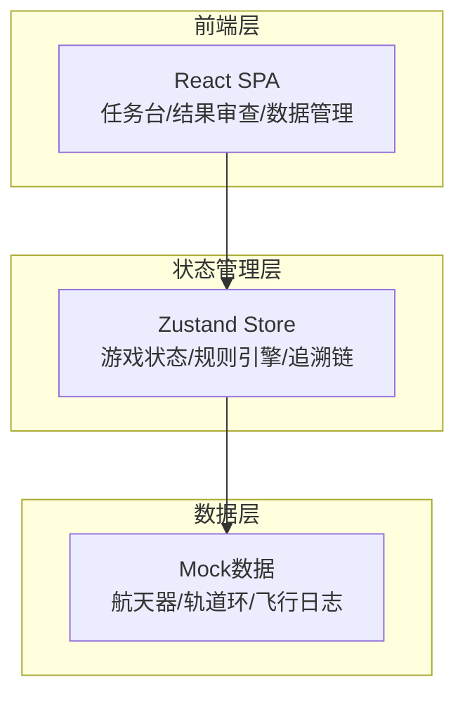
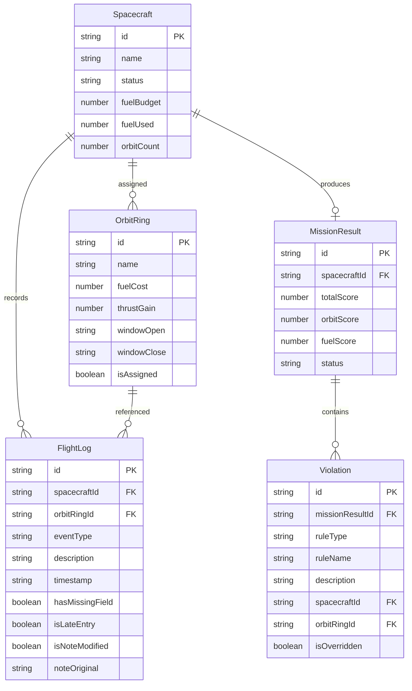

## 1. 架构设计



纯前端项目，无后端服务，使用 Zustand 管理所有状态，Mock数据直接内置。

## 2. 技术说明

- **前端**：React@18 + TypeScript + Tailwind CSS@3 + Vite
- **初始化工具**：vite-init (react-ts 模板)
- **后端**：无
- **数据库**：无，使用内置 Mock 数据
- **状态管理**：Zustand
- **路由**：react-router-dom
- **图标**：lucide-react

## 3. 路由定义

| 路由 | 用途 |
|------|------|
| `/` | 任务台主页面：航天器面板、轨道选择、燃料预算、飞行日志 |
| `/review/:missionId` | 结果审查页：结算总览、违规详情、追溯导航 |
| `/data` | 数据管理页：样例数据浏览与回溯 |

## 4. API定义

无后端API，所有数据通过 Zustand Store 和内置 Mock 数据提供。

## 5. 服务端架构图

不适用，纯前端项目。

## 6. 数据模型

### 6.1 数据模型定义



### 6.2 数据定义语言

使用 TypeScript 类型定义：

```typescript
interface Spacecraft {
  id: string;
  name: string;
  status: 'in_orbit' | 'de_orbit' | 'window_standby';
  fuelBudget: number;
  fuelUsed: number;
  orbitCount: number;
}

interface OrbitRing {
  id: string;
  name: string;
  fuelCost: number;
  thrustGain: number;
  windowOpen: string;
  windowClose: string;
  isAssigned: boolean;
  assignedTo?: string;
}

interface FlightLog {
  id: string;
  spacecraftId: string;
  orbitRingId?: string;
  eventType: 'allocation' | 'fuel_settlement' | 'window_miss' | 'orbit_intersection' | 'note';
  description: string;
  timestamp: string;
  hasMissingField: boolean;
  isLateEntry: boolean;
  isNoteModified: boolean;
  noteOriginal?: string;
}

interface MissionResult {
  id: string;
  spacecraftId: string;
  totalScore: number;
  orbitScore: number;
  fuelScore: number;
  status: 'success' | 'partial' | 'failed';
  violations: Violation[];
}

interface Violation {
  id: string;
  missionResultId: string;
  ruleType: 'orbit_propulsion' | 'fuel_settlement' | 'window_rule';
  ruleName: string;
  description: string;
  spacecraftId: string;
  orbitRingId?: string;
  isOverridden: boolean;
}
```

### 6.3 规则引擎核心逻辑

- **窗口错过优先级最高**：一旦产生"窗口错过"违规，其 `isOverridden` 永远为 `false`，不会被燃料不足或轨道相交覆盖
- **错误定位**：每条违规必须标注 `ruleType` 和具体涉及的实体ID，玩家可看到"轨道推进规则第X条"或"燃料结算规则第Y条"
- **历史留痕**：FlightLog 中的 `hasMissingField`、`isLateEntry`、`isNoteModified` 标记保证数据变更可追溯
- **双向追溯**：航天器 → MissionResult → Violation → OrbitRing，以及反向 OrbitRing → Violation → MissionResult → Spacecraft
