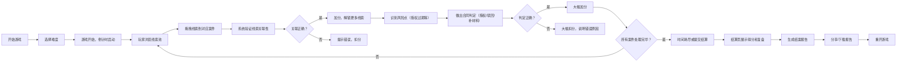

## 1. 产品概述

"音乐版权拼案"是一款模拟音乐版权纠纷处理的浏览器游戏，帮助版权法从业者在游戏化场景中练习线索关联、合同判定和风险识别能力。玩家需要在限定时间内，将散落的歌曲片段、平台通知、采样记录等线索正确归类，识别授权过期、采样超限、同名曲混淆等风险点，并做出正确的合同判定。

- 核心问题：解决手工翻阅材料容易遗漏关键信息的痛点
- 目标用户：版权法从业者、法务人员、音乐行业从业者
- 产品价值：通过游戏化方式提升版权风险识别能力，模拟真实案件处理流程

## 2. 核心功能

### 2.1 用户角色
| 角色 | 注册方式 | 核心权限 |
|------|----------|----------|
| 玩家 | 无需注册，直接进入 | 完整游戏体验、查看报告、分享结果 |

### 2.2 功能模块
1. **游戏主界面**：时间计时器、分数面板、线索池、案件档案区、操作控制区
2. **线索关联系统**：拖拽线索到对应案件，系统自动验证关联性
3. **合同判定系统**：根据关联的线索做出授权/驳回/需补充材料的判定
4. **风险预警系统**：识别授权过期、采样超限、同名曲混淆等风险点
5. **结算复盘系统**：展示时间扣分、错误判定扣分、案件处理结果
6. **报告生成系统**：生成可分享的人话版结案报告

### 2.3 页面详情
| 页面名称 | 模块名称 | 功能描述 |
|---------|---------|----------|
| 开始页 | 游戏介绍 | 说明游戏规则、目标、评分机制 |
| 开始页 | 难度选择 | 选择案件复杂度（初级/中级/高级） |
| 游戏主界面 | 顶部状态栏 | 显示剩余时间、当前分数、暂停/重开按钮 |
| 游戏主界面 | 线索池区域 | 展示待处理的歌曲片段、平台通知、采样记录等线索卡片 |
| 游戏主界面 | 案件档案区 | 三个案件卡槽，用于归类线索和做出判定 |
| 游戏主界面 | 风险提示面板 | 实时显示已识别的风险点和触发材料 |
| 游戏主界面 | 操作控制区 | 开始、暂停、重开、提交判定按钮 |
| 结算页 | 得分详情 | 时间推进扣分、错误判定扣分、正确关联加分 |
| 结算页 | 案件复盘 | 每个案件的处理结果、正确答案、错误点说明 |
| 结算页 | 风险分析 | 授权过期/采样超限/同名曲混淆的识别率统计 |
| 报告页 | 结案报告 | 人话版报告，解释每个案件的判定理由，尤其说明授权过期为何未通过 |
| 报告页 | 分享功能 | 复制报告、下载为文本文件 |

## 3. 核心流程

**主要用户流程描述：**
1. 玩家进入游戏，阅读规则后选择难度开始
2. 倒计时启动，玩家从线索池中拖拽线索卡片到三个案件卡槽中
3. 系统实时验证线索关联性，正确关联加分，错误关联扣分并提示
4. 当某案件收集到足够线索后，系统自动识别风险点（如授权过期、采样超限、同名曲混淆）
5. 玩家根据线索和风险提示，对每个案件做出"授权通过"、"驳回"或"需补充材料"的判定
6. 时间耗尽或玩家主动提交后，进入结算页，展示详细得分构成和案件复盘
7. 生成可分享的结案报告，用人话解释每个判定理由

## 4. 用户界面设计

### 4.1 设计风格
- **主色调**：深靛蓝（#1E3A5F）代表法律专业感，搭配琥珀金（#D4AF37）作为强调色代表正确判定
- **辅助色**：警示红（#E74C3C）用于授权过期等风险，中性灰（#95A5A6）用于未分类线索
- **按钮风格**：微立体设计，圆角8px，悬停时有微妙上浮效果
- **字体**：标题用 "Noto Serif SC" 衬线字体体现专业感，正文用 "Noto Sans SC" 保证可读性
- **布局风格**：三栏式卡片布局，线索池在左，案件区在中，风险提示在右
- **图标风格**：线性图标，歌曲用音符🎵，合同用📄，风险用⚠️，时间用⏱️

### 4.2 页面设计概述
| 页面名称 | 模块名称 | UI元素 |
|---------|---------|--------|
| 开始页 | 游戏介绍 | 大标题、渐变色背景、卡片式规则说明、动画入场效果 |
| 开始页 | 难度选择 | 三个卡片按钮，hover放大效果，选中高亮 |
| 游戏主界面 | 顶部状态栏 | 固定顶部，半透明背景，时间数字实时跳动动画 |
| 游戏主界面 | 线索池区域 | 瀑布流卡片，可拖拽，拖拽时半透明，释放有弹性动画 |
| 游戏主界面 | 案件档案区 | 三个垂直卡片，有卡槽占位，正确放入有绿光效果，错误有红光抖动 |
| 游戏主界面 | 风险提示面板 | 时间线样式，新风险出现时滑入动画，高亮显示触发材料 |
| 结算页 | 得分详情 | 数字滚动动画，柱状图展示各项得分占比 |
| 结算页 | 案件复盘 | 折叠卡片，展开显示正确/错误对比，时间线展示处理过程 |
| 报告页 | 结案报告 | 文档式排版，人话解释，重点内容高亮，复制按钮 |

### 4.3 响应式
- Desktop-first 设计，优先保证1280px以上分辨率体验
- 平板端（768px-1280px）：左右两栏布局，线索池在上，案件区在下
- 移动端（<768px）：单列布局，线索池可折叠，案件卡片垂直排列
- 所有拖拽操作在移动端兼容长按拖拽

### 4.4 动效设计
- **页面入场**：各模块按顺序淡入，延迟50ms逐级显示
- **线索拖拽**：拿起时缩小到95%+阴影加深，放下时弹性回弹
- **正确反馈**：绿色闪光+轻微向上浮动+"+10"分数飘字
- **错误反馈**：红色边框+左右抖动+扣分提示
- **风险出现**：从右侧滑入，警示图标闪烁3次
- **倒计时**：最后30秒数字变红，每秒跳动放大
- **结算动画**：数字从0滚动到最终得分，柱状图从0增长
