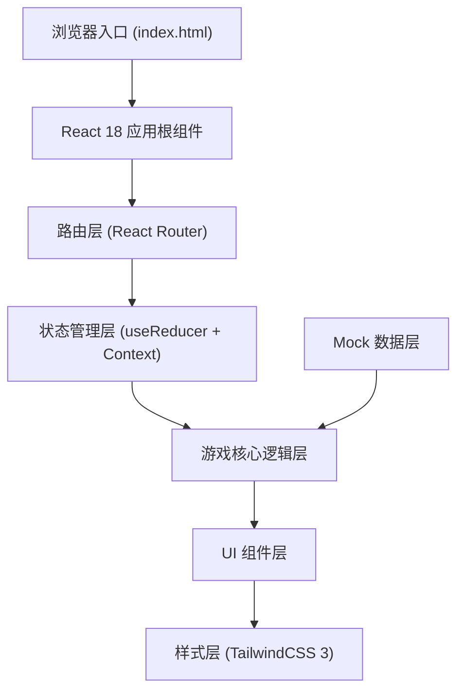
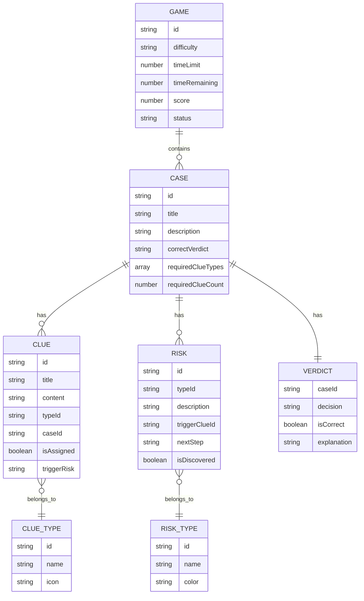

## 1. 架构设计



**架构说明：**
- 纯前端单页应用，无后端依赖
- 采用 React Context + useReducer 进行全局状态管理
- 游戏核心逻辑与UI组件分离，便于维护和测试
- 所有案件数据、线索数据采用本地Mock数据
- 使用 CSS动画 + Framer Motion 实现丰富的交互动效

## 2. 技术描述

- **前端框架**：React@18 + TypeScript@5
- **构建工具**：Vite@5
- **样式方案**：TailwindCSS@3 + PostCSS
- **路由管理**：React Router@6
- **状态管理**：React Context + useReducer（原生方案，避免额外依赖）
- **动画库**：Framer Motion（用于拖拽、过渡动画）
- **拖拽实现**：@dnd-kit/core + @dnd-kit/sortable（专业拖拽库）
- **图表展示**：Recharts（结算页得分可视化）
- **图标方案**：Lucide React（线性图标库）
- **初始化方式**：npm create vite@latest . -- --template react-ts

## 3. 路由定义

| 路由路径 | 页面组件 | 功能说明 |
|---------|---------|----------|
| `/` | `StartPage` | 游戏开始页，规则介绍、难度选择 |
| `/game` | `GamePage` | 游戏主界面，核心玩法区域 |
| `/settlement` | `SettlementPage` | 结算页，得分详情、案件复盘 |
| `/report` | `ReportPage` | 结案报告页，生成可分享报告 |

## 4. 数据模型

### 4.1 实体关系图



### 4.2 核心数据结构定义

```typescript
// 游戏状态
type GameStatus = 'idle' | 'playing' | 'paused' | 'finished';

interface GameState {
  status: GameStatus;
  difficulty: 'easy' | 'medium' | 'hard';
  timeLimit: number;
  timeRemaining: number;
  score: number;
  scoreBreakdown: ScoreBreakdown;
  currentCaseId: string | null;
}

interface ScoreBreakdown {
  correctAssociation: number;
  wrongAssociation: number;
  correctVerdict: number;
  wrongVerdict: number;
  timePenalty: number;
  riskDiscovered: number;
}

// 线索类型
type ClueType = 'song_segment' | 'platform_notice' | 'sample_record' | 'contract' | 'auth_certificate';

interface Clue {
  id: string;
  title: string;
  content: string;
  type: ClueType;
  correctCaseId: string;
  currentCaseId: string | null;
  triggerRisk?: string;
  isKeyEvidence: boolean;
}

// 风险类型
type RiskType = 'auth_expired' | 'sample_exceed' | 'name_confusion' | 'missing_evidence';

interface Risk {
  id: string;
  type: RiskType;
  title: string;
  description: string;
  triggerClueId: string;
  caseId: string;
  nextStep: string;
  isDiscovered: boolean;
  discoveredAt: number | null;
}

// 案件
type VerdictDecision = 'approve' | 'reject' | 'need_more';

interface Case {
  id: string;
  title: string;
  description: string;
  correctVerdict: VerdictDecision;
  verdictExplanation: string;
  requiredClueTypes: ClueType[];
  requiredClueCount: number;
  clues: Clue[];
  risks: Risk[];
  userVerdict: VerdictDecision | null;
  isCompleted: boolean;
}

// 游戏配置
interface GameConfig {
  easy: { timeLimit: number; clueCount: number; caseCount: number };
  medium: { timeLimit: number; clueCount: number; caseCount: number };
  hard: { timeLimit: number; clueCount: number; caseCount: number };
}
```

## 5. 核心状态管理

### 5.1 Action 类型定义

```typescript
type GameAction =
  | { type: 'START_GAME'; payload: { difficulty: 'easy' | 'medium' | 'hard' } }
  | { type: 'PAUSE_GAME' }
  | { type: 'RESUME_GAME' }
  | { type: 'RESTART_GAME' }
  | { type: 'TICK' }
  | { type: 'ASSIGN_CLUE'; payload: { clueId: string; caseId: string } }
  | { type: 'UNASSIGN_CLUE'; payload: { clueId: string } }
  | { type: 'DISCOVER_RISK'; payload: { riskId: string } }
  | { type: 'SUBMIT_VERDICT'; payload: { caseId: string; verdict: VerdictDecision } }
  | { type: 'FINISH_GAME' };
```

### 5.2 核心游戏逻辑

1. **线索关联验证**：拖拽线索到案件时，验证 `clue.correctCaseId === caseId`
   - 正确：+10分，标记线索已分配，检查是否触发风险
   - 错误：-5分，线索弹回线索池，显示错误提示

2. **风险触发机制**：当特定线索被正确关联时，自动发现对应风险
   - 授权过期：关联"授权证书"线索且日期已过期时触发
   - 采样超限：关联"采样记录"线索且采样时长/比例超限时触发
   - 同名曲混淆：同时关联两首同名但不同版本的"歌曲片段"时触发

3. **合同判定逻辑**：每个案件收集到足够线索后，玩家可提交判定
   - 判定选项：授权通过 / 驳回 / 需补充材料
   - 正确判定：+50分，标记案件完成
   - 错误判定：-30分，显示正确答案和解释

4. **时间扣分机制**：
   - 总时间：初级10分钟，中级8分钟，高级6分钟
   - 每秒扣除0.1分（基础时间消耗）
   - 超时未完成：剩余未处理案件每个-100分
   - 提前完成：剩余时间每秒+0.5分奖励

## 6. 目录结构

```
src/
├── components/
│   ├── layout/
│   │   ├── Header.tsx          # 顶部状态栏
│   │   └── GameLayout.tsx      # 游戏布局容器
│   ├── game/
│   │   ├── ClueCard.tsx        # 线索卡片
│   │   ├── CluePool.tsx        # 线索池
│   │   ├── CaseCard.tsx        # 案件卡片
│   │   ├── CaseArea.tsx        # 案件区域
│   │   ├── RiskPanel.tsx       # 风险提示面板
│   │   ├── VerdictButtons.tsx  # 判定按钮组
│   │   └── DragDropContext.tsx # 拖拽上下文
│   ├── settlement/
│   │   ├── ScoreChart.tsx      # 得分图表
│   │   ├── CaseReview.tsx      # 案件复盘
│   │   └── RiskAnalysis.tsx    # 风险分析
│   ├── report/
│   │   ├── CaseReport.tsx      # 案件报告
│   │   └── ReportActions.tsx   # 报告操作按钮
│   └── common/
│       ├── Button.tsx
│       ├── Modal.tsx
│       └── Toast.tsx
├── pages/
│   ├── StartPage.tsx
│   ├── GamePage.tsx
│   ├── SettlementPage.tsx
│   └── ReportPage.tsx
├── store/
│   ├── GameContext.tsx         # 游戏状态上下文
│   ├── gameReducer.ts          # 状态Reducer
│   └── initialState.ts         # 初始状态
├── data/
│   ├── cases.ts                # Mock案件数据
│   ├── clues.ts                # Mock线索数据
│   ├── risks.ts                # Mock风险数据
│   └── config.ts               # 游戏配置
├── types/
│   └── index.ts                # TypeScript类型定义
├── utils/
│   ├── gameLogic.ts            # 游戏核心逻辑函数
│   ├── reportGenerator.ts      # 报告生成器
│   └── scoreCalculator.ts      # 分数计算器
├── hooks/
│   ├── useGameTimer.ts         # 游戏计时器Hook
│   └── useDragDrop.ts          # 拖拽Hook
├── App.tsx
├── main.tsx
└── index.css
```

## 7. 报告生成逻辑

结案报告采用"人话"模板生成，核心转换规则：

| 技术术语 | 人话表达 |
|---------|---------|
| 授权过期 | "这首歌的授权合同在X年X月X日就已经到期了，相当于租房合同过期了还在住，是侵权的" |
| 采样超限 | "采样了X秒，但合同只允许用Y秒，超了Z秒，属于超范围使用" |
| 同名曲混淆 | "有两首同名但完全不同的歌，你把A歌的授权用到了B歌上，张冠李戴了" |
| 需补充材料 | "现在手里的材料还不够判，得去要【XX材料】才能做决定" |

报告结构：
1. 总体评价（S/A/B/C/D等级）
2. 每个案件的判定说明
3. 关键风险点详解（重点解释授权过期）
4. 改进建议
