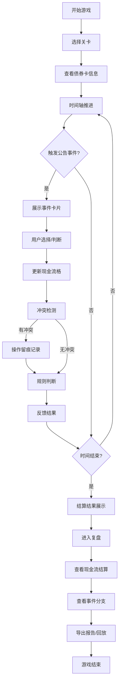

## 1. 产品概述

债券兑付时间线是一款投教类小游戏，帮助用户理解债券兑付过程中的复杂场景。通过模拟债券卡、现金流格、公告事件三者的交互，让玩家在游戏中学习如何处理付息顺延、回售漏选、违约误判等实际业务场景。

- 核心目标：通过游戏化方式讲解债券兑付时间线，解决投教中的概念解释难题
- 目标用户：债券投教策划人员、金融学习者、债券从业人员

## 2. 核心功能

### 2.1 功能模块
1. **游戏主界面**：时间轴展示、债券卡信息、现金流格、公告事件
2. **关卡系统**：3个递进关卡，覆盖付息顺延、回售漏选、混合场景
3. **规则反馈系统**：实时判断、失败提示、操作留痕
4. **复盘系统**：现金流结算、事件分支可视化、报告导出
5. **回放功能**：完整操作回放，支持步骤跳转

### 2.2 页面详情
| 页面名称 | 模块名称 | 功能描述 |
|-----------|-------------|---------------------|
| 游戏主页 | 关卡选择 | 展示3个关卡，显示完成状态和难度 |
| 游戏主界面 | 时间轴区域 | 水平时间轴，显示关键时间节点，支持推进 |
| 游戏主界面 | 债券卡面板 | 展示债券基本信息（面值、票息、到期日等） |
| 游戏主界面 | 现金流格 | 显示各期付息/兑付金额，支持标记操作 |
| 游戏主界面 | 公告事件区 | 展示事件卡片，支持选择和判断 |
| 游戏主界面 | 操作留痕区 | 记录所有操作和冲突事件 |
| 复盘界面 | 结算面板 | 展示现金流计算过程和结果 |
| 复盘界面 | 事件分支图 | 可视化展示事件选择的分支路径 |
| 复盘界面 | 报告导出 | 导出包含债券卡、现金流、事件对应关系的详细报告 |

## 3. 核心流程

### 3.1 游戏主流程
1. 用户选择关卡进入游戏
2. 查看债券卡获取基础信息
3. 时间轴推进，触发公告事件
4. 用户根据事件更新现金流格标记
5. 系统实时判断操作正确性，冲突时先留痕再判断
6. 时间轴推进至结束，显示结算结果
7. 进入复盘界面，查看详细分析
8. 可选择回放或导出报告

### 3.2 流程图

## 4. 用户界面设计

### 4.1 设计风格
- **主色调**：深蓝(#1a365d) + 金色(#d4af37)，体现金融专业感
- **辅助色**：绿色(#10b981)表示正确，红色(#ef4444)表示错误/违约，橙色(#f59e0b)表示警告/顺延
- **字体**：标题使用Playfair Display展示专业感，正文使用Inter保证可读性
- **布局风格**：卡片式布局，清晰分区，时间轴横向贯穿
- **图标风格**：线性图标，简洁专业

### 4.2 页面设计概述
| 页面名称 | 模块名称 | UI元素 |
|-----------|-------------|-------------|
| 游戏主页 | 关卡选择 | 卡片式关卡展示，进度指示器，开始按钮 |
| 游戏主界面 | 顶部信息栏 | 关卡名称，暂停按钮，帮助按钮 |
| 游戏主界面 | 时间轴 | 横向时间线，节点标记，进度动画 |
| 游戏主界面 | 债券卡 | 圆角卡片，信息分组展示，金色边框强调 |
| 游戏主界面 | 现金流格 | 网格布局，可点击单元格，状态颜色标记 |
| 游戏主界面 | 公告事件 | 弹出式卡片，时间戳，选择按钮 |
| 游戏主界面 | 操作留痕 | 侧边栏，时间顺序记录，颜色区分事件类型 |
| 复盘界面 | 结算面板 | 表格展示计算过程，公式高亮 |
| 复盘界面 | 事件分支图 | 树状图展示决策路径，当前路径高亮 |
| 复盘界面 | 报告区域 | 预览窗口，导出按钮，格式选择 |

### 4.3 响应式设计
- 桌面端优先，横向时间轴完整展示
- 平板端：侧边栏可折叠，现金流格自适应
- 移动端：时间轴改为垂直布局，卡片堆叠展示

## 5. 业务规则

### 5.1 冲突处理规则
- 债券卡、现金流格、公告事件三者信息冲突时，先在留痕区记录冲突
- 优先级判断：公告事件 > 现金流格 > 债券卡（最新信息优先）

### 5.2 复杂场景规则
- **付息顺延**：付息日遇节假日顺延，需在现金流格中标记并更新日期
- **回售漏选**：回售登记期内未选择回售，视为放弃回售权
- **违约误判**：先标记违约，后续收到兑付公告时撤销违约标记
- 以上场景同时出现时，按时间顺序处理，留痕区显示先后顺序
