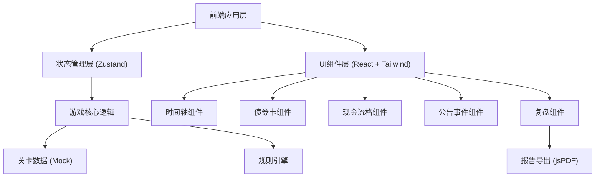

## 1. 架构设计



## 2. 技术描述

- **前端框架**: React@18 + TypeScript
- **构建工具**: Vite@5
- **样式方案**: TailwindCSS@3
- **状态管理**: Zustand
- **路由**: React Router DOM@6
- **图表可视化**: Mermaid (用于事件分支图)
- **报告导出**: jsPDF
- **图标**: Lucide React
- **数据**: Mock 数据，内置3个关卡

## 3. 路由定义

| 路由 | 页面组件 | 用途 |
|-------|---------|------|
| / | HomePage | 游戏主页，关卡选择 |
| /game/:levelId | GamePage | 游戏主界面 |
| /review/:levelId | ReviewPage | 复盘界面 |

## 4. 数据模型

### 4.1 核心数据结构

```typescript
// 债券卡信息
interface BondCard {
  id: string;
  name: string;
  code: string;
  faceValue: number;
  couponRate: number;
  maturityDate: string;
  interestPaymentDates: string[];
  putOptionDate?: string;
}

// 现金流格
interface CashFlowCell {
  id: string;
  date: string;
  type: 'coupon' | 'principal' | 'put';
  expectedAmount: number;
  actualAmount?: number;
  status: 'pending' | 'confirmed' | 'delayed' | 'default' | 'put_option';
  isSelected: boolean;
}

// 公告事件
interface AnnouncementEvent {
  id: string;
  date: string;
  type: 'interest_delay' | 'put_notice' | 'default_warning' | 'payment_confirmation' | 'revoke_default';
  title: string;
  content: string;
  correctAction: string;
  timeWindow: number;
}

// 操作留痕
interface OperationTrace {
  id: string;
  timestamp: string;
  type: 'user_action' | 'conflict' | 'system_judge';
  content: string;
  source: 'bond_card' | 'cash_flow' | 'announcement';
  isCorrect?: boolean;
}

// 关卡
interface Level {
  id: string;
  name: string;
  description: string;
  difficulty: 'easy' | 'medium' | 'hard';
  bondCard: BondCard;
  initialCashFlows: CashFlowCell[];
  events: AnnouncementEvent[];
  targetScore: number;
}
```

## 5. 状态管理设计

```typescript
interface GameState {
  currentLevel: Level | null;
  currentDateIndex: number;
  cashFlows: CashFlowCell[];
  activeEvent: AnnouncementEvent | null;
  traces: OperationTrace[];
  score: number;
  isGameOver: boolean;
  selectedAnswers: Record<string, string>;
  
  // Actions
  startLevel: (levelId: string) => void;
  advanceTimeline: () => void;
  selectCashFlow: (cellId: string) => void;
  handleEvent: (eventId: string, action: string) => void;
  endGame: () => void;
  resetGame: () => void;
}
```

## 6. 核心模块说明

### 6.1 规则引擎
- 位置: `src/utils/rulesEngine.ts`
- 功能: 处理冲突检测、操作正确性判断、复杂场景逻辑

### 6.2 时间轴控制器
- 位置: `src/components/Timeline.tsx`
- 功能: 控制时间推进，触发事件，管理进度

### 6.3 复盘生成器
- 位置: `src/utils/reviewGenerator.ts`
- 功能: 生成现金流结算表、事件分支分析、导出报告

### 6.4 回放系统
- 位置: `src/utils/replaySystem.ts`
- 功能: 记录操作序列，支持步骤回放和跳转
