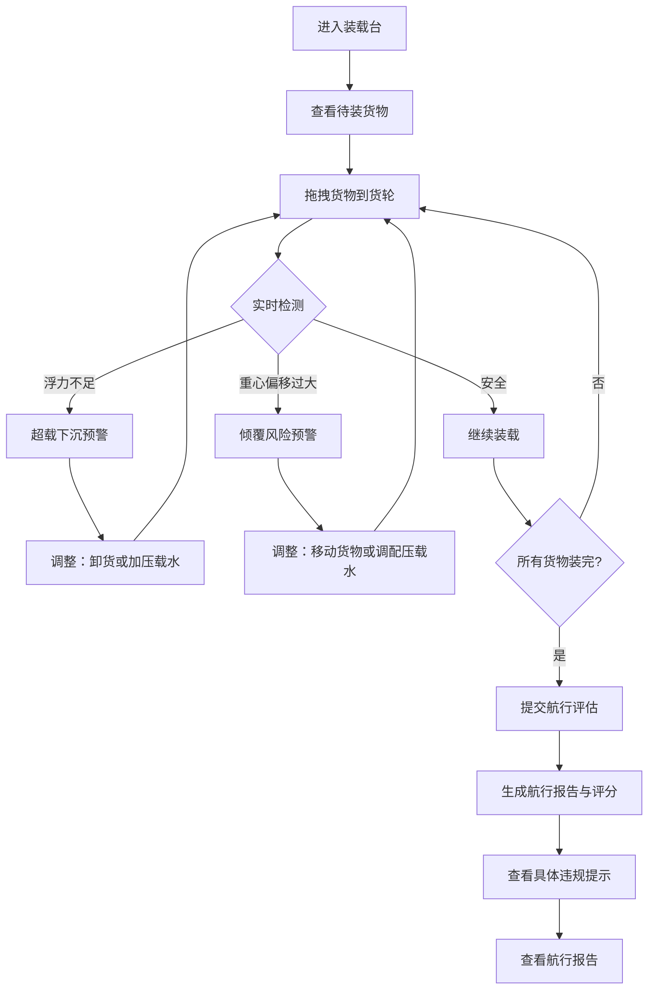

## 1. 产品概述

浮力货轮装载赛是一款物理模拟策略游戏，玩家需要通过拖拽装载货物到货轮上，在浮力计算、重心控制和压载调配之间做出取舍。核心挑战不是简单地"装满船"，而是当重心偏移和超载下沉交织在一起时，依然能保持货轮安全航行。

- 目标用户：物理爱好者、策略游戏玩家、对航海知识感兴趣的玩家
- 核心价值：让玩家在拖拽操作中直观感受浮力与重心的物理博弈，每次失误都能获得具体到规则的精准反馈

## 2. 核心功能

### 2.1 用户角色
| 角色 | 说明 |
|------|------|
| 玩家 | 拖拽装载货物、调配压载水、查看航行报告 |

### 2.2 功能模块
1. **装载台页面**：货轮甲板俯视图、待装货物区、拖拽装载交互、实时浮力/重心仪表
2. **航行报告页面**：装载明细表、压载水记录、重心轨迹、超载预警历史

### 2.3 页面详情
| 页面名称 | 模块名称 | 功能描述 |
|----------|----------|----------|
| 装载台 | 货轮甲板 | Canvas绘制的货轮俯视/侧视切面图，显示吃水线和载货位置 |
| 装载台 | 待装货物区 | 可拖拽的货物卡片，标注重量、体积、类别 |
| 装载台 | 实时仪表盘 | 浮力余量、重心偏移角、总载重/最大载重比、吃水深度 |
| 装载台 | 压载水控制 | 左右舱压载水注入/排出按钮，实时影响重心和吃水 |
| 装载台 | 航行评估 | 提交装载方案后，生成航行安全评分和具体违规提示 |
| 航行报告 | 装载明细表 | 每件货物的位置、重量、对重心的影响值 |
| 航行报告 | 压载水记录 | 压载水操作日志，补录标记及影响明细标记 |
| 航行报告 | 重心轨迹图 | 装载过程中重心移动路径的可视化 |

## 3. 核心流程

玩家进入装载台 → 查看待装货物列表 → 拖拽货物到货轮指定位置 → 系统实时计算浮力余量和重心偏移 → 视情况调整压载水 → 所有货物装完后提交评估 → 系统给出航行安全评分和具体违规提示 → 查看航行报告

## 4. 用户界面设计

### 4.1 设计风格
- 主色调：深海蓝（#0A2540）+ 码头橙（#E8602C）作为强调色
- 辅助色：钢铁灰（#4A5568）、浪花白（#F0F4F8）、警戒红（#E53E3E）
- 按钮风格：圆角矩形，3D凸起效果（box-shadow），按压反馈
- 字体：显示字体用 "Oswald"（粗犷工业风），UI字体用 "Source Sans 3"
- 布局：左侧货轮视图+仪表盘，右侧货物面板，底部操作栏
- 图标风格：航海/工业主题线条图标

### 4.2 页面设计概览
| 页面名称 | 模块名称 | UI 元素 |
|----------|----------|----------|
| 装载台 | 货轮甲板 | Canvas绘图，深蓝背景，吃水线动画，货物块彩色方块，重心十字线 |
| 装载台 | 待装货物区 | 卡片列表，拖拽手柄，重量/体积标签，分类色标 |
| 装载台 | 实时仪表盘 | 圆弧仪表（浮力余量），数值显示（重心角），进度条（载重比） |
| 装载台 | 压载水控制 | 滑块+按钮，水位动画，左右舱独立控制 |
| 装载台 | 航行评估 | 模态弹窗，评分环图，违规条目列表，具体规则引用 |
| 航行报告 | 装载明细表 | 表格，行高亮（压载补录影响标记），列排序 |
| 航行报告 | 压载水记录 | 时间线样式，补录标签，影响明细折叠面板 |
| 航行报告 | 重心轨迹图 | Canvas折线图，安全区域着色，危险区域标红 |

### 4.3 响应式
- 桌面优先设计（1920×1080最佳）
- 平板适配（1024×768）：货物面板折叠为底部抽屉
- 触控优化：拖拽区域足够大，长按显示详情

### 4.4 3D 场景指引
- 不使用3D场景，采用2D Canvas侧视切面图展示货轮截面
- 水面使用波浪动画模拟
- 货物块使用不同颜色和纹理区分类型
