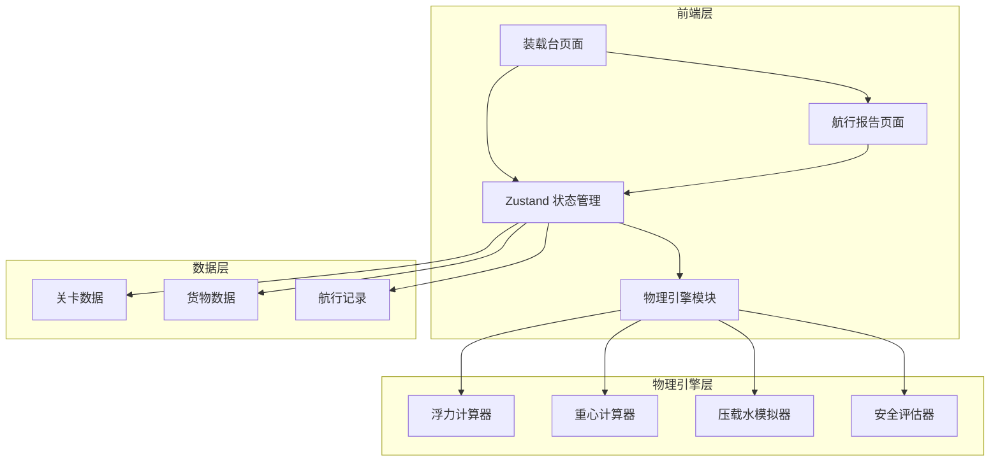
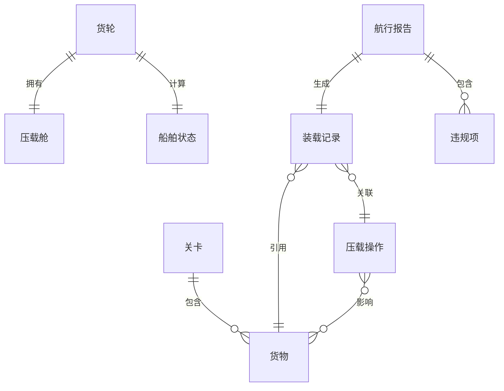

## 1. 架构设计



## 2. 技术说明
- 前端：React@18 + TypeScript + Tailwind CSS@3 + Vite
- 初始化工具：vite-init
- 后端：无（纯前端，数据存储在 Zustand + localStorage）
- 数据库：无（使用内存状态 + localStorage 持久化）
- 物理计算：自研轻量浮力/重心计算模块
- 拖拽：原生 HTML5 Drag & Drop API + 自定义拖拽逻辑
- 图表：Canvas 2D 绑定自定义绘制

## 3. 路由定义
| 路由 | 用途 |
|------|------|
| / | 装载台主页面，包含货轮视图、货物面板、仪表盘 |
| /report | 航行报告页面，装载明细、压载记录、重心轨迹 |

## 4. API 定义
无后端 API，所有数据通过 Zustand store 在前端管理。

### 核心 TypeScript 类型定义

```typescript
interface Cargo {
  id: string;
  name: string;
  weight: number;       // 吨
  volume: number;       // 立方米
  category: 'steel' | 'grain' | 'machinery' | 'chemical' | 'container';
  position?: { x: number; y: number };  // 在货轮上的网格位置
  loaded: boolean;
}

interface BallastTank {
  id: string;
  side: 'port' | 'starboard';
  capacity: number;     // 吨
  current: number;      // 当前水量(吨)
  operations: BallastOperation[];
}

interface BallastOperation {
  id: string;
  timestamp: number;
  action: 'fill' | 'drain';
  amount: number;
  isRetroactive: boolean;   // 是否补录
  affectedCargoIds: string[]; // 影响的货物ID
}

interface ShipState {
  maxDisplacement: number;  // 最大排水量(吨)
  currentDisplacement: number;
  draftDepth: number;       // 吃水深度(米)
  maxDraft: number;         // 最大允许吃水(米)
  buoyancyMargin: number;   // 浮力余量(吨)
  centerOfGravity: { x: number; y: number }; // 重心坐标
  maxHeelAngle: number;     // 最大允许横倾角(度)
  currentHeelAngle: number; // 当前横倾角(度)
}

interface VoyageReport {
  cargoManifest: Cargo[];
  ballastLog: BallastOperation[];
  gravityTrack: { x: number; y: number; timestamp: number }[];
  violations: Violation[];
  score: number;
}

interface Violation {
  rule: 'overload' | 'gravity_shift' | 'ballast_omit' | 'draft_exceed';
  severity: 'warning' | 'danger' | 'critical';
  message: string;       // 具体到材料/对象的提示
  relatedCargoIds: string[];
  relatedBallastOpIds: string[];
}
```

## 5. 服务器架构图
无后端服务器。

## 6. 数据模型

### 6.1 数据模型定义



### 6.2 数据定义语言
使用 localStorage 键值对存储：
- `voyage_game_state`: 当前游戏状态（Zustand persist）
- `voyage_game_history`: 历史航行报告列表
