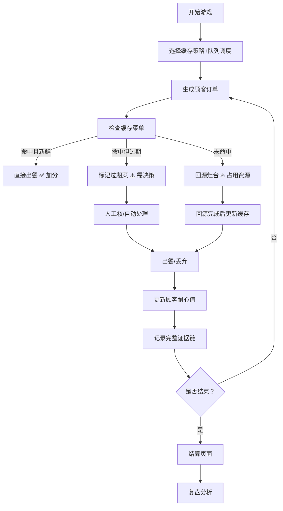

## 1. 产品概述

"算法缓存厨房"是一款面向后端工程师的培训型浏览器小游戏，通过餐厅后厨的隐喻，让玩家在互动中直观理解缓存系统的核心概念与常见问题。游戏模拟了热菜（缓存命中）、过期菜（缓存过期）、回源压力（缓存未命中）、脏数据扩散、缓存击穿等真实场景，让学习者在操作中建立对缓存策略的体感认知。

- 核心目的：将抽象的缓存算法具象化为可操作的游戏体验
- 目标用户：后端培训师、新人工程师、对缓存系统感兴趣的开发者
- 产品价值：解决"缓存概念易讲清、问题难复现"的培训痛点，提供可重复、可复盘的教学案例

## 2. 核心功能

### 2.1 游戏玩法模块

| 模块名称 | 核心功能 |
|---------|---------|
| 后厨操作台 | 显示缓存菜单（热菜区）、待处理订单队列、回源灶台 |
| 缓存策略选择 | LRU、LFU、FIFO、TTL过期 四种策略可切换 |
| 队列调度 | 优先级调度、先进先出、后进先出 三种调度模式 |
| 订单系统 | 自动生成顾客订单，包含菜品ID、期望送达时间、耐心值 |
| 证据留存 | 每笔订单的完整生命周期记录（缓存状态、处理时间、顾客耐心变化） |

### 2.2 游戏控制模块

| 页面名称 | 模块名称 | 功能描述 |
|---------|---------|---------|
| 主游戏页 | 控制栏 | 开始、暂停、继续、重开、加速/减速游戏 |
| 主游戏页 | 状态面板 | 实时分数、当前缓存命中率、回源压力指数、队列长度 |
| 结算页 | 分数明细 | 基础分、缓存命中加分、回源限流扣分、脏数据扣分、顾客投诉扣分 |
| 复盘页 | 事件时间线 | 可回放的订单处理时间线，支持逐帧查看 |
| 复盘页 | 问题定位 | 自动标记缓存击穿、脏数据扩散、过期误读等关键事件 |
| 说明页 | 玩法指南 | 订单卡准备方法、缓存击穿复现步骤、分数解释规则 |

## 3. 核心流程

## 4. 用户界面设计

### 4.1 设计风格

**整体调性：温暖工业风厨房 + 复古仪表盘**
- 主色调：暖橙色 `#FF7A18`（热菜/缓存）、深红色 `#D32F2F`（过期/脏数据）、深蓝色 `#1565C0`（回源/数据库）
- 辅助色：暖黄色 `#FFD54F`（等待中）、薄荷绿 `#81C784`（成功出餐）
- 背景：深褐灰色 `#2D2A26` 带细微噪点纹理，营造后厨氛围
- 字体：展示字体用 `Bebas Neue`（数字、标题），正文字体用 `JetBrains Mono`（等宽，便于代码感）

**卡片与按钮：**
- 订单卡：圆角 8px，边框 2px，阴影根据状态变化（热菜发光、过期抖动）
- 控制按钮：3D 凸起效果，hover 时轻微上浮，active 时下压
- 缓存菜单格：金属质感边框，热菜有橙色光晕动画

### 4.2 页面布局

| 页面 | 模块 | 布局说明 |
|-----|------|---------|
| 主游戏页 | 顶部控制栏 | 固定高度 64px，左侧Logo，中间控制按钮，右侧状态指示器 |
| 主游戏页 | 左侧缓存区 | 30% 宽度，缓存菜单格子网格布局，显示TTL倒计时 |
| 主游戏页 | 中间订单队列 | 40% 宽度，订单卡垂直排列，显示耐心条倒计时 |
| 主游戏页 | 右侧回源区 | 30% 宽度，灶台状态，回源进度条，限流指示器 |
| 主游戏页 | 底部日志栏 | 固定高度 120px，滚动显示最近事件 |
| 结算页 | 分数面板 | 居中卡片，各项分数明细带图表 |
| 结算页 | 问题统计 | 缓存击穿次数、脏数据扩散链、过期误读统计 |
| 复盘页 | 时间线 | 横向可滑动时间轴，点击事件查看详情 |
| 复盘页 | 证据面板 | 选中事件的完整证据链（缓存快照、耐心值曲线、决策记录） |

### 4.3 关键动效

1. **热菜发光**：缓存命中的菜品卡片有呼吸式橙色光晕 `box-shadow` 动画
2. **过期抖动**：过期菜品左右轻微抖动 `shake` 动画，边框变红
3. **回源火焰**：回源灶台有 SVG 火焰动画，根据压力调整大小
4. **顾客耐心条**：线性渐变从绿到红，随时间平滑缩短
5. **订单飞入**：新订单从顶部滑入，带轻微弹性
6. **出餐成功**：卡片缩小消失，飞向分数区域 +10 动画

### 4.4 响应式

- 桌面端（默认）：三栏布局，左侧缓存、中间队列、右侧回源
- 平板：改为上下布局，缓存区+回源区在上半部分两半分，队列在下
- 移动端：单页滚动，折叠面板，重点保留队列和核心控制

## 5. 游戏规则核心设计

### 5.1 缓存策略影响
- **LRU**：最近最少使用淘汰，适合访问模式稳定的场景
- **LFU**：最不经常使用淘汰，适合热点数据明显的场景
- **FIFO**：先进先出淘汰，简单但易淘汰热点
- **TTL**：固定时间过期，需合理设置过期时间

### 5.2 队列调度影响
- **优先级调度**：按顾客耐心值紧急程度处理，减少投诉但可能饿死低优先级订单
- **先进先出**：公平但紧急订单可能超时
- **后进先出**：新订单优先，老订单容易超时

### 5.3 分数规则
- 基础分：每单正确出餐 +10
- 缓存命中加成：+5（节省回源成本）
- 脏数据扣分：-20（给顾客过期菜，且证据确凿）
- 回源限流扣分：-15（并发回源超过阈值，系统压力过大）
- 顾客投诉扣分：-10（耐心值归零）
- 缓存击穿扣分：-30（热点key过期，大量回源）

### 5.4 证据系统
每笔订单记录以下数据，结算和复盘时可追溯：
- 订单创建时间、期望完成时间
- 缓存检查时间点、缓存状态（命中/未命中/过期）
- 处理决策（直接出餐/回源/人工核）
- 顾客耐心值实时曲线
- 是否造成脏数据扩散（该订单的过期数据是否被后续订单引用）
