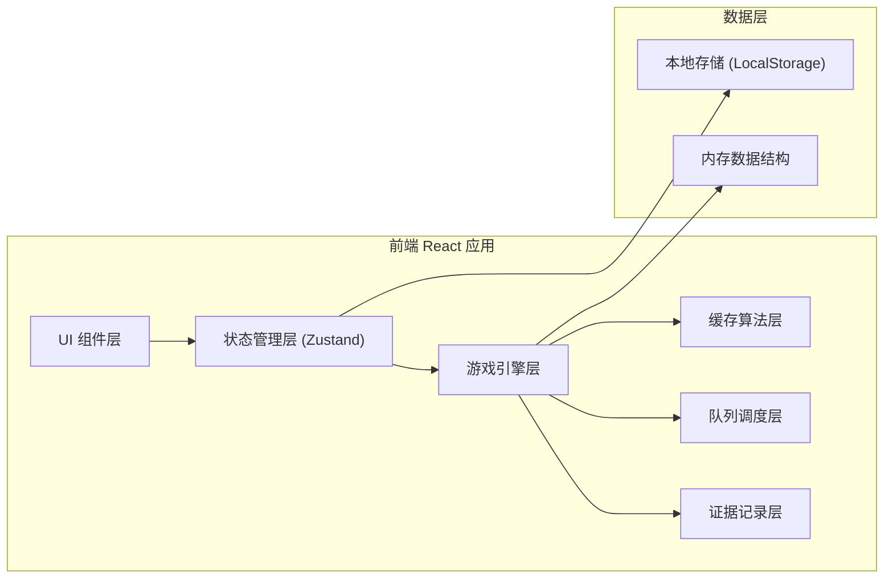

## 1. 架构设计



## 2. 技术描述

- **前端框架**: React@18 + TypeScript
- **构建工具**: Vite@5
- **样式方案**: TailwindCSS@3
- **状态管理**: Zustand@4
- **路由**: React Router DOM@6
- **图标**: Lucide React
- **图表**: Recharts（分数可视化）
- **动画**: CSS Keyframes + Framer Motion（复杂动画）

## 3. 目录结构

```
src/
├── components/           # 组件
│   ├── game/            # 游戏核心组件
│   │   ├── ControlBar.tsx       # 控制栏
│   │   ├── CacheMenu.tsx        # 缓存菜单
│   │   ├── OrderQueue.tsx       # 订单队列
│   │   ├── OrderCard.tsx        # 订单卡片
│   │   ├── SourceStation.tsx    # 回源灶台
│   │   ├── StatusPanel.tsx      # 状态面板
│   │   └── EventLog.tsx         # 事件日志
│   ├── settlement/      # 结算页组件
│   │   ├── ScoreBoard.tsx       # 分数面板
│   │   ├── ProblemStats.tsx     # 问题统计
│   │   └── ScoreChart.tsx       # 分数图表
│   ├── review/          # 复盘页组件
│   │   ├── Timeline.tsx         # 时间线
│   │   ├── EvidencePanel.tsx    # 证据面板
│   │   └── EventDetail.tsx      # 事件详情
│   ├── guide/           # 说明页组件
│   │   ├── OrderPrepGuide.tsx   # 订单卡准备
│   │   ├── CacheBreakdown.tsx   # 缓存击穿复现
│   │   └── ScoreExplain.tsx     # 分数解释
│   └── common/          # 公共组件
│       ├── Button.tsx
│       ├── Card.tsx
│       └── ProgressBar.tsx
├── hooks/               # 自定义 Hooks
│   ├── useGameLoop.ts          # 游戏主循环
│   ├── useCacheStrategy.ts     # 缓存策略
│   ├── useQueueScheduler.ts    # 队列调度
│   └── useEvidence.ts          # 证据记录
├── store/               # Zustand Store
│   ├── gameStore.ts            # 游戏状态
│   ├── cacheStore.ts           # 缓存状态
│   └── evidenceStore.ts        # 证据状态
├── types/               # TypeScript 类型定义
│   ├── game.ts
│   ├── cache.ts
│   ├── order.ts
│   └── evidence.ts
├── utils/               # 工具函数
│   ├── cacheAlgorithms.ts      # 缓存算法实现
│   ├── schedulers.ts           # 调度算法实现
│   ├── scoring.ts              # 计分规则
│   └── eventRecorder.ts        # 事件记录
├── pages/               # 页面
│   ├── GamePage.tsx
│   ├── SettlementPage.tsx
│   ├── ReviewPage.tsx
│   └── GuidePage.tsx
├── App.tsx
├── main.tsx
└── index.css
```

## 4. 路由定义

| 路由 | 页面 | 用途 |
|-----|------|------|
| `/` | GamePage | 游戏主界面 |
| `/settlement` | SettlementPage | 结算页面 |
| `/review` | ReviewPage | 复盘分析页面 |
| `/guide` | GuidePage | 玩法说明页面 |

## 5. 核心数据模型

### 5.1 订单 (Order)

```typescript
interface Order {
  id: string;
  dishId: string;
  dishName: string;
  createdAt: number;      // 毫秒时间戳
  expectedAt: number;     // 期望完成时间
  patience: number;       // 当前耐心值 0-100
  maxPatience: number;    // 初始耐心值
  priority: 'low' | 'normal' | 'high' | 'urgent';
  status: 'pending' | 'processing' | 'completed' | 'failed';
  cacheCheck?: {
    checkedAt: number;
    result: 'hit' | 'miss' | 'expired';
    cacheVersion?: string;
  };
  patienceHistory: Array<{ time: number; value: number }>;
}
```

### 5.2 缓存条目 (CacheEntry)

```typescript
interface CacheEntry {
  dishId: string;
  dishName: string;
  value: any;              // 缓存的数据
  createdAt: number;
  lastAccessedAt: number;
  accessCount: number;
  ttl: number;             // 存活时间(ms)
  expiresAt: number;       // 过期时间戳
  version: string;         // 数据版本号
  isDirty: boolean;        // 是否为脏数据
  sourceRequestId?: string; // 关联的回源请求ID
}
```

### 5.3 证据链 (Evidence)

```typescript
interface Evidence {
  orderId: string;
  eventType: 'order_created' | 'cache_check' | 'source_start' | 
             'source_complete' | 'serve' | 'dirty_spread' |
             'cache_breakdown' | 'expired_misread' | 'timeout';
  timestamp: number;
  cacheSnapshot: Array<CacheEntry>;
  patienceSnapshot: number;
  decision: string;
  details: Record<string, any>;
}
```

### 5.4 游戏状态 (GameState)

```typescript
interface GameState {
  status: 'idle' | 'playing' | 'paused' | 'ended';
  startTime: number | null;
  endTime: number | null;
  pausedAt: number | null;
  totalPauseTime: number;
  speed: 1 | 2 | 3;           // 游戏速度倍率
  cacheStrategy: 'LRU' | 'LFU' | 'FIFO' | 'TTL';
  queueScheduler: 'priority' | 'fifo' | 'lifo';
  score: number;
  scoreBreakdown: {
    base: number;
    cacheHitBonus: number;
    dirtyDataPenalty: number;
    sourceLimitPenalty: number;
    complaintPenalty: number;
    breakdownPenalty: number;
  };
  stats: {
    totalOrders: number;
    completedOrders: number;
    cacheHits: number;
    cacheMisses: number;
    cacheExpired: number;
    sourceRequests: number;
    concurrentSource: number;  // 当前并发回源数
    maxConcurrentSource: number;
    dirtySpreads: number;
    cacheBreakdowns: number;
    expiredMisreads: number;
    customerComplaints: number;
  };
}
```

## 6. 缓存算法实现

### 6.1 LRU (最近最少使用)
- 使用 Map 保持插入顺序
- 访问时删除并重新插入到末尾
- 淘汰时删除头部元素

### 6.2 LFU (最不经常使用)
- 维护访问计数器
- 按访问次数排序
- 次数相同时按最近访问时间

### 6.3 FIFO (先进先出)
- 使用队列结构
- 按插入顺序淘汰

### 6.4 TTL (过期时间)
- 每个条目设置过期时间
- 访问时检查是否过期
- 定期清理过期条目

## 7. 队列调度实现

### 7.1 优先级调度
- 按 `urgent > high > normal > low` 排序
- 同优先级按剩余耐心值升序

### 7.2 FIFO (先进先出)
- 按创建时间升序

### 7.3 LIFO (后进先出)
- 按创建时间降序

## 8. 事件检测逻辑

### 8.1 缓存击穿检测
```
条件：
1. 某 dishId 同时有 >= 5 个未处理订单
2. 该 dishId 缓存刚好过期或不存在
3. 同时触发 >= 3 个回源请求
触发：记录为缓存击穿事件，扣30分
```

### 8.2 脏数据扩散检测
```
条件：
1. 订单A使用了过期缓存完成出餐
2. 后续订单B检查同一dishId时
3. 系统未发现过期（版本号被覆盖）
触发：标记脏数据扩散链，扣20分
```

### 8.3 过期误读检测
```
条件：
1. 缓存条目已过期
2. 订单检查时系统误判为有效
3. 原因是新版本写入时覆盖了过期标记
触发：记录过期误读，扣15分
```

## 9. 计分规则

```typescript
function calculateScore(event: GameEvent): number {
  switch (event.type) {
    case 'serve_success':
      return 10 + (event.cacheHit ? 5 : 0);
    case 'serve_dirty':
      return -20;
    case 'source_limit_exceeded':
      return -15;
    case 'customer_complaint':
      return -10;
    case 'cache_breakdown':
      return -30;
    case 'expired_misread':
      return -15;
    default:
      return 0;
  }
}
```

## 10. 游戏主循环

使用 `requestAnimationFrame` 实现游戏主循环：
- 每帧更新：订单耐心值、回源进度、缓存TTL
- 每 500ms 检查：新订单生成、缓存过期检测、事件检测
- 使用 `performance.now()` 保证时间精度
- 暂停时停止循环，记录暂停时长
