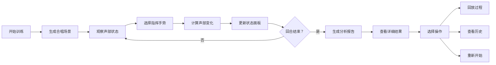

# 合唱声部防线 - 产品需求文档

## 1. 产品概述

"合唱声部防线"是一款面向音乐课堂和培训场景的交互式训练游戏，通过模拟合唱指挥决策过程，帮助学习者理解声部平衡、节奏同步和音量控制。玩家每一步选择都会实时影响演唱局势，游戏结束后提供可追溯的详细分析报告。

- **目标用户**：音乐教师、合唱指导、音乐学习者
- **核心价值**：将抽象的合唱概念具象化，通过决策和复盘提升合唱协调能力
- **解决问题**：传统合唱训练缺乏量化反馈和决策回溯机制

## 2. 核心功能

### 2.1 用户角色

| 角色 | 注册方式 | 核心权限 |
|------|----------|----------|
| 训练者 | 无需注册，本地存储 | 进行游戏训练、查看历史记录、分析练习结果 |

### 2.2 功能模块

1. **游戏主界面**：声部轨道可视化、指挥手势选择区、实时状态反馈
2. **决策交互系统**：每一步选择影响声部同步度、音量平衡、整体评分
3. **详细分析报告**：分类型展示错误（延迟进入、音量失衡、休止误判）
4. **历史记录管理**：数据持久化存储、支持回看和复盘
5. **回放系统**：逐步骤回放决策过程，展示触发声部同步的关键节点

### 2.3 页面详情

| 页面名称 | 模块名称 | 功能描述 |
|-----------|-------------|---------------------|
| 游戏主界面 | 声部轨道区 | 可视化展示各声部当前状态：音量、节奏、同步度 |
| 游戏主界面 | 指挥手势区 | 提供音量调节、节奏控制、声部强调等操作选项 |
| 游戏主界面 | 实时状态面板 | 显示当前回合数、总评分、风险预警提示 |
| 结果分析页 | 总览面板 | 展示最终得分、评级、整体表现摘要 |
| 结果分析页 | 错误详情 | 分类展示：延迟进入、音量失衡、休止误判的具体发生时机和原因 |
| 结果分析页 | 关键决策回溯 | 标记触发声部同步的关键步骤及其影响 |
| 历史记录页 | 记录列表 | 按时间展示所有训练记录，支持筛选和排序 |
| 历史记录页 | 记录详情 | 查看任意历史对局的完整报告和回放 |
| 回放界面 | 进度控制 | 可暂停、快进、逐帧查看决策过程 |
| 回放界面 | 影响展示 | 实时显示每个决策对评分的具体影响数值 |

## 3. 核心流程

### 3.1 主流程描述

训练者进入游戏后，系统随机生成一个合唱练习场景。在每个回合中，训练者观察当前各声部状态（音量、节奏、同步情况），选择合适的指挥手势进行干预。每次决策后，系统根据选择计算各声部的变化，更新状态并给予即时反馈。当所有回合结束或达到特定条件时，游戏结束，生成详细的分析报告。训练者可以查看报告，也可以选择回放整个决策过程，或查看历史训练记录。

### 3.2 流程图

## 4. 用户界面设计

### 4.1 设计风格

**整体风格**：音乐艺术感 + 专业教育质感

- **主色调**：深靛蓝 (#1E3A5F) - 代表专业、沉稳
- **辅助色**：金色 (#D4AF37) - 代表音乐的优雅
- **状态色**：
  - 同步：翠绿 (#2ECC71)
  - 警告：琥珀 (#F39C12)
  - 危险：珊瑚红 (#E74C3C)
  - 中性：银灰 (#BDC3C7)

- **字体**：
  - 标题：Noto Serif SC - 古典优雅
  - 正文：Noto Sans SC - 清晰易读

- **视觉元素**：
  - 五线谱纹理背景
  - 音符装饰元素
  - 指挥棒动效
  - 声波可视化效果

### 4.2 页面设计概述

| 页面名称 | 模块名称 | UI元素 |
|-----------|-------------|-------------|
| 游戏主界面 | 声部轨道区 | 垂直轨道布局、音量柱状图、节奏指示器、同步度光环、悬浮微动画 |
| 游戏主界面 | 指挥手势区 | 圆形按钮、按压动效、选中状态高亮、操作标签 |
| 游戏主界面 | 实时状态面板 | 卡片式布局、数据可视化图表、渐变背景 |
| 结果分析页 | 错误详情 | 时间轴布局、分类标签、悬停展开详情、图标标识 |
| 结果分析页 | 关键决策回溯 | 折线图展示评分变化、关键节点标记、点击查看详情 |
| 历史记录页 | 记录列表 | 卡片式列表、日期排序、缩略评分、悬停预览 |
| 回放界面 | 进度控制 | 时间轴滑块、播放/暂停按钮、速度调节 |

### 4.3 响应式设计

- **桌面端优先**：1280px+ 完整功能展示
- **平板适配**：768px-1279px 调整布局密度，保持核心功能
- **移动端**：375px-767px 简化视图，优先保证游戏核心体验
- **触摸优化**：增大触控区域，支持手势操作

### 4.4 动画与交互

- 声部同步时触发金色波纹扩散效果
- 错误发生时显示红色脉冲提示
- 决策选择时有平滑过渡动画
- 页面切换使用渐变和滑动组合
- 悬停效果提升交互质感

