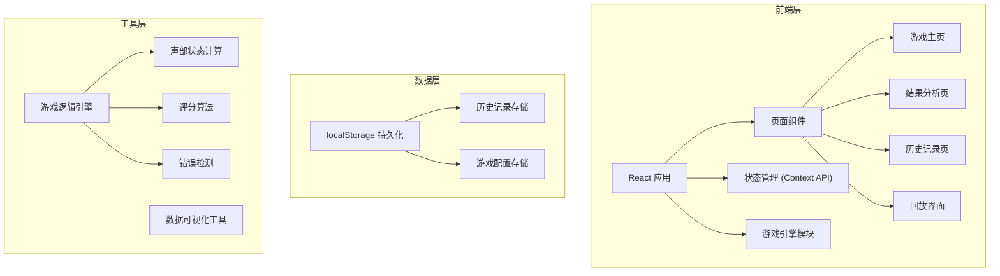
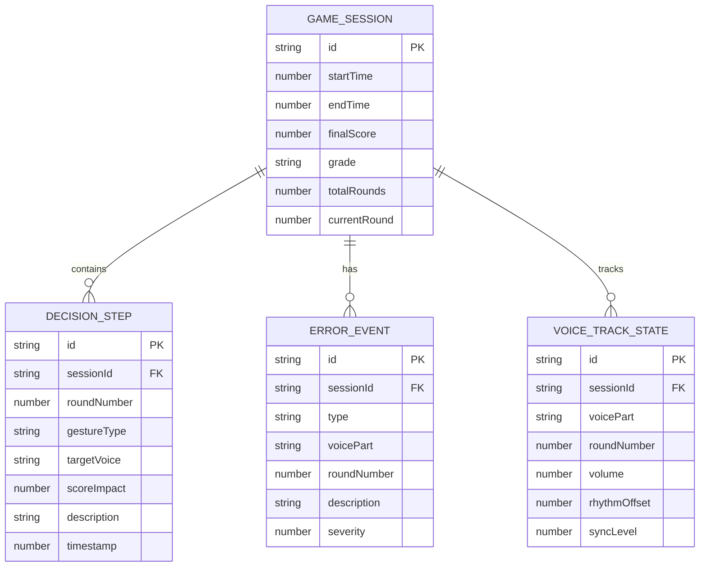

# 合唱声部防线 - 技术架构文档

## 1. 架构设计



## 2. 技术描述

- **前端框架**：React@18 + TypeScript
- **构建工具**：Vite@5
- **样式方案**：TailwindCSS@3
- **状态管理**：React Context API + useReducer
- **数据持久化**：localStorage
- **图标库**：Lucide React
- **图表可视化**：Recharts

## 3. 路由定义

| 路由 | 页面 | 功能 |
|-------|------|------|
| `/` | 游戏主页 | 声部轨道展示、指挥手势操作、实时状态反馈 |
| `/result/:sessionId` | 结果分析页 | 展示详细分析报告、错误分类、关键决策回溯 |
| `/history` | 历史记录页 | 历史对局列表、筛选排序 |
| `/replay/:sessionId` | 回放界面 | 逐步骤回放决策过程 |

## 4. 数据模型

### 4.1 实体关系图



### 4.2 核心类型定义

```typescript
// 声部分类
type VoicePart = 'soprano' | 'alto' | 'tenor' | 'bass';

// 指挥手势类型
type GestureType = 
  | 'volume_up' 
  | 'volume_down' 
  | 'emphasize' 
  | 'sync' 
  | 'rest' 
  | 'hold';

// 错误类型
type ErrorType = 'delayed_entry' | 'volume_imbalance' | 'rest_misjudgment';

// 声部状态
interface VoiceState {
  part: VoicePart;
  name: string;
  volume: number; // 0-100
  rhythmOffset: number; // -50 to +50, 0 is perfect
  syncLevel: number; // 0-100
}

// 决策步骤
interface DecisionStep {
  id: string;
  round: number;
  gesture: GestureType;
  targetVoice: VoicePart | 'all';
  scoreImpact: number;
  description: string;
  timestamp: number;
  triggeredSync: boolean;
}

// 错误事件
interface ErrorEvent {
  id: string;
  type: ErrorType;
  voicePart: VoicePart;
  round: number;
  description: string;
  severity: 'low' | 'medium' | 'high';
  pointsLost: number;
}

// 游戏会话
interface GameSession {
  id: string;
  startTime: number;
  endTime?: number;
  status: 'playing' | 'completed' | 'abandoned';
  currentRound: number;
  totalRounds: number;
  score: number;
  grade: 'S' | 'A' | 'B' | 'C' | 'D';
  voiceStates: VoiceState[];
  decisions: DecisionStep[];
  errors: ErrorEvent[];
  sceneName: string;
}
```

## 5. 状态管理设计

### 5.1 Game State Context

```typescript
interface GameState {
  session: GameSession | null;
  isPlaying: boolean;
  isPaused: boolean;
}

type GameAction =
  | { type: 'START_GAME'; payload: { sceneName: string; totalRounds: number } }
  | { type: 'MAKE_DECISION'; payload: { gesture: GestureType; target: VoicePart | 'all' } }
  | { type: 'NEXT_ROUND' }
  | { type: 'END_GAME' }
  | { type: 'LOAD_SESSION'; payload: GameSession }
  | { type: 'RESET_GAME' };
```

## 6. 核心算法

### 6.1 声部同步检测算法

```typescript
function calculateSyncLevel(voices: VoiceState[]): number {
  const rhythmOffsets = voices.map(v => v.rhythmOffset);
  const variance = calculateVariance(rhythmOffsets);
  const volumeDeviation = calculateVolumeDeviation(voices);
  return Math.max(0, 100 - variance * 2 - volumeDeviation * 0.5);
}
```

### 6.2 评分计算逻辑

```typescript
function calculateScore(
  baseScore: number,
  syncLevel: number,
  errors: ErrorEvent[],
  decisions: DecisionStep[]
): number {
  let score = baseScore + syncLevel * 0.5;
  errors.forEach(e => score -= e.pointsLost);
  decisions.forEach(d => score += d.scoreImpact);
  return Math.max(0, Math.min(100, score));
}
```

## 7. 目录结构

```
src/
├── components/
│   ├── game/
│   │   ├── VoiceTrack.tsx
│   │   ├── GesturePanel.tsx
│   │   └── StatusPanel.tsx
│   ├── result/
│   │   ├── ScoreOverview.tsx
│   │   ├── ErrorTimeline.tsx
│   │   └── DecisionReview.tsx
│   ├── history/
│   │   ├── SessionCard.tsx
│   │   └── SessionList.tsx
│   ├── replay/
│   │   ├── PlaybackControls.tsx
│   │   └── ReplayVisualizer.tsx
│   └── common/
│       └── MusicNoteIcon.tsx
├── context/
│   └── GameContext.tsx
├── hooks/
│   ├── useGameEngine.ts
│   └── useLocalStorage.ts
├── types/
│   └── index.ts
├── utils/
│   ├── gameLogic.ts
│   ├── scoring.ts
│   └── storage.ts
├── data/
│   └── scenes.ts
├── pages/
│   ├── GamePage.tsx
│   ├── ResultPage.tsx
│   ├── HistoryPage.tsx
│   └── ReplayPage.tsx
├── App.tsx
├── main.tsx
└── index.css
```

## 8. 数据持久化策略

- 使用 `localStorage` 存储所有游戏会话
- Key: `chorus_defense_sessions`
- 每次游戏结束自动保存
- 页面加载时读取历史记录
- 避免重复：使用 UUID 作为会话 ID
- 存储上限：最近 50 条记录，超出自动清理最旧记录

