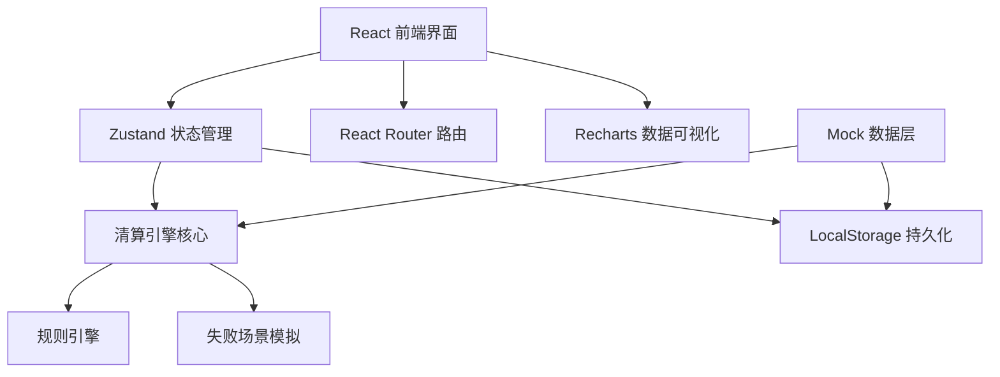
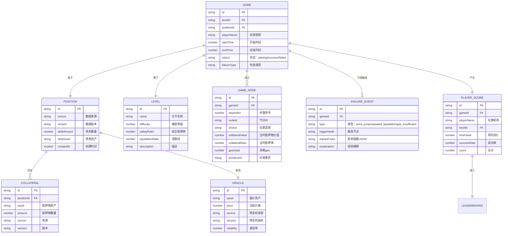

## 1. 架构设计



## 2. 技术描述

- **前端框架**: React 18 + TypeScript 5
- **构建工具**: Vite 5
- **样式方案**: TailwindCSS 3 + CSS 变量主题系统
- **状态管理**: Zustand（轻量级，适合游戏状态追踪）
- **路由管理**: React Router 6
- **图表可视化**: Recharts（用于抵押率变化曲线、影响链分析）
- **图标库**: Lucide React
- **数据持久化**: LocalStorage（存储游戏历史、排行榜、自定义仓位）
- **Mock数据**: 内置3个预设关卡，包含借贷仓位、抵押物、预言机价格数据

## 3. 目录结构

```
src/
├── components/          # UI组件
│   ├── game/           # 游戏相关组件（迷宫地图、节点、状态面板）
│   ├── layout/         # 布局组件（导航、页脚）
│   └── common/         # 通用组件（按钮、弹窗、卡片）
├── pages/              # 页面组件
│   ├── Home.tsx        # 首页（关卡选择）
│   ├── Game.tsx        # 迷宫游戏页
│   ├── Review.tsx      # 复盘详情页
│   ├── Leaderboard.tsx # 排行榜页
│   └── Import.tsx      # 数据导入页
├── store/              # 状态管理
│   ├── useGameStore.ts # 游戏状态
│   └── useUserStore.ts # 用户/排行榜状态
├── engine/             # 核心引擎
│   ├── types.ts        # 类型定义
│   ├── rules.ts        # 清算规则
│   ├── failure.ts      # 失败场景模拟
│   └── calculator.ts   # 抵押率计算器
├── data/               # Mock数据
│   ├── levels.ts       # 关卡配置
│   └── positions.ts    # 预设借贷仓位
├── hooks/              # 自定义Hooks
└── utils/              # 工具函数
```

## 4. 路由定义

| 路由 | 页面 | 用途 |
|------|------|------|
| `/` | 首页 | 关卡选择、排行榜入口 |
| `/game/:levelId` | 游戏页 | 迷宫闯关、路线选择、清算判定 |
| `/review/:gameId` | 复盘页 | 路线回放、影响链分析、数据对照 |
| `/leaderboard` | 排行榜 | 玩家排名、成绩展示 |
| `/import` | 导入页 | 借贷仓位导入、自定义关卡 |

## 5. 数据模型

### 5.1 实体关系图



### 5.2 核心类型定义

```typescript
// 抵押物
interface Collateral {
  id: string;
  asset: string;
  amount: number;
  source: string;
  version: string;
}

// 借贷仓位
interface Position {
  id: string;
  source: string;
  version: string;
  debtAmount: number;
  debtAsset: string;
  collaterals: Collateral[];
  oracle: Oracle;
  createdAt: number;
}

// 预言机
interface Oracle {
  id: string;
  asset: string;
  price: number;
  source: string;
  version: string;
  volatility: number;
}

// 游戏状态
interface GameState {
  id: string;
  levelId: string;
  position: Position;
  currentNodeId: string;
  path: string[];
  collateralRatio: number;
  gasRemaining: number;
  priceHistory: { step: number; price: number }[];
  status: 'playing' | 'success' | 'failed';
  failureEvent?: FailureEvent;
  nodeHistory: GameNode[];
}

// 失败事件
interface FailureEvent {
  type: 'price_jump' | 'repeated_liquidation' | 'gas_insufficient';
  triggerNode: string;
  impactChain: ImpactLink[];
  explanation: string;
}

// 影响链路
interface ImpactLink {
  id: string;
  description: string;
  affectedMetric: string;
  change: string;
  ruleReference: string;
}
```

### 5.3 清算规则引擎

```typescript
// 核心计算函数
function calculateCollateralRatio(
  collateralValue: number,
  debtValue: number
): number;

// 清算判定
function checkLiquidation(
  currentRatio: number,
  liquidationRatio: number,
  safetyRatio: number
): { safe: boolean; warning: boolean; liquidatable: boolean };

// 价格跳变模拟
function simulatePriceJump(
  basePrice: number,
  volatility: number,
  triggerProbability: number
): { newPrice: number; jumpOccurred: boolean; jumpDirection: 'up' | 'down' };

// Gas费用计算
function calculateGasCost(
  operationType: 'liquidation' | 'partial' | 'swap',
  baseGas: number,
  networkCongestion: number
): number;
```

## 6. 核心算法说明

### 6.1 抵押率计算
```
抵押率 = (抵押物数量 × 预言机价格) / 债务价值 × 100%
```

### 6.2 价格跳变触发逻辑
- 每步有30%概率触发价格跳变
- 跳变幅度 = 基础价格 × 波动率 × 随机系数(0.8-1.5)
- 向下跳变概率65%（模拟清算风险）

### 6.3 排行榜计分规则
```
总分 = 基础分(1000) - 用时惩罚(每秒扣2分) + 风险控制奖励
风险控制奖励 = 平均抵押率超出安全线部分 × 100
```
