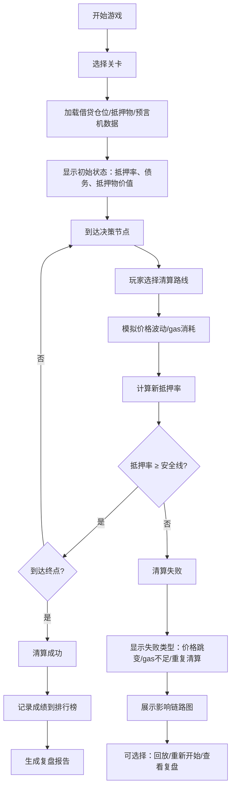

## 1. 产品概述

"DeFi清算迷宫"是一款面向Web3学习者和从业者的教育类游戏，通过迷宫闯关的形式帮助玩家理解DeFi借贷协议中抵押率计算、清算触发条件、gas费用影响等核心机制。

- 核心问题：抵押物价值波动与gas费用竞争导致清算失败，学习者难以直观理解抵押率结算的完整链路
- 目标用户：Web3讲师、DeFi学习者、协议开发者
- 产品价值：将抽象的金融清算规则转化为可视化的迷宫闯关，让失败路径可追溯、可回放、可教学

## 2. 核心特性

### 2.1 用户角色

| 角色 | 注册方式 | 核心权限 |
|------|----------|----------|
| 玩家 | 本地匿名，支持输入昵称 | 游戏闯关、查看排行榜、复盘历史、回放游戏 |
| 讲师 | 同上 | 导入借贷仓位数据、创建自定义关卡、导出复盘报告 |

### 2.2 功能模块

1. **游戏主界面**：迷宫可视化、路线选择、实时状态面板
2. **清算判定引擎**：抵押率计算、价格波动模拟、gas费竞争机制
3. **失败场景系统**：价格跳变、重复清算、gas不足三类典型失败
4. **复盘中心**：历史记录、路线回放、影响链分析、排行榜
5. **数据管理**：借贷仓位导入、抵押物配置、预言机版本追踪

### 2.3 页面详情

| 页面名称 | 模块名称 | 功能描述 |
|----------|----------|----------|
| 首页 | 关卡选择 | 展示可用关卡，显示难度、失败率、最佳成绩 |
| 首页 | 排行榜入口 | 展示玩家排名，支持按关卡筛选 |
| 迷宫游戏页 | 迷宫地图 | 可视化显示清算路径节点，支持点击选择路线 |
| 迷宫游戏页 | 状态面板 | 实时显示抵押率、抵押物价值、债务、gas余量、预言机价格 |
| 迷宫游戏页 | 规则提示 | 每步操作后显示规则反馈，解释当前选择的影响 |
| 迷宫游戏页 | 失败弹窗 | 清算失败时显示失败类型、触发条件、影响链路 |
| 复盘详情页 | 路线回放 | 步进式回放整局游戏，支持暂停/快进 |
| 复盘详情页 | 影响链分析 | 可视化展示价格跳变等事件如何传导至最终结果 |
| 复盘详情页 | 数据对照 | 借贷仓位、抵押物、排行榜三者对应关系展示 |
| 排行榜页 | 排名列表 | 玩家昵称、用时、成功率、通关关卡数 |
| 数据导入页 | 仓位导入 | 支持导入借贷仓位JSON，保留来源和版本信息 |

## 3. 核心流程

玩家选择关卡后进入迷宫，每个节点代表一个清算决策点，玩家需要在抵押物价值波动、gas费用竞争、预言机价格跳变等不确定因素下，选择正确的清算路径以维持抵押率在安全线以上。

## 4. 用户界面设计

### 4.1 设计风格

**整体定位：金融科技 + 游戏化教育**

- **主色调**：深邃的科技蓝 `#0B1220` 作为背景，搭配警戒红 `#E63946`（清算风险）、安全绿 `#2EC4B6`（健康状态）、警告橙 `#FF9F1C`（警告状态）
- **辅助色**：矩阵绿 `#00FF88` 用于数据高亮，霓虹紫 `#9D4EDD` 用于强调交互
- **字体**：显示字体使用 `JetBrains Mono`（等宽字体，强调金融数据感），正文字体使用 `Noto Sans SC`
- **布局**：左侧迷宫地图 + 右侧状态面板的分栏布局，数据使用卡片式堆叠
- **动效**：节点发光脉冲、抵押率变化时的数字滚动、失败时的屏幕震动和红色闪烁
- **图标风格**：线性简约图标，配合颜色编码区分状态

### 4.2 页面设计概览

| 页面名称 | 模块名称 | UI元素 |
|----------|----------|--------|
| 首页 | 关卡选择 | 卡片式关卡列表，悬停时显示关卡数据预览，背景有微妙的网格动画 |
| 迷宫游戏页 | 迷宫地图 | SVG绘制的节点连线图，节点根据状态显示不同颜色和发光效果，鼠标悬停显示该节点的规则提示 |
| 迷宫游戏页 | 状态面板 | 顶部大字号显示抵押率，下方分组展示抵押物、债务、gas、预言机价格，每项数据附带变化趋势箭头 |
| 失败弹窗 | 失败详情 | 大号失败类型标题，下方时间线展示从触发事件到最终失败的完整传导链，每项标注影响的规则条目 |
| 复盘详情页 | 路线回放 | 顶部时间轴可拖拽，左侧节点列表，右侧数据变化曲线图，支持步进控制 |
| 复盘详情页 | 数据对照 | 三栏布局：借贷仓位详情、抵押物配置、排行榜成绩，高亮显示三者关联字段 |

### 4.3 响应式设计

- 桌面端：左右分栏布局（迷宫70% + 面板30%）
- 平板端：上下布局，状态面板折叠可展开
- 移动端：纵向滚动，迷宫地图自适应缩放，支持双指缩放查看节点

### 4.4 交互细节

- **节点选择**：点击节点时有涟漪扩散动画，选中节点持续脉冲发光
- **抵押率变化**：数字滚动动画，跨越警戒线时颜色渐变+边框闪烁
- **失败触发**：屏幕轻微震动，红色遮罩淡入，失败原因逐条显现
- **回放控制**：时间轴拖拽时数据同步变化，关键节点自动暂停并高亮
