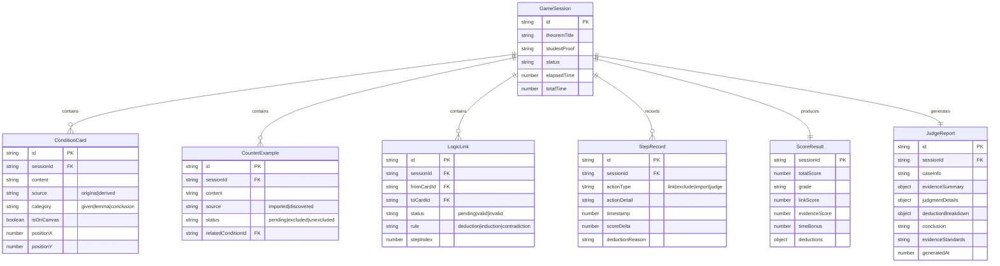

## 1. 架构设计

```mermaid
flowchart TD
    "浏览器前端" --> "React App"
    "React App" --> "游戏状态管理 (Zustand)"
    "React App" --> "路由 (React Router)"
    "React App" --> "画布引擎 (SVG)"
    "游戏状态管理 (Zustand)" --> "游戏核心逻辑"
    "游戏状态管理 (Zustand)" --> "导入/导出模块"
    "游戏核心逻辑" --> "逻辑连线判定"
    "游戏核心逻辑" --> "证据状态管理"
    "游戏核心逻辑" --> "评分引擎"
    "导入/导出模块" --> "材料导入解析"
    "导入/导出模块" --> "判决报告生成"
    "判决报告生成" --> "JSON导出"
    "判决报告生成" --> "分享链接"
```

## 2. 技术说明
- 前端：React@18 + TypeScript + Tailwind CSS@3 + Vite
- 初始化工具：Vite (react-ts template)
- 状态管理：Zustand（轻量级，适合游戏状态）
- 画布交互：SVG + 自定义拖拽/连线逻辑
- 后端：无（纯前端单机游戏）
- 数据库：无（使用 localStorage 持久化 + JSON 导入导出）
- 动画：CSS transitions + Framer Motion

## 3. 路由定义
| 路由 | 用途 |
|------|------|
| / | 游戏主页面，包含条件卡、证据、画布、计时器 |
| /settlement | 结算页面，步骤评分和扣分明细 |
| /review | 复盘页面，逐步回放游戏过程 |
| /report | 判决报告页面，导出与分享 |

## 4. 数据模型

### 4.1 数据模型定义



### 4.2 核心数据结构 (TypeScript)

```typescript
interface GameSession {
  id: string;
  theoremTitle: string;
  theoremStatement: string;
  studentProof: string;
  status: 'idle' | 'playing' | 'paused' | 'finished';
  elapsedTime: number;
  totalTime: number;
  conditions: ConditionCard[];
  counterExamples: CounterExample[];
  logicLinks: LogicLink[];
  stepRecords: StepRecord[];
  scoreResult: ScoreResult | null;
}

interface ConditionCard {
  id: string;
  content: string;
  source: 'original' | 'derived';
  category: 'given' | 'lemma' | 'conclusion';
  isOnCanvas: boolean;
  position: { x: number; y: number };
}

interface CounterExample {
  id: string;
  content: string;
  source: 'imported' | 'discovered';
  status: 'pending' | 'excluded' | 'unexcluded';
  relatedConditionId: string | null;
}

interface LogicLink {
  id: string;
  fromCardId: string;
  toCardId: string;
  status: 'pending' | 'valid' | 'invalid';
  rule: 'deduction' | 'induction' | 'contradiction';
  stepIndex: number;
}

interface StepRecord {
  id: string;
  actionType: 'link' | 'exclude' | 'import' | 'judge';
  actionDetail: string;
  timestamp: number;
  scoreDelta: number;
  deductionReason: string | null;
}

interface ScoreResult {
  totalScore: number;
  grade: 'S' | 'A' | 'B' | 'C' | 'D';
  linkScore: number;
  evidenceScore: number;
  timeBonus: number;
  deductions: DeductionItem[];
}

interface DeductionItem {
  stepIndex: number;
  category: 'lemma_misuse' | 'condition_missing' | 'counterexample_unexcluded';
  description: string;
  evidenceRef: string;
  pointsDeducted: number;
}

interface JudgeReport {
  id: string;
  sessionId: string;
  caseInfo: string;
  evidenceSummary: {
    totalConditions: number;
    originalCount: number;
    derivedCount: number;
    counterExamples: { excluded: number; unexcluded: number; pending: number };
  };
  judgmentDetails: LogicLink[];
  deductionBreakdown: DeductionItem[];
  conclusion: string;
  evidenceStandards: string;
  generatedAt: number;
}
```

## 5. 导入/导出规范

### 5.1 导入格式
材料导入使用JSON格式，区分 `raw`（原始材料）和 `processed`（处理结果）：

```json
{
  "type": "conditions" | "counterExamples" | "timer",
  "metadata": {
    "source": "string",
    "importedAt": "number"
  },
  "raw": { },
  "processed": { }
}
```

### 5.2 导出报告格式
判决报告导出为自包含JSON，包含完整证据判定口径：

```json
{
  "reportId": "string",
  "caseInfo": { },
  "evidenceStandards": "证据判定标准说明",
  "judgments": [ ],
  "deductions": [ ],
  "conclusion": "string"
}
```
