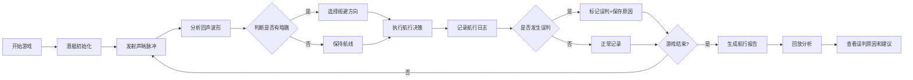

## 1. 产品概述

声波潜艇寻路是一款面向音乐科技社课堂培训的交互式教学关卡。玩家通过声呐节拍判断海域状况，做出航行决策避开暗礁。每一步选择都会影响局势，游戏结束后可回溯分析决策过程，理解回声误判的原因及处理方法。

- 核心目标：通过游戏化方式培训学员理解声波反射原理、节奏判断和航行决策
- 目标用户：音乐科技社学生、声学相关课程学员
- 教学价值：将抽象的声波理论转化为可操作的决策训练

## 2. 核心功能

### 2.1 用户角色

| 角色 | 使用方式 | 核心权限 |
|------|----------|----------|
| 学员玩家 | 直接进入游戏 | 进行游戏、查看航行报告、回看决策过程 |
| 指导老师 | 查看回放模式 | 分析学员决策、查看失败原因、导出培训记录 |

### 2.2 功能模块

1. **游戏主界面**：潜艇航行视图、声呐脉冲可视化、暗礁探测、节奏节拍器
2. **航行决策系统**：方向选择、速度调整、声呐发射时机
3. **航行报告系统**：决策记录、缺字段标记、晚补记录、备注修改历史
4. **回声误判分析**：误判原因展示、处理建议、对比正确判断
5. **回放系统**：步骤回溯、成绩影响分析、关键节点标记

### 2.3 页面详情

| 页面名称 | 模块名称 | 功能描述 |
|-----------|-------------|---------------------|
| 游戏主界面 | 潜艇航行区 | 2D侧视图展示潜艇位置、海域深度、暗礁分布 |
| 游戏主界面 | 声呐脉冲面板 | 声波发射动画、回声波形显示、节奏节拍指示 |
| 游戏主界面 | 决策控制区 | 方向选择按钮、速度调节、声呐发射按钮 |
| 航行报告页 | 决策记录列表 | 时间线展示每一步决策，标记缺字段/晚补/备注 |
| 航行报告页 | 误判分析卡片 | 显示误判原因、声波波形对比、处理建议 |
| 回放分析页 | 步骤回溯器 | 可拖动时间轴回看每一步，高亮触发声波反馈的节点 |
| 回放分析页 | 成绩影响分析 | 失败回放展示关键错误如何影响最终成绩 |

## 3. 核心流程

玩家进入游戏后，首先看到潜艇在海域起始位置。通过观察声呐脉冲返回的波形，结合节拍节奏判断前方是否有暗礁。每一步需要选择航行方向和速度，系统实时记录决策。如果发生回声误判，系统会在航行报告中标记并保留历史痕迹。游戏结束后，学员和老师都可以查看完整的航行报告和回放分析，理解每一个决策如何影响最终结果。

## 4. 用户界面设计

### 4.1 设计风格

**深海科技风格**
- 主色调：深海蓝 (#0a1628)、科技青 (#00d4ff)、警示橙 (#ff6b35)
- 辅助色：声波绿 (#00ff88)、暗礁红 (#ff4757)
- 字体：JetBrains Mono（等宽科技感字体）搭配 Orbitron（标题显示字体）
- 按钮风格：圆角矩形、发光边框、悬停时微放大效果
- 布局风格：深色背景、发光元素、网格线背景、扫描线动画
- 图标风格：线性科技图标，发光描边效果

### 4.2 页面设计概述

| 页面名称 | 模块名称 | UI 元素 |
|-----------|-------------|-------------|
| 游戏主界面 | 潜艇航行区 | 2D画布、潜艇精灵、暗礁剪影、声波扩散动画、深度网格线 |
| 游戏主界面 | 声呐脉冲面板 | 波形图、节拍指示器、脉冲倒计时、回声强度条 |
| 游戏主界面 | 决策控制区 | 方向键（上下左右）、速度滑块、声呐发射按钮（脉冲动画） |
| 航行报告页 | 决策记录列表 | 时间线布局、卡片式记录、状态标签（缺字段/晚补/备注） |
| 航行报告页 | 误判分析卡片 | 双波形对比图、原因说明文字、建议列表、参考链接 |
| 回放分析页 | 步骤回溯器 | 时间轴滑块、播放/暂停按钮、关键节点标记（发光圆点） |
| 回放分析页 | 成绩影响分析 | 瀑布流程图、扣分标记、因果关系连线 |

### 4.3 响应式

- 桌面端优先设计（适配培训教室大屏展示）
- 平板端适配（堆叠布局，触控优化）
- 关键操作按钮最小尺寸 48px，便于触控

### 4.4 视觉动效指引

- 声呐脉冲：圆形波纹向外扩散，透明度渐变
- 潜艇航行：轻微上下浮动动画，尾迹粒子效果
- 回声波形：实时绘制的线条图，带有发光效果
- 节拍指示器：按节奏闪烁的圆点，颜色随节拍变化
- 误判提示：屏幕边缘红色闪烁，伴随震动反馈
- 页面切换：淡入淡出 + 轻微滑动过渡
