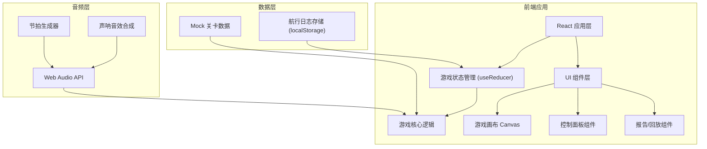

## 1. 架构设计



## 2. 技术描述

- **前端框架**: React@18 + TypeScript + Vite
- **样式方案**: TailwindCSS@3 + CSS 变量
- **状态管理**: React useReducer (游戏状态) + Context API
- **图形渲染**: Canvas 2D API (游戏主画面) + SVG (波形图)
- **音频处理**: Web Audio API (节拍器 + 声呐音效)
- **数据持久化**: localStorage (航行日志存储)
- **图标**: Lucide React
- **后端**: 无后端，纯前端应用
- **数据库**: 无数据库，使用 Mock 数据 + localStorage

## 3. 路由定义

| 路由 | 页面组件 | 用途 |
|-------|---------|------|
| / | HomePage | 游戏首页，介绍和开始按钮 |
| /game | GamePage | 游戏主界面 |
| /report | ReportPage | 航行报告和误判分析 |
| /replay | ReplayPage | 回放分析页面 |

## 4. 核心数据模型

### 4.1 类型定义

```typescript
// 游戏状态
interface GameState {
  submarine: Submarine;
  reefs: Reef[];
  sonarHistory: SonarPulse[];
  decisionLog: DecisionRecord[];
  currentPhase: GamePhase;
  score: number;
  misjudgments: Misjudgment[];
}

// 潜艇
interface Submarine {
  x: number;
  y: number;
  depth: number;
  speed: number;
  direction: 'up' | 'down' | 'left' | 'right';
}

// 暗礁
interface Reef {
  id: string;
  x: number;
  y: number;
  width: number;
  height: number;
  type: 'rock' | 'coral' | 'debris';
}

// 声呐脉冲
interface SonarPulse {
  id: string;
  timestamp: number;
  originX: number;
  originY: number;
  radius: number;
  echoes: Echo[];
  isComplete: boolean;
}

// 回声
interface Echo {
  id: string;
  distance: number;
  angle: number;
  strength: number;
  isMisjudged: boolean;
  actualTarget?: string;
  misjudgmentReason?: string;
}

// 决策记录
interface DecisionRecord {
  id: string;
  timestamp: number;
  step: number;
  action: 'move' | 'sonar' | 'wait';
  direction?: string;
  speed?: number;
  sonarData?: SonarPulse;
  isMissingFields: boolean;
  isLateEntry: boolean;
  remarks?: string;
  remarkHistory?: RemarkChange[];
  consequence?: 'safe' | 'near-miss' | 'collision';
}

// 备注修改记录
interface RemarkChange {
  id: string;
  timestamp: number;
  oldValue: string;
  newValue: string;
  author: string;
}

// 误判记录
interface Misjudgment {
  id: string;
  step: number;
  timestamp: number;
  sonarPulseId: string;
  expectedReading: Echo;
  actualReading: Echo;
  reason: string;
  suggestion: string;
  impactOnScore: number;
  playerDecision: string;
  correctDecision: string;
}

// 游戏阶段
type GamePhase = 'intro' | 'playing' | 'paused' | 'completed' | 'failed';
```

### 4.2 Mock 关卡数据

```typescript
const LEVEL_DATA = {
  id: 'level-1',
  name: '基础声呐导航',
  description: '学习识别基本的声波反射模式',
  reefs: [
    { id: 'reef-1', x: 300, y: 200, width: 80, height: 120, type: 'rock' },
    { id: 'reef-2', x: 500, y: 350, width: 60, height: 90, type: 'coral' },
    { id: 'reef-3', x: 700, y: 150, width: 100, height: 80, type: 'debris' },
  ],
  misjudgmentTriggers: [
    {
      step: 3,
      type: 'ambiguous_echo',
      reason: '水流扰动导致波形畸变',
      suggestion: '建议等待下一个脉冲确认，或降低航速谨慎通过'
    },
    {
      step: 5,
      type: 'multiple_reflections',
      reason: '多次反射回声叠加造成假目标',
      suggestion: '注意观察回声强度变化，假目标通常强度较弱'
    }
  ],
  targetPosition: { x: 900, y: 250 },
  startPosition: { x: 50, y: 250 }
};
```

## 5. 核心组件结构

```
src/
├── components/
│   ├── game/
│   │   ├── GameCanvas.tsx      # 游戏主画布
│   │   ├── Submarine.tsx       # 潜艇组件
│   │   ├── SonarVisualizer.tsx # 声呐可视化
│   │   └── ReefRenderer.tsx    # 暗礁渲染
│   ├── ui/
│   │   ├── ControlPanel.tsx    # 控制面板
│   │   ├── BeatIndicator.tsx   # 节拍指示器
│   │   └── StatusBar.tsx       # 状态栏
│   ├── report/
│   │   ├── DecisionLog.tsx     # 决策记录列表
│   │   ├── MisjudgmentCard.tsx # 误判分析卡片
│   │   └── WaveformCompare.tsx # 波形对比
│   └── replay/
│       ├── Timeline.tsx        # 时间轴
│       ├── ReplayPlayer.tsx    # 回放播放器
│       └── ScoreImpact.tsx     # 成绩影响分析
├── hooks/
│   ├── useGameState.ts         # 游戏状态管理
│   ├── useSonar.ts             # 声呐逻辑
│   └── useAudio.ts             # 音频钩子
├── types/
│   └── game.ts                 # 类型定义
├── data/
│   └── levels.ts               # 关卡数据
└── utils/
    ├── waveform.ts             # 波形生成
    └── collision.ts            # 碰撞检测
```

## 6. 声呐算法说明

### 6.1 回声强度计算
```
强度 = 基础强度 / (距离²) * 反射系数 * 随机扰动
- 基础强度：声呐发射功率（默认 100）
- 距离：目标到潜艇的距离
- 反射系数：岩石(0.9) > 珊瑚(0.7) > 残骸(0.5)
- 随机扰动：模拟真实环境噪声 (±5%)
```

### 6.2 误判触发条件
1. **波形畸变**：当潜艇靠近复杂地形时，回声波形叠加噪声
2. **假目标**：在特定区域生成虚拟回声，强度略低于真实目标
3. **延迟回声**：回声返回时间异常，可能导致距离判断错误

### 6.3 节拍系统
- 基础节拍：60 BPM（每秒一次）
- 声呐脉冲与节拍同步
- 玩家需要在节拍窗口内做出决策，否则记为"晚补"
