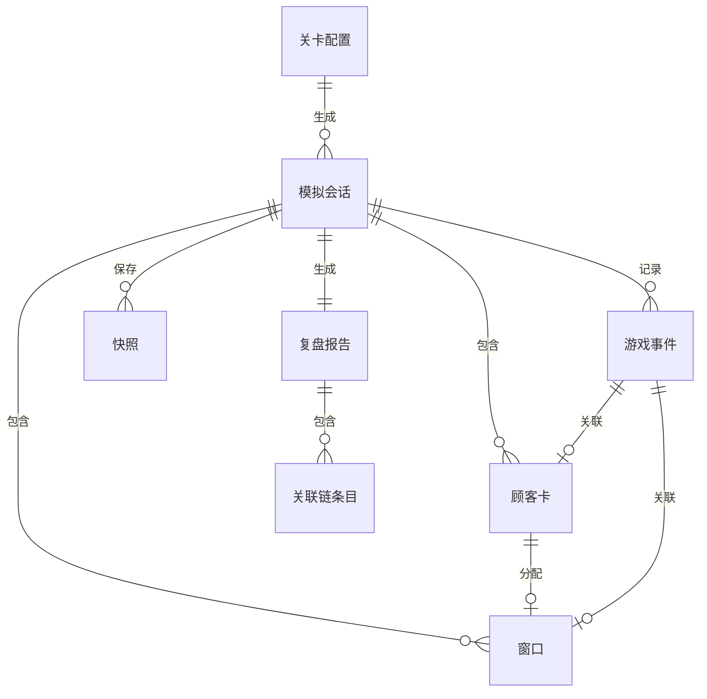

## 1. 架构设计

```mermaid
flowchart TB
    subgraph "前端层"
        "React UI" --> "Zustand Store"
        "Zustand Store" --> "游戏引擎(Simulation Engine)"
    end
    subgraph "数据层"
        "游戏引擎(Simulation Engine)" --> "事件记录器(Event Logger)"
        "游戏引擎(Simulation Engine)" --> "状态快照(Snapshot Store)"
    end
    subgraph "导出层"
        "事件记录器(Event Logger)" --> "报告生成器(Report Generator)"
        "状态快照(Snapshot Store)" --> "回放控制器(Replay Controller)"
        "报告生成器(Report Generator)" --> "文件下载(File Download)"
    end
```

纯前端项目，无后端服务。所有排队论计算、状态管理、报告生成均在浏览器端完成。

## 2. 技术说明
- 前端：React@18 + TypeScript + tailwindcss@3 + vite
- 初始化工具：vite-init (react-ts模板)
- 后端：无
- 数据库：无，使用内存状态 + localStorage持久化
- 状态管理：Zustand
- 图表：Canvas原生绘制（等待分布柱状图）
- 导出：JSON/CSV纯前端生成下载

## 3. 路由定义
| 路由 | 用途 |
|------|------|
| / | 首页，关卡选择与规则说明 |
| /game/:levelId | 游戏页面，运行模拟 |
| /review/:sessionId | 复盘页面，回放与报告导出 |

## 4. API定义
无后端API。所有数据通过Zustand store和props传递。

### 4.1 核心数据类型

```typescript
interface CustomerCard {
  id: string
  appointmentNo: string
  arrivalTime: number
  serviceDuration: number
  originalServiceDuration: number
  status: 'waiting' | 'serving' | 'completed' | 'no_show' | 'abandoned'
  assignedWindow: number | null
  waitStartTime: number
  waitEndTime: number | null
  serviceStartTime: number | null
  serviceEndTime: number | null
  isAbnormal: boolean
  abnormalReason?: string
}

interface ServiceWindow {
  id: number
  label: string
  status: 'idle' | 'serving' | 'disabled'
  currentCustomer: string | null
  disabledAt: number | null
  disabledReason?: string
  serviceProgress: number
}

interface GameEvent {
  tick: number
  type: 'arrival' | 'service_start' | 'service_end' | 'no_show' | 'window_disabled' | 'window_enabled' | 'abnormal_duration' | 'abandon' | 'config_change'
  customerId?: string
  windowId?: number
  detail: string
  triggerSource: string
}

interface WindowConfig {
  windowCount: number
  disabledWindows: number[]
  serviceRate: number
}

interface LevelConfig {
  id: string
  name: string
  model: string
  arrivalRate: number
  serviceRate: number
  initialWindowCount: number
  totalCustomers: number
  description: string
  failureConditions: FailureCondition[]
  anomalies: AnomalyConfig[]
}

interface FailureCondition {
  type: 'max_wait_exceeded' | 'queue_length_exceeded' | 'no_show_rate_exceeded'
  threshold: number
  message: string
}

interface AnomalyConfig {
  type: 'no_show' | 'window_disabled' | 'abnormal_duration'
  probability: number
  triggerTickRange: [number, number]
}

interface SimulationSnapshot {
  tick: number
  queue: string[]
  windows: ServiceWindow[]
  events: GameEvent[]
  metrics: SimulationMetrics
}

interface SimulationMetrics {
  avgWaitTime: number
  maxWaitTime: number
  utilizationRate: number[]
  noShowCount: number
  completedCount: number
  abandonedCount: number
  queueLength: number
}

interface ReviewReport {
  sessionId: string
  levelId: string
  windowConfig: WindowConfig
  configHistory: { tick: number; config: WindowConfig }[]
  metrics: SimulationMetrics
  waitTimeDistribution: number[]
  events: GameEvent[]
  customerCards: CustomerCard[]
  correlationChain: CorrelationEntry[]
}

interface CorrelationEntry {
  customerId: string
  appointmentNo: string
  windowId: number | null
  reportItemIndex: number
  arrivalTime: number
  serviceDuration: number
  status: string
}
```

## 5. 服务器架构图
不适用（纯前端项目）

## 6. 数据模型

### 6.1 数据模型定义



### 6.2 数据定义语言
不使用SQL数据库。数据存储在Zustand store中，通过localStorage持久化会话记录。

### 关键存储键
- `queue_game_sessions`: 已完成的模拟会话列表
- `queue_game_current`: 当前进行中的模拟状态
