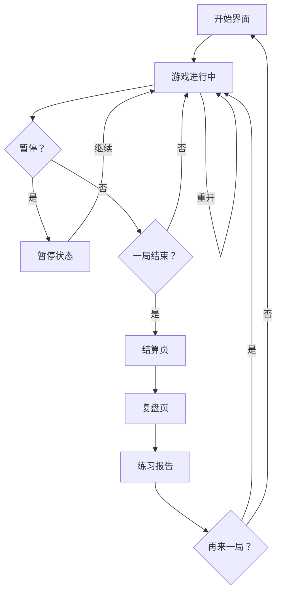
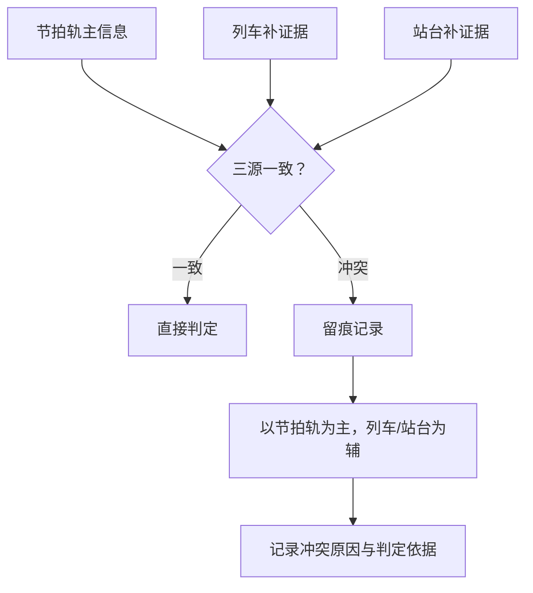
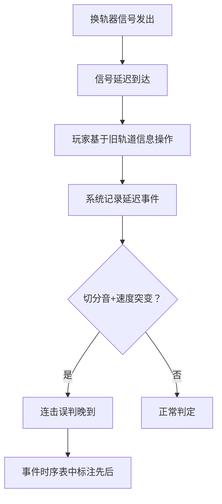

## 1. 产品概述

节拍列车编组是一款浏览器内运行的节奏+策略融合游戏。玩家在多轨道上操控列车编组，同步完成节拍敲击与轨道调度，游戏三源（节拍轨主信息、列车补证据、站台补证据）冲突时先留痕再判定，结算与复盘环节可追溯每一次判定的来龙去脉。

- 目标用户：音乐学习者、节奏训练爱好者
- 核心价值：让节奏判定和轨道调度的因果链透明可查，训练玩家在信息延迟与多源冲突场景下的判断力

## 2. 核心功能

### 2.1 用户角色
| 角色 | 注册方式 | 核心权限 |
|------|----------|----------|
| 玩家 | 无需注册，直接游玩 | 游玩、暂停、重开、查看结算与复盘 |

### 2.2 功能模块
1. **游戏主界面**：开始游戏、轨道可视化、实时判定反馈、暂停/重开控制
2. **结算页**：总分、各节拍判定明细、错因提示与扣分因果链
3. **复盘页**：时间轴回放、三源冲突留痕、切分音/速度突变事件时序
4. **练习报告**：完整判定溯源、成绩导出对应关系

### 2.3 页面详情
| 页面名称 | 模块名称 | 功能描述 |
|----------|----------|----------|
| 游戏主界面 | 轨道区域 | 4条轨道，列车从上方滚动到判定线，玩家按键敲击 |
| 游戏主界面 | 判定反馈 | Perfect/Great/Good/Miss 实时显示，连击计数 |
| 游戏主界面 | 轨道调度指示 | 换轨器图标及延迟提示，显示调度信息到达时机 |
| 游戏主界面 | 控制栏 | 开始、暂停、重开按钮，当前 BPM 与进度 |
| 游戏主界面 | 三源状态面板 | 节拍轨/列车/站台三栏，冲突时标红留痕 |
| 结算页 | 得分总览 | 总分、各判定等级数量、最大连击 |
| 结算页 | 错因扣分明细 | 逐条列出每次扣分的错因提示、对应判定来源、扣分值 |
| 结算页 | 冲突事件表 | 三源冲突记录，标注判定依据与留痕时间 |
| 复盘页 | 时间轴回放 | 可拖动时间轴，逐拍重现判定过程与轨道状态 |
| 复盘页 | 事件时序 | 切分音漏拍、速度突变、换轨器延迟等事件的先后顺序 |
| 练习报告 | 判定溯源表 | 每次判定的节拍轨信息、列车证据、站台证据及最终判定依据 |
| 练习报告 | 成绩导出 | 节拍轨ID ↔ 列车ID ↔ 成绩记录的对应关系表，支持导出 JSON |

## 3. 核心流程

玩家进入游戏后，选择开始，列车按节拍在轨道上滚动。玩家需在判定线处按键，系统根据三源信息做出节奏判定。换轨器可能延迟到达，导致轨道调度信息滞后。当切分音漏拍与速度突变同时出现时，连击误判会晚到。一局结束后进入结算页，查看错因扣分明细，随后可进入复盘页回溯判定过程，最后生成练习报告。

### 三源冲突判定流程

### 换轨器延迟与连击误判流程

## 4. 用户界面设计

### 4.1 设计风格
- 主色调：深蓝灰底（#1a1d2e），轨道用琥珀金（#f0a830）高亮，冲突标红（#e74c3c）
- 辅助色：列车用青蓝（#3dc1d3），站台用薄荷绿（#2ed573），判定线用白色发光
- 按钮风格：圆角胶囊按钮，3D 微凸起感，hover 发光
- 字体：显示字体用 "Orbitron"（科技感），正文用 "Noto Sans SC"
- 布局：居中轨道区域，左/右侧面板显示三源状态与控制，底部判定反馈
- 图标风格：线性图标搭配发光效果，列车/站台用象形图标

### 4.2 页面设计概览
| 页面名称 | 模块名称 | UI 元素 |
|----------|----------|---------|
| 游戏主界面 | 轨道区域 | 4条垂直轨道，列车方块从上滚下，判定线横穿底部发光 |
| 游戏主界面 | 判定反馈 | 判定线处弹出文字（Perfect 金色/Great 绿色/Good 蓝色/Miss 红色） |
| 游戏主界面 | 换轨器指示 | 轨道间箭头动画，延迟时半透明+倒计时标签 |
| 游戏主界面 | 三源面板 | 三列卡片，正常灰底，冲突红底+警告图标 |
| 游戏主界面 | 控制栏 | 胶囊按钮组，BPM 数字脉冲动画 |
| 结算页 | 得分总览 | 大号总分+环形图（判定比例），最大连击高亮 |
| 结算页 | 错因明细 | 表格行，每行含：时间戳、错因标签、来源标签、扣分值 |
| 结算页 | 冲突事件 | 时间线布局，冲突节点红点+展开详情 |
| 复盘页 | 时间轴 | 可拖动进度条+缩放，上方轨道缩略图 |
| 复盘页 | 事件时序 | 竖向时间线，事件气泡按时间排列 |
| 练习报告 | 溯源表 | 大表格，列：拍号、节拍轨、列车、站台、判定、依据 |
| 练习报告 | 导出区 | JSON 导出按钮+预览区 |

### 4.3 响应式设计
- 桌面优先，轨道区域最小宽度 600px
- 窄屏时三源面板折叠为底部抽屉
- 触屏设备支持触控按键区域

### 4.4 动效设计
- 列车滚动：缓入缓出，带拖尾粒子
- 判定弹出：缩放+淡出
- 换轨器延迟：闪烁警告动画
- 冲突留痕：红色波纹扩散
- 页面切换：滑入滑出过渡
