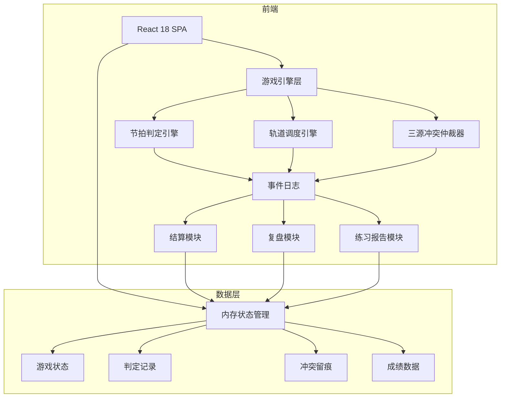

## 1. 架构设计



## 2. 技术说明

- 前端：React@18 + TypeScript + TailwindCSS@3 + Vite
- 初始化工具：Vite (react-ts 模板)
- 后端：无（纯前端，所有数据在内存中）
- 数据库：无，使用内存状态 + JSON 导出
- 动画：CSS Animations + requestAnimationFrame 游戏循环
- 音频：Web Audio API 生成节拍音效

## 3. 路由定义

| 路由 | 用途 |
|------|------|
| / | 游戏主界面（开始、暂停、重开、游玩） |
| /settlement | 结算页（总分、错因扣分明细、冲突事件） |
| /replay | 复盘页（时间轴回放、事件时序） |
| /report | 练习报告（判定溯源表、成绩导出） |

## 4. 核心数据结构

### 4.1 节拍数据（BeatNote）
```typescript
interface BeatNote {
  id: string;
  trackIndex: number;
  targetTime: number;
  isSyncopation: boolean;
  bpm: number;
  sourceBeat: BeatTrackInfo;
  sourceTrain: TrainInfo;
  sourcePlatform: PlatformInfo;
}
```

### 4.2 三源信息
```typescript
interface BeatTrackInfo {
  noteId: string;
  expectedTrack: number;
  expectedTime: number;
  isSyncopation: boolean;
}

interface TrainInfo {
  trainId: string;
  actualTrack: number;
  arrivalTime: number;
  switchDelay: number;
}

interface PlatformInfo {
  platformId: string;
  designatedTrack: number;
  openTime: number;
}
```

### 4.3 判定记录
```typescript
interface JudgmentRecord {
  id: string;
  beatNoteId: string;
  judgmentTime: number;
  result: "perfect" | "great" | "good" | "miss";
  deviation: number;
  sources: {
    beatTrack: BeatTrackInfo;
    train: TrainInfo;
    platform: PlatformInfo;
  };
  hasConflict: boolean;
  conflictDetails: ConflictDetail[];
  finalBasis: string;
  scoreChange: number;
  comboAtTime: number;
  events: TimedEvent[];
}
```

### 4.4 冲突留痕
```typescript
interface ConflictDetail {
  timestamp: number;
  sourceA: string;
  sourceB: string;
  field: string;
  valueA: unknown;
  valueB: unknown;
  resolution: string;
}
```

### 4.5 时间事件
```typescript
interface TimedEvent {
  timestamp: number;
  type: "switch_delay" | "syncopation_miss" | "speed_change" | "combo_misjudge" | "conflict";
  description: string;
  relatedJudgmentId?: string;
  order: number;
}
```

### 4.6 换轨器调度
```typescript
interface TrackSwitch {
  id: string;
  fromTrack: number;
  toTrack: number;
  triggerTime: number;
  arrivalDelay: number;
  isDelivered: boolean;
}
```

### 4.7 成绩导出
```typescript
interface ScoreExport {
  sessionId: string;
  totalScore: number;
  maxCombo: number;
  judgments: JudgmentRecord[];
  conflicts: ConflictDetail[];
  events: TimedEvent[];
  mapping: {
    beatTrackId: string;
    trainId: string;
    platformId: string;
    judgmentId: string;
    scoreRecordId: string;
  }[];
}
```

## 5. 游戏引擎设计

### 5.1 游戏循环
使用 requestAnimationFrame 驱动，每帧：
1. 更新当前时间
2. 推进列车位置
3. 检查换轨器是否到达
4. 检测玩家输入
5. 执行三源仲裁与判定
6. 记录事件日志
7. 更新 UI

### 5.2 判定窗口
| 等级 | 偏差范围 | 得分 |
|------|----------|------|
| Perfect | ≤50ms | 100 |
| Great | ≤100ms | 75 |
| Good | ≤150ms | 50 |
| Miss | >150ms | 0 |

### 5.3 三源仲裁规则
1. 节拍轨为主信息源（权重最高）
2. 列车提供实际轨道证据
3. 站台提供调度安排证据
4. 三源一致 → 直接判定
5. 列车与节拍轨冲突 → 以节拍轨为准，列车偏差记入留痕
6. 站台与节拍轨冲突 → 以节拍轨为准，站台偏差记入留痕
7. 列车与站台同时与节拍轨冲突 → 以节拍轨为准，双重冲突标记

### 5.4 换轨器延迟机制
- 换轨信号在 triggerTime 发出，但 arrivalDelay 毫秒后才到达
- 延迟期间玩家看到旧轨道信息
- 延迟到达后系统标记延迟事件，若影响判定则记入错因

### 5.5 切分音+速度突变处理
- 切分音漏拍（isSyncopation=true + Miss）与速度突变（bpm变化>10%）同时出现时
- 连击误判会延迟到下一个判定点
- 事件时序表中用 order 字段严格排序所有事件

### 5.6 扣分规则
| 错因类型 | 扣分 | 说明 |
|----------|------|------|
| 时值偏差 | 0-50 | 根据 Perfect/Great/Good/Miss 等级 |
| 换轨器延迟导致误判 | 30 | 因延迟信息导致的轨道错误 |
| 三源冲突误判 | 20 | 因冲突信息导致的判定偏差 |
| 切分音漏拍 | 15 | 切分音符未击中 |
| 速度突变连击断裂 | 25 | 速度突变导致的连击断裂 |
| 连击误判（晚到） | 10 | 误判结果延迟到达的额外扣分 |
