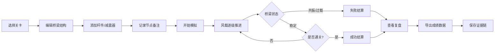

## 1. 产品概述

桥梁振动塔防是一款融合物理模拟与工程管理的策略游戏。玩家通过搭建桥梁结构、配置减震装置，抵御逐级增强的风载振动，同时需严格控制预算并保留完整的工程决策证据链。

- 解决问题：工程设计中"前后口径不一致"、"证据被新版本覆盖"、"凭印象决策"等问题
- 目标用户：对物理模拟、工程管理、策略塔防感兴趣的玩家

---

## 2. 核心功能

### 2.1 用户角色

| 角色 | 注册方式 | 核心权限 |
|------|---------|---------|
| 玩家 | 本地存储 | 完整游戏体验、成绩导出、回放查看 |

### 2.2 功能模块

1. **游戏主界面**：桥梁编辑器、振动模拟区、控制面板
2. **关卡选择**：3个递进难度的关卡
3. **回放系统**：完整对局回放、关键节点跳转
4. **复盘分析**：振动曲线、预算明细、节点日志
5. **成绩导出**：JSON格式导出完整证据链

### 2.3 页面详情

| 页面名称 | 模块名称 | 功能描述 |
|---------|---------|---------|
| 主菜单 | 关卡选择 | 选择关卡、查看历史成绩、开始游戏 |
| 游戏界面 | 桥梁编辑器 | 添加节点、连接杆件、配置减震器 |
| 游戏界面 | 振动模拟 | 实时物理模拟、振动波形显示 |
| 游戏界面 | 预算面板 | 实时预算监控、超支警告 |
| 游戏界面 | 节点日志 | 记录每次修改备注、版本变更 |
| 结算界面 | 失败提示 | 显示失败原因（共振/过载/超支） |
| 结算界面 | 复盘面板 | 振动曲线图、预算明细、事件时间线 |
| 结算界面 | 导出功能 | 导出完整成绩数据为JSON文件 |

---

## 3. 核心流程

**用户流程说明**：
1. 玩家选择关卡后进入桥梁编辑器
2. 在预算限制内搭建桥梁结构，每次修改自动记录版本
3. 启动风载模拟，振动强度逐级增加
4. 实时监控桥梁振动状态，共振或杆件过载时游戏失败
5. 结算时可查看完整复盘：振动曲线、预算明细、所有节点修改记录
6. 导出JSON格式的完整证据链文件

---

## 4. 用户界面设计

### 4.1 设计风格

- **主色调**：工业蓝 (#1E3A5F) + 警示橙 (#FF6B35) + 数据绿 (#2ECC71)
- **按钮风格**：方正硬朗，带轻微3D效果，工业风
- **字体**：JetBrains Mono（等宽字体，适合数据展示）+ Roboto
- **布局风格**：左右分栏，左侧工程面板，右侧模拟视图
- **图标风格**：线性图标，工程/科技感

### 4.2 页面设计概览

| 页面名称 | 模块名称 | UI元素 |
|---------|---------|--------|
| 主菜单 | 关卡卡片 | 深色卡片、关卡难度标识、最佳成绩 |
| 游戏界面 | 桥梁画布 | Canvas渲染、节点可拖拽、杆件高亮 |
| 游戏界面 | 振动波形 | SVG实时曲线图、多色数据通道 |
| 游戏界面 | 预算条 | 进度条渐变、超支变红、实时数字跳动 |
| 游戏界面 | 日志面板 | 时间线样式、版本号、备注气泡 |
| 结算界面 | 复盘图表 | 振动峰值标注、事件标记、可缩放 |
| 结算界面 | 导出按钮 | 突出显示、带下载图标 |

### 4.3 响应式

- 桌面端优先（1280px+），完整功能体验
- 平板端自适应布局，调整面板位置
- 移动端简化操作，保留核心模拟和复盘功能

### 4.4 动画与交互

- 节点选中：脉冲发光效果
- 杆件过载：红色闪烁警告
- 共振检测：屏幕边缘红色光晕
- 预算超支：数字变红+抖动
- 风载推进：背景风速粒子效果
